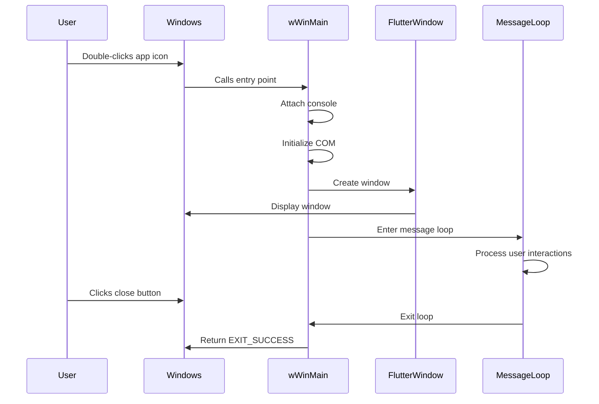

# Chapter 1: Application Entry Point and Initialization

Welcome to the first chapter of our Public Safety Application tutorial! In this chapter, we'll explore how a Windows application starts up and prepares itself to run. Think of this as learning how a car starts before it can drive—there are several important steps that happen before you see anything on the screen.

## What Problem Does This Solve?

Imagine you're building a house. Before you can move in furniture or paint the walls, you need to lay the foundation, connect utilities, and make sure everything is ready. Similarly, before our Public Safety Application can display its beautiful interface and help keep people safe, it needs to:

1. **Set up its environment** (like connecting to Windows services)
2. **Prepare for debugging** (so developers can find and fix problems)
3. **Understand what the user wants** (by reading command-line arguments)
4. **Create the main window** (where users will interact with the app)

Let's see how our application accomplishes all of this!

## The Entry Point: Where Everything Begins

Every Windows application needs a starting point—a special function that Windows calls when you double-click the app icon. In our Public Safety Application, this starting point is called `wWinMain`. Think of it as the "ignition key" that starts the entire application.

Here's what the function signature looks like:

```cpp
int APIENTRY wWinMain(_In_ HINSTANCE instance, 
                      _In_opt_ HINSTANCE prev,
                      _In_ wchar_t *command_line, 
                      _In_ int show_command) {
  // Application setup code goes here
}
```

**What's happening here?**
- `wWinMain` is the special name Windows looks for when starting your app
- It receives information from Windows (like `instance`, which identifies your running application)
- It returns an integer: `EXIT_SUCCESS` if everything went well, or `EXIT_FAILURE` if something went wrong

## Breaking Down the Initialization Steps

Let's walk through each initialization step one by one. Think of this as a pilot's pre-flight checklist—each item must be completed in order.

### Step 1: Attaching to the Console (For Debugging)

```cpp
if (!::AttachConsole(ATTACH_PARENT_PROCESS) && ::IsDebuggerPresent()) {
  CreateAndAttachConsole();
}
```

**What does this do?**

When you run the app from a command line (like when developers use `flutter run`), this code connects the app to that console window. This way, any debug messages or errors can be printed to the console, making it easier to see what's happening inside the app.

**Analogy:** It's like plugging in a microphone so the app can "speak" to developers and tell them what's going on.

### Step 2: Initializing COM Libraries

```cpp
::CoInitializeEx(nullptr, COINIT_APARTMENTTHREADED);
```

**What does this do?**

COM (Component Object Model) is a Windows technology that allows different software components to talk to each other. Many Windows features and plugins need COM to work properly.

**Analogy:** Think of this as turning on the phone lines in an office building. Without it, different departments (components) can't communicate with each other.

**Important:** At the end of the application, we must call `::CoUninitialize()` to properly clean up—like hanging up the phone when you're done.

### Step 3: Creating the Flutter Project

```cpp
flutter::DartProject project(L"data");
```

**What does this do?**

This line creates a Flutter project object and tells it where to find the application's data files (in a folder called "data"). Flutter is the framework that powers the user interface of our Public Safety Application.

**Analogy:** This is like opening a blueprint that contains all the instructions for building the app's interface.

### Step 4: Parsing Command-Line Arguments

```cpp
std::vector<std::string> command_line_arguments =
    GetCommandLineArguments();

project.set_dart_entrypoint_arguments(std::move(command_line_arguments));
```

**What does this do?**

Sometimes users or developers want to pass special instructions to the app when it starts (like `myapp.exe --debug-mode`). This code reads those instructions and passes them to the Flutter project.

**Example Input:** Running `women_safety_app.exe --test-mode`

**What happens:** The app receives `["--test-mode"]` as an argument and can behave differently based on this flag.

### Step 5: Creating the Main Window

```cpp
FlutterWindow window(project);
Win32Window::Point origin(10, 10);
Win32Window::Size size(1280, 720);
if (!window.Create(L"women_safety_app", origin, size)) {
  return EXIT_FAILURE;
}
```

**What does this do?**

This creates the actual window you see on screen! It sets:
- **Position:** The window appears 10 pixels from the top-left corner of your screen
- **Size:** The window is 1280 pixels wide and 720 pixels tall
- **Title:** "women_safety_app" appears in the title bar

If the window can't be created (maybe due to insufficient memory), the app returns `EXIT_FAILURE` and stops.

### Step 6: Configuring Window Behavior

```cpp
window.SetQuitOnClose(true);
```

**What does this do?**

This tells the window: "When the user clicks the X button to close the window, shut down the entire application." Without this, closing the window might leave the app running invisibly in the background!

### Step 7: The Message Loop (Keeping the App Alive)

```cpp
::MSG msg;
while (::GetMessage(&msg, nullptr, 0, 0)) {
  ::TranslateMessage(&msg);
  ::DispatchMessage(&msg);
}
```

**What does this do?**

This is the heart that keeps the application alive! Windows applications work by receiving "messages" (like "user clicked a button" or "window needs to redraw"). This loop continuously:
1. **Gets** the next message from Windows
2. **Translates** keyboard input into readable characters
3. **Dispatches** the message to the appropriate handler

**Analogy:** Think of this as a receptionist at a busy office who continuously receives phone calls, understands what each caller wants, and forwards them to the right department. The loop keeps running until the user closes the app.

## How It All Flows Together

Let's visualize the entire initialization process with a simple diagram:



## Under the Hood: Helper Functions

Our initialization process uses some helper functions defined in `utils.cpp`. Let's look at the most important ones:

### Getting Command-Line Arguments

```cpp
std::vector<std::string> GetCommandLineArguments() {
  int argc;
  wchar_t** argv = ::CommandLineToArgvW(::GetCommandLineW(), &argc);
  // ... conversion code ...
  return command_line_arguments;
}
```

**What does this do?**

Windows provides command-line arguments in a special format (UTF-16). This function:
1. Gets the command line from Windows
2. Splits it into individual arguments
3. Converts them to UTF-8 (the format Flutter expects)
4. Skips the first argument (which is just the program name)

**Example:** If you run `app.exe --debug --verbose`, this function returns `["--debug", "--verbose"]`.

### Creating a Debug Console

```cpp
void CreateAndAttachConsole() {
  if (::AllocConsole()) {
    // Redirect stdout and stderr to console
    // ... redirection code ...
  }
}
```

**What does this do?**

When running with a debugger, this creates a new console window and redirects all output (like `print` statements) to it. This is incredibly helpful for developers to see what's happening inside the app.

## Putting It All Together: A Complete Example

Let's trace what happens when a user starts the Public Safety Application:

1. **User double-clicks** `women_safety_app.exe`
2. **Windows calls** `wWinMain` with information about the application
3. **Console attaches** (if running from command line or debugger)
4. **COM initializes** so Windows components can communicate
5. **Flutter project loads** from the "data" folder
6. **Command-line arguments parse** (if any were provided)
7. **Main window creates** at position (10, 10) with size 1280x720
8. **Message loop starts**, keeping the app responsive
9. **User interacts** with the app (clicks buttons, types text, etc.)
10. **User closes** the window
11. **Message loop exits**
12. **COM uninitializes** to clean up resources
13. **Application returns** `EXIT_SUCCESS` to Windows

## Key Takeaways

In this chapter, you learned:

- **Every Windows app needs an entry point** (`wWinMain`) where execution begins
- **Initialization happens in a specific order**: console setup, COM initialization, project creation, window creation, and message loop
- **The message loop is crucial**—it keeps the app running and responsive to user input
- **Proper cleanup is important**—we must uninitialize COM when the app closes

Think of this chapter as learning how to start a car: turn the key (entry point), let the engine warm up (initialization), and keep it running (message loop) until you're ready to turn it off (cleanup).

## What's Next?

Now that you understand how the application starts up and initializes, you're ready to learn about how the Flutter window itself is managed throughout its lifetime. In the next chapter, we'll dive into [Flutter Window Lifecycle Management](02_flutter_window_lifecycle_management_.md), where you'll discover how the window is created, configured, and responds to events!

