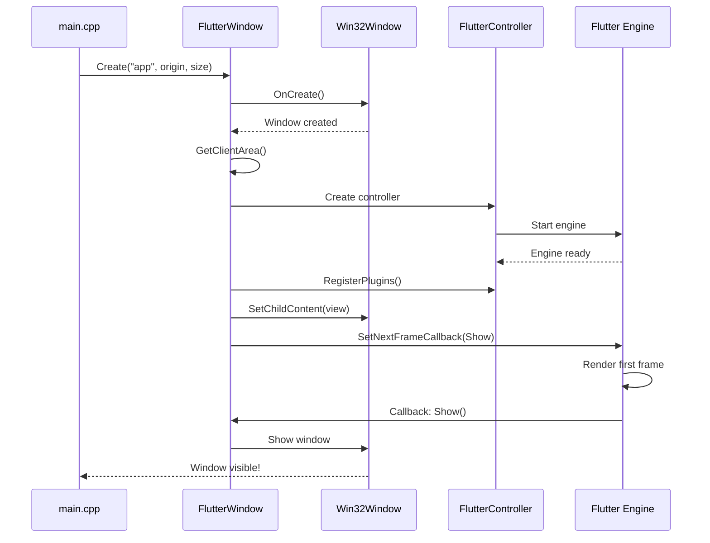

# Chapter 2: Flutter Window Lifecycle Management

Welcome back! In [Chapter 1: Application Entry Point and Initialization](01_application_entry_point_and_initialization_.md), you learned how our Public Safety Application starts up—like turning the key in a car's ignition. We saw how the app initializes COM, creates a Flutter project, and enters the message loop.

But there's a crucial piece we only briefly touched on: the `FlutterWindow` itself. How does this window come to life? How does it display the beautiful Flutter UI? And what happens when it's time to close? In this chapter, we'll explore the complete lifecycle of the Flutter window—from birth to death!

## What Problem Does This Solve?

Imagine you're organizing a theater performance. You need someone to:
1. **Set up the stage** before the show (create the window and prepare Flutter)
2. **Raise the curtain** at the right moment (show the window when Flutter is ready)
3. **Manage the performance** (handle user interactions and system events)
4. **Clean up after the show** (properly destroy everything when closing)

The `FlutterWindow` class is exactly like that stage manager! It coordinates between Windows (the operating system) and Flutter (the UI framework) to ensure everything happens in the right order and at the right time.

**Our Use Case:** When a user launches the Public Safety Application, we need to create a window that displays the Flutter interface smoothly, without flickering or showing an empty window. When they close the app, we need to clean up all resources properly.

Let's see how `FlutterWindow` accomplishes this!

## The FlutterWindow Class: Your Stage Manager

The `FlutterWindow` class inherits from `Win32Window` (a basic Windows window) and adds Flutter-specific functionality. Think of it as a specialized window that knows how to work with Flutter.

Here's how it's defined:

```cpp
class FlutterWindow : public Win32Window {
 public:
  FlutterWindow(const flutter::DartProject& project);
  virtual ~FlutterWindow();
  
 protected:
  bool OnCreate() override;
  void OnDestroy() override;
  // ... more methods ...
};
```

**What's happening here?**
- `FlutterWindow` is a special type of `Win32Window`
- It takes a `DartProject` (the Flutter project configuration) when created
- It overrides `OnCreate()` and `OnDestroy()` to add Flutter-specific setup and cleanup

## Key Lifecycle Stages

The Flutter window goes through three main stages, just like a theater performance:

### Stage 1: Construction (Preparing Backstage)

```cpp
FlutterWindow::FlutterWindow(const flutter::DartProject& project)
    : project_(project) {}
```

**What does this do?**

When you create a `FlutterWindow` object (like we did in `main.cpp`), this constructor runs. It simply stores the Flutter project configuration for later use.

**Analogy:** This is like a stage manager receiving the script and production notes before the show. Nothing visible happens yet—we're just preparing.

**Example from main.cpp:**
```cpp
flutter::DartProject project(L"data");
FlutterWindow window(project);  // Constructor is called here
```

At this point, no window exists on screen yet. We've just created an object that *knows how* to create a Flutter window.

### Stage 2: Creation (Setting Up the Stage)

The real magic happens when we call `window.Create()` from `main.cpp`. This triggers a chain of events:

```cpp
if (!window.Create(L"women_safety_app", origin, size)) {
  return EXIT_FAILURE;
}
```

Behind the scenes, this calls `FlutterWindow::OnCreate()`, which is where all the setup happens. Let's break it down step by step!

#### Step 2.1: Create the Basic Window

```cpp
bool FlutterWindow::OnCreate() {
  if (!Win32Window::OnCreate()) {
    return false;
  }
  // ... more setup ...
}
```

**What does this do?**

First, we call the parent class's `OnCreate()` to create the basic Windows window. This creates the window frame, title bar, and borders—but it's still empty inside.

**Analogy:** We've built the theater building, but the stage is still empty.

#### Step 2.2: Get the Window Dimensions

```cpp
RECT frame = GetClientArea();
```

**What does this do?**

This gets the size of the window's content area (excluding the title bar and borders). We need these dimensions to tell Flutter how much space it has to draw.

**Example Output:** If the window is 1280x720, `frame` might contain:
- `left = 0`
- `top = 0`
- `right = 1280`
- `bottom = 720`

#### Step 2.3: Create the Flutter Controller

```cpp
flutter_controller_ = std::make_unique<flutter::FlutterViewController>(
    frame.right - frame.left, 
    frame.bottom - frame.top, 
    project_);
```

**What does this do?**

This creates the Flutter engine and view controller! The `FlutterViewController` is the bridge between Windows and Flutter. It:
- Starts the Flutter engine (which runs your Dart code)
- Creates a view (the surface where Flutter draws)
- Configures everything with the project settings

**Analogy:** This is like hiring the actors, setting up the lighting, and preparing all the props for the show.

#### Step 2.4: Verify Everything Initialized

```cpp
if (!flutter_controller_->engine() || !flutter_controller_->view()) {
  return false;
}
```

**What does this do?**

This checks that both the Flutter engine and view were created successfully. If either failed, we return `false` to indicate the window creation failed.

**Analogy:** Before the show starts, the stage manager checks that all actors are present and the equipment works.

#### Step 2.5: Register Plugins

```cpp
RegisterPlugins(flutter_controller_->engine());
```

**What does this do?**

Flutter plugins (like camera access, location services, etc.) need to be registered with the Flutter engine. This function connects all the plugins your app uses.

**Analogy:** This is like connecting all the microphones and special effects equipment to the control board.

#### Step 2.6: Attach Flutter View to Window

```cpp
SetChildContent(flutter_controller_->view()->GetNativeWindow());
```

**What does this do?**

This embeds the Flutter view inside our Windows window. Now Flutter can draw its UI in the window's content area!

**Analogy:** We've placed the stage inside the theater building—now performers can actually appear on stage.

#### Step 2.7: Schedule Window Display (The Smart Part!)

```cpp
flutter_controller_->engine()->SetNextFrameCallback([&]() {
  this->Show();
});
```

**What does this do?**

Here's the clever part! Instead of showing the window immediately, we tell Flutter: "Call `this->Show()` after you've drawn your first frame." This prevents the user from seeing an empty or partially-loaded window.

**Analogy:** The curtain stays closed until the actors are in position. Once everything is ready, the curtain rises automatically.

**Why is this important?** Without this, users might see a white or black window for a split second before the Flutter UI appears—not a great experience!

#### Step 2.8: Force a Redraw (Just in Case)

```cpp
flutter_controller_->ForceRedraw();
```

**What does this do?**

Sometimes Flutter completes its first frame *before* we register the callback. This call ensures Flutter draws at least one frame, triggering our callback to show the window.

**Analogy:** If the actors are already in position, we give them a cue to start the show immediately.

#### Step 2.9: Success!

```cpp
  return true;
}
```

If we reach this point, everything succeeded! The window is created, Flutter is running, and the window will appear as soon as Flutter finishes its first frame.

## Visualizing the Creation Process

Let's see how all these pieces work together:



## Stage 3: Destruction (Tearing Down the Stage)

When the user closes the window, we need to clean up properly. This happens in the `OnDestroy()` method:

```cpp
void FlutterWindow::OnDestroy() {
  if (flutter_controller_) {
    flutter_controller_ = nullptr;
  }

  Win32Window::OnDestroy();
}
```

**What does this do?**

1. **Destroy the Flutter controller:** Setting `flutter_controller_` to `nullptr` destroys the unique pointer, which automatically shuts down the Flutter engine and releases all resources.
2. **Call parent cleanup:** `Win32Window::OnDestroy()` destroys the Windows window itself.

**Analogy:** After the show ends, we:
1. Dismiss the actors and crew (destroy Flutter controller)
2. Tear down the stage and close the theater (destroy Windows window)

**Why is order important?** We must destroy the Flutter controller *before* destroying the window, because Flutter needs the window to exist while it's shutting down.

## Handling Messages: The Performance Continues

While the window is visible, it needs to respond to events (like mouse clicks, keyboard input, or system notifications). This happens in the `MessageHandler()` method:

```cpp
LRESULT FlutterWindow::MessageHandler(HWND hwnd, UINT message,
                                      WPARAM wparam, LPARAM lparam) {
  if (flutter_controller_) {
    std::optional<LRESULT> result =
        flutter_controller_->HandleTopLevelWindowProc(
            hwnd, message, wparam, lparam);
    if (result) {
      return *result;
    }
  }
  // ... handle other messages ...
}
```

**What does this do?**

1. **Give Flutter first chance:** We pass every Windows message to Flutter first. If Flutter handles it (like a mouse click on a button), it returns a result and we're done.
2. **Handle special cases:** If Flutter doesn't handle the message, we check if it's something we need to handle specially.

Let's look at one special case:

```cpp
switch (message) {
  case WM_FONTCHANGE:
    flutter_controller_->engine()->ReloadSystemFonts();
    break;
}
```

**What does this do?**

If Windows notifies us that system fonts changed (maybe the user installed a new font), we tell Flutter to reload its font cache. This ensures text displays correctly.

**Analogy:** If a prop breaks during the performance, the stage manager quickly replaces it so the show continues smoothly.

## Putting It All Together: A Complete Example

Let's trace what happens when a user launches and closes the Public Safety Application:

**User Action:** Double-clicks the app icon

1. **main.cpp creates FlutterWindow object** (constructor stores project)
2. **main.cpp calls window.Create()** (triggers OnCreate)
3. **OnCreate creates basic Windows window** (empty frame appears, but hidden)
4. **OnCreate creates Flutter controller** (Flutter engine starts)
5. **OnCreate registers plugins** (camera, location, etc. become available)
6. **OnCreate attaches Flutter view** (Flutter can now draw in the window)
7. **OnCreate sets up callback** (window will show after first frame)
8. **Flutter renders first frame** (UI is ready)
9. **Callback triggers Show()** (window becomes visible with UI!)
10. **User interacts with app** (MessageHandler routes events to Flutter)

**User Action:** Clicks the X button to close

11. **Windows sends WM_CLOSE message**
12. **OnDestroy is called**
13. **Flutter controller is destroyed** (engine shuts down gracefully)
14. **Windows window is destroyed** (window disappears)
15. **Message loop exits** (back in main.cpp)
16. **Application terminates**

## Under the Hood: Why This Design?

You might wonder: "Why is this so complicated? Why not just create a window and show it immediately?"

Great question! Here's why this careful orchestration matters:

### Problem 1: The Blank Window Flicker

**Without the callback approach:**
```cpp
// BAD: Show window immediately
window.Show();
flutter_controller_ = CreateFlutterController();
```

**Result:** User sees an empty white window for 100-500ms while Flutter starts up. Not professional!

**With the callback approach:**
```cpp
// GOOD: Show window only when ready
flutter_controller_->engine()->SetNextFrameCallback([&]() {
  this->Show();
});
```

**Result:** Window appears instantly with the UI already rendered. Smooth!

### Problem 2: Resource Cleanup Order

**Without proper ordering:**
```cpp
// BAD: Destroy window first
Win32Window::OnDestroy();
flutter_controller_ = nullptr;  // Flutter tries to use destroyed window!
```

**Result:** Crash or undefined behavior!

**With proper ordering:**
```cpp
// GOOD: Destroy Flutter first
flutter_controller_ = nullptr;  // Flutter shuts down cleanly
Win32Window::OnDestroy();       // Then destroy window
```

**Result:** Clean shutdown every time.

## Key Takeaways

In this chapter, you learned:

- **FlutterWindow manages the complete lifecycle** of the application window, from creation to destruction
- **The window creation happens in stages**: basic window → Flutter controller → plugin registration → view attachment → delayed display
- **The callback mechanism prevents flicker** by showing the window only after Flutter renders its first frame
- **Message handling gives Flutter priority** so it can respond to user interactions
- **Proper cleanup order matters** to avoid crashes and resource leaks

Think of `FlutterWindow` as a skilled stage manager who ensures:
- The stage is set up correctly before the curtain rises
- The show runs smoothly while the audience watches
- Everything is cleaned up properly after the final bow

## What's Next?

Now you understand how the Flutter window is created, displayed, and destroyed. But how does the window actually *respond* to user interactions? How does it handle mouse clicks, keyboard input, and system notifications?

In the next chapter, [Windows Message Handling](03_windows_message_handling_.md), we'll dive deep into the Windows message system—the communication channel between the operating system and your application. You'll learn how every click, keystroke, and system event flows through your app!

