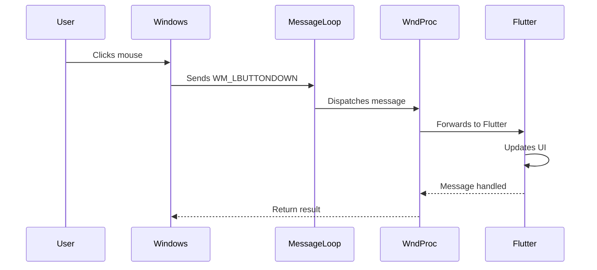
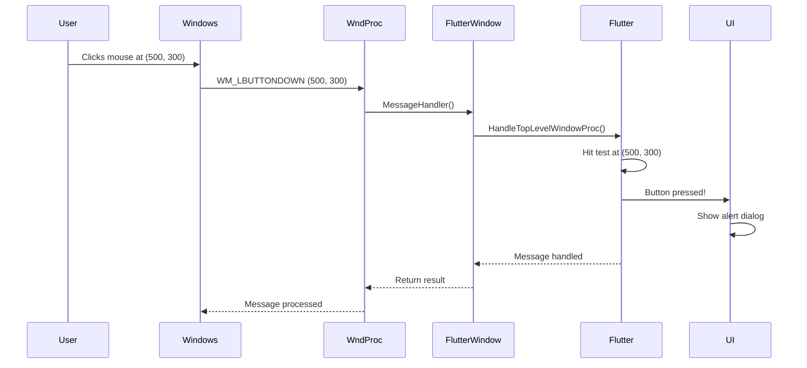

# Chapter 3: Windows Message Handling

Welcome back! In [Chapter 2: Flutter Window Lifecycle Management](02_flutter_window_lifecycle_management_.md), you learned how the `FlutterWindow` is created, displayed, and destroyed—like a stage manager setting up a theater performance. We saw how the window appears only after Flutter renders its first frame, creating a smooth user experience.

But here's a question: Once the window is visible, how does it know when the user clicks a button? How does it respond when you type on the keyboard? How does it handle window resizing or system theme changes?

The answer lies in **Windows Message Handling**—the communication system that connects your application to the Windows operating system. In this chapter, we'll explore how messages flow from Windows into your app and how they're processed!

## What Problem Does This Solve?

Imagine you're running a busy restaurant. Customers (the operating system) constantly send requests:
- "I'd like to order food!" (mouse click)
- "Can I get the check?" (keyboard input)
- "We need a bigger table!" (window resize)
- "Turn on the lights, it's getting dark!" (theme change)

You need a **receptionist** who:
1. **Receives all incoming requests** from customers
2. **Understands what each request means**
3. **Routes requests to the right department** (kitchen, billing, etc.)
4. **Handles some requests directly** (like showing customers to their table)

In Windows applications, the **WndProc** (Window Procedure) function is exactly like that receptionist! It receives all messages from Windows and decides what to do with each one.

**Our Use Case:** When a user interacts with the Public Safety Application—clicking the emergency button, typing a message, or resizing the window—we need to capture these events and respond appropriately. Some events should go to Flutter (like button clicks), while others need special handling (like window resizing).

Let's see how this works!

## Understanding Windows Messages

Before diving into code, let's understand what a "message" actually is.

### What is a Windows Message?

A **Windows message** is a small packet of information that Windows sends to your application to notify it about an event. Think of it like a text message on your phone—it contains:

1. **Message ID** (what type of event): Like "WM_LBUTTONDOWN" (left mouse button pressed)
2. **Additional data** (details about the event): Like the X,Y coordinates where the mouse was clicked
3. **Target window** (who should receive it): Which window this message is for

**Example Messages:**
- `WM_LBUTTONDOWN`: User pressed the left mouse button
- `WM_KEYDOWN`: User pressed a key on the keyboard
- `WM_SIZE`: Window was resized
- `WM_PAINT`: Window needs to redraw itself
- `WM_CLOSE`: User clicked the X button to close the window

**Analogy:** If Windows is a postal service, messages are like letters. Each letter has an address (target window), a subject line (message ID), and contents (additional data).

## The Message Flow: From Windows to Your App

Let's visualize how messages travel through the system:



**What's happening here?**

1. **User performs an action** (clicks, types, resizes)
2. **Windows detects the action** and creates a message
3. **Message loop receives the message** (remember this from Chapter 1?)
4. **WndProc processes the message** (our receptionist!)
5. **Message is handled** (either by Flutter or by our code)

## The WndProc Function: Your Message Receptionist

The heart of message handling is the `WndProc` function. Let's look at how it's defined in `Win32Window`:

```cpp
static LRESULT CALLBACK WndProc(
    HWND window,      // Which window received the message
    UINT message,     // What type of message (WM_CLICK, WM_SIZE, etc.)
    WPARAM wparam,    // Additional data (part 1)
    LPARAM lparam     // Additional data (part 2)
) noexcept;
```

**What does this do?**

This is a **callback function**—Windows calls it automatically whenever a message arrives for your window. The parameters tell you everything about the message:

- `window`: Which window this message is for (you might have multiple windows)
- `message`: The message ID (like `WM_LBUTTONDOWN`)
- `wparam` and `lparam`: Extra information (like mouse coordinates or key codes)

**Analogy:** This is like a receptionist's phone that rings whenever a customer calls. The caller ID tells you who's calling, and the conversation tells you what they want.

## How Win32Window Handles Messages

Let's walk through the message handling process step-by-step. We'll start with the static `WndProc` and see how it routes to the instance method.

### Step 1: The Static Entry Point

```cpp
LRESULT CALLBACK Win32Window::WndProc(
    HWND const window,
    UINT const message,
    WPARAM const wparam,
    LPARAM const lparam) noexcept {
```

**What does this do?**

This is the function Windows calls directly. It's `static`, meaning it doesn't belong to any specific `Win32Window` object—it's shared by all windows.

**Why static?** Windows doesn't know about C++ objects. It only knows how to call plain functions. So we need a static function as the "front door."

### Step 2: Special Handling for Window Creation

```cpp
if (message == WM_NCCREATE) {
    auto window_struct = reinterpret_cast<CREATESTRUCT*>(lparam);
    SetWindowLongPtr(window, GWLP_USERDATA,
        reinterpret_cast<LONG_PTR>(window_struct->lpCreateParams));
```

**What does this do?**

When a window is first created, Windows sends a `WM_NCCREATE` message. We use this opportunity to store a pointer to our `Win32Window` object inside the window's data. This lets us find the C++ object later!

**Analogy:** When a new employee joins the company, we give them an ID badge. Later, when they call the receptionist, we can look up who they are using their badge number.

### Step 3: Routing to the Instance Method

```cpp
} else if (Win32Window* that = GetThisFromHandle(window)) {
    return that->MessageHandler(window, message, wparam, lparam);
}
```

**What does this do?**

For all other messages, we:
1. **Look up the C++ object** using `GetThisFromHandle(window)`
2. **Call the instance method** `MessageHandler` on that object

**Why?** Now we can use instance variables and virtual functions! This is where the real message processing happens.

### Step 4: Default Processing

```cpp
return DefWindowProc(window, message, wparam, lparam);
```

**What does this do?**

If we don't have a `Win32Window` object for this window (shouldn't happen normally), we call `DefWindowProc`—Windows' default message handler. This ensures messages are always processed, even if something goes wrong.

## The Instance MessageHandler: Where the Magic Happens

Now let's look at the instance `MessageHandler` method, where we actually process messages:

```cpp
LRESULT Win32Window::MessageHandler(
    HWND hwnd,
    UINT const message,
    WPARAM const wparam,
    LPARAM const lparam) noexcept {
```

This method uses a `switch` statement to handle different message types. Let's examine each case!

### Handling Window Destruction

```cpp
case WM_DESTROY:
    window_handle_ = nullptr;
    Destroy();
    if (quit_on_close_) {
        PostQuitMessage(0);
    }
    return 0;
```

**What does this do?**

When the user closes the window (clicks the X button), Windows sends `WM_DESTROY`. We:
1. **Clear our window handle** (it's about to become invalid)
2. **Call our cleanup code** (`Destroy()`)
3. **Exit the message loop** if configured to do so (`PostQuitMessage`)

**Example:** User clicks the X button → `WM_DESTROY` arrives → App cleans up and exits

### Handling DPI Changes

```cpp
case WM_DPICHANGED: {
    auto newRectSize = reinterpret_cast<RECT*>(lparam);
    LONG newWidth = newRectSize->right - newRectSize->left;
    LONG newHeight = newRectSize->bottom - newRectSize->top;

    SetWindowPos(hwnd, nullptr, newRectSize->left, newRectSize->top,
                 newWidth, newHeight, SWP_NOZORDER | SWP_NOACTIVATE);
    return 0;
}
```

**What does this do?**

When the user moves the window to a monitor with different DPI (dots per inch), Windows sends `WM_DPICHANGED`. We resize the window to match the new DPI scaling.

**Example:** User drags window from laptop screen (100% scaling) to external monitor (150% scaling) → Window automatically resizes to look correct

**Analogy:** Like adjusting your font size when switching from a phone to a tablet—the content should look the same size relative to the screen.

### Handling Window Resizing

```cpp
case WM_SIZE: {
    RECT rect = GetClientArea();
    if (child_content_ != nullptr) {
        MoveWindow(child_content_, rect.left, rect.top,
                   rect.right - rect.left,
                   rect.bottom - rect.top, TRUE);
    }
    return 0;
}
```

**What does this do?**

When the window is resized, Windows sends `WM_SIZE`. We:
1. **Get the new window size** (`GetClientArea()`)
2. **Resize the child content** (the Flutter view) to fill the window

**Example:** User drags window corner to make it bigger → Flutter view automatically expands to fill the new space

**Why is this important?** Without this, the Flutter content would stay the same size even if the window grew!

### Handling Window Activation

```cpp
case WM_ACTIVATE:
    if (child_content_ != nullptr) {
        SetFocus(child_content_);
    }
    return 0;
```

**What does this do?**

When the window becomes active (user clicks on it), Windows sends `WM_ACTIVATE`. We set keyboard focus to the Flutter view so the user can type immediately.

**Example:** User clicks on the app window → Keyboard focus moves to Flutter → User can type in text fields

### Handling Theme Changes

```cpp
case WM_DWMCOLORIZATIONCOLORCHANGED:
    UpdateTheme(hwnd);
    return 0;
```

**What does this do?**

When the user changes Windows theme (light mode to dark mode), Windows sends `WM_DWMCOLORIZATIONCOLORCHANGED`. We update the window's title bar to match the new theme.

**Example:** User switches Windows to dark mode → App title bar automatically becomes dark

## How FlutterWindow Extends Message Handling

Remember from [Chapter 2: Flutter Window Lifecycle Management](02_flutter_window_lifecycle_management_.md) that `FlutterWindow` inherits from `Win32Window`? It overrides `MessageHandler` to add Flutter-specific processing:

```cpp
LRESULT FlutterWindow::MessageHandler(
    HWND hwnd, UINT const message,
    WPARAM const wparam, LPARAM const lparam) noexcept {
```

### Step 1: Give Flutter First Chance

```cpp
if (flutter_controller_) {
    std::optional<LRESULT> result =
        flutter_controller_->HandleTopLevelWindowProc(
            hwnd, message, wparam, lparam);
    if (result) {
        return *result;
    }
}
```

**What does this do?**

Before handling any message ourselves, we pass it to Flutter first! If Flutter handles it (returns a result), we're done. This ensures Flutter receives all user input events.

**Example:** User clicks a button in the Flutter UI → Message goes to Flutter → Flutter updates the button state → We return Flutter's result

**Why is this important?** Flutter needs to see mouse clicks, keyboard input, and touch events to make the UI interactive!

### Step 2: Handle Special Cases

```cpp
switch (message) {
    case WM_FONTCHANGE:
        flutter_controller_->engine()->ReloadSystemFonts();
        break;
}
```

**What does this do?**

Some messages need special handling even after Flutter sees them. For example, when system fonts change (`WM_FONTCHANGE`), we tell Flutter to reload its font cache.

**Example:** User installs a new font → Windows notifies all apps → Flutter reloads fonts → Text displays correctly with new fonts

### Step 3: Call Parent Handler

```cpp
return Win32Window::MessageHandler(hwnd, message, wparam, lparam);
```

**What does this do?**

Finally, we call the parent class's `MessageHandler` to handle standard window messages (like resizing, activation, etc.).

**This creates a chain:**
1. Flutter gets first chance
2. FlutterWindow handles special cases
3. Win32Window handles standard window messages
4. DefWindowProc handles anything else

## Putting It All Together: A Complete Example

Let's trace what happens when a user clicks a button in the Public Safety Application:

**User Action:** Clicks the "Emergency Alert" button



**Step-by-step breakdown:**

1. **User clicks** at screen coordinates (500, 300)
2. **Windows creates** a `WM_LBUTTONDOWN` message with coordinates
3. **Static WndProc receives** the message
4. **WndProc routes** to `FlutterWindow::MessageHandler`
5. **FlutterWindow passes** to Flutter's handler
6. **Flutter performs hit testing** to find what's at (500, 300)
7. **Flutter finds** the "Emergency Alert" button
8. **Flutter triggers** the button's onPressed callback
9. **UI updates** to show the alert dialog
10. **Result flows back** through the chain

All of this happens in **milliseconds**—so fast the user doesn't notice!

## Understanding Theme Updates

Let's look at one more interesting piece: how the app responds to Windows theme changes. This happens in the `UpdateTheme` method:

```cpp
void Win32Window::UpdateTheme(HWND const window) {
    DWORD light_mode;
    DWORD light_mode_size = sizeof(light_mode);
```

**What does this do?**

We declare variables to store the theme preference from Windows registry.

### Reading the Registry

```cpp
LSTATUS result = RegGetValue(
    HKEY_CURRENT_USER,
    kGetPreferredBrightnessRegKey,
    kGetPreferredBrightnessRegValue,
    RRF_RT_REG_DWORD, nullptr, &light_mode,
    &light_mode_size);
```

**What does this do?**

We read the Windows registry to check if the user prefers light or dark mode. The registry is like a database where Windows stores settings.

**Registry path:** `HKEY_CURRENT_USER\Software\Microsoft\Windows\CurrentVersion\Themes\Personalize\AppsUseLightTheme`

**Value meaning:**
- `0` = User prefers dark mode
- `1` (or any non-zero) = User prefers light mode

### Applying the Theme

```cpp
if (result == ERROR_SUCCESS) {
    BOOL enable_dark_mode = light_mode == 0;
    DwmSetWindowAttribute(window, DWMWA_USE_IMMERSIVE_DARK_MODE,
                          &enable_dark_mode, sizeof(enable_dark_mode));
}
```

**What does this do?**

If we successfully read the preference:
1. **Convert to dark mode flag** (0 means dark, so we invert it)
2. **Tell Windows** to use dark or light title bar via `DwmSetWindowAttribute`

**Example:** User has dark mode enabled → We read `light_mode = 0` → We set `enable_dark_mode = TRUE` → Title bar becomes dark

**Visual result:** The window's title bar (with minimize, maximize, close buttons) matches the system theme!

## Message Handling Best Practices

Based on what we've learned, here are some important principles:

### 1. Give Flutter Priority

Always pass messages to Flutter first! User input events (mouse, keyboard, touch) should go to Flutter so the UI can respond.

```cpp
// GOOD: Flutter gets first chance
if (flutter_controller_) {
    auto result = flutter_controller_->HandleTopLevelWindowProc(...);
    if (result) return *result;
}
// Then handle our own messages
```

### 2. Handle Window Messages Properly

Some messages (like `WM_SIZE`, `WM_DESTROY`) need special handling to keep the window working correctly.

```cpp
// GOOD: Resize child content when window resizes
case WM_SIZE:
    MoveWindow(child_content_, ...);
    return 0;
```

### 3. Always Return a Result

Every message must return a result! If you don't handle it, call `DefWindowProc` to let Windows handle it.

```cpp
// GOOD: Default handling for unhandled messages
return DefWindowProc(window_handle_, message, wparam, lparam);
```

### 4. Be Fast!

Message handlers should execute quickly. If you need to do slow work (like network requests), do it on another thread!

**Why?** While processing a message, your app can't process other messages. A slow handler makes the app feel frozen.

## Key Takeaways

In this chapter, you learned:

- **Windows messages are how the OS communicates with your app**—like letters in a postal system
- **WndProc is the receptionist** that receives all messages and routes them appropriately
- **Message handling happens in layers**: Flutter first, then FlutterWindow, then Win32Window, then default processing
- **Different message types require different handling**: user input goes to Flutter, window management is handled directly
- **Theme changes are detected** by reading the Windows registry and updating window attributes

Think of message handling as a well-organized office:
- The receptionist (WndProc) receives all calls
- Important calls go to the CEO (Flutter) first
- Routine matters are handled by departments (Win32Window)
- Everything else goes to the default handler

## What's Next?

Congratulations! You've now completed the core tutorial for the Public Safety Application's Windows implementation. You understand:

1. **How the app starts** ([Chapter 1: Application Entry Point and Initialization](01_application_entry_point_and_initialization_.md))
2. **How the window is created and managed** ([Chapter 2: Flutter Window Lifecycle Management](02_flutter_window_lifecycle_management_.md))
3. **How messages flow from Windows to your app** (this chapter!)

With this foundation, you're ready to explore more advanced topics like:
- Adding custom plugins to extend functionality
- Implementing native Windows features (notifications, file dialogs, etc.)
- Optimizing performance and memory usage
- Debugging Windows-specific issues

You now have the knowledge to understand and modify the Windows portion of any Flutter application. Happy coding! 🚀

