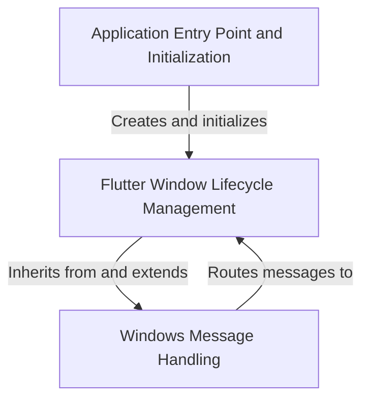

# Tutorial: Public_Safety_Application

This is a **Windows desktop application** built with *Flutter*, a cross-platform UI framework. 
The project sets up the **native Windows infrastructure** needed to run a Flutter app, handling 
tasks like *creating the application window*, *processing user input and system events*, and 
*initializing the Flutter engine*. Think of it as the **bridge between Windows and Flutter** - 
it creates a window where Flutter can draw its UI and ensures all Windows messages (like clicks 
and keyboard input) are properly forwarded to the Flutter framework.

**Source Repository:** [https://github.com/pruthvirajt24/Public_Safety_Application](https://github.com/pruthvirajt24/Public_Safety_Application)

## Chapters

1. [Application Entry Point and Initialization
](01_application_entry_point_and_initialization_.md)
2. [Flutter Window Lifecycle Management
](02_flutter_window_lifecycle_management_.md)
3. [Windows Message Handling
](03_windows_message_handling_.md)
