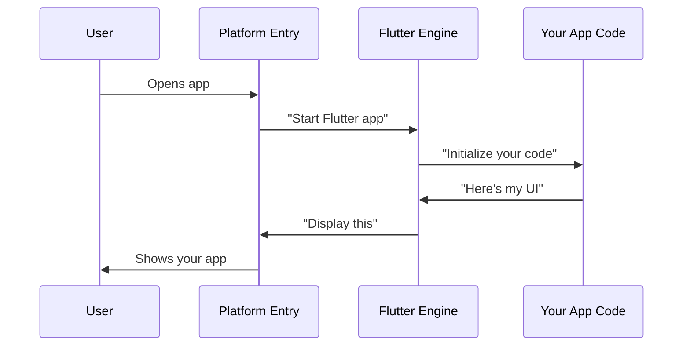

# Chapter 1: Cross-Platform Flutter Application Structure

Welcome to your journey into Flutter app development! Imagine you're building a public safety application that emergency responders need to use on their phones, tablets, and computers. Some use iPhones, others use Android devices, and dispatchers might use Windows or Linux computers. Instead of creating separate apps for each platform (which would take forever!), Flutter lets you write your app once and run it everywhere.

## The Problem: One App, Many Platforms

Let's say you want to create a simple emergency alert app. Without Flutter, you'd need to:
- Learn Swift to build for iPhone/iPad
- Learn Kotlin/Java for Android
- Learn C++ for Windows
- Learn different languages for Linux

That's a lot of work! Flutter solves this by acting like a universal translator - you write your app in one language (Dart), and Flutter translates it so each platform understands it.

## Understanding the Structure

Think of your Flutter app like a house with different entrances for different types of visitors. The main house (your Flutter code) stays the same, but each platform gets its own special doorway with the right key and instructions.

Here's what your project folder looks like:

```
my_public_safety_app/
├── lib/           # Your main Flutter code lives here
├── ios/           # iPhone/iPad entrance
├── android/       # Android entrance  
├── windows/       # Windows entrance
├── linux/         # Linux entrance
└── macos/         # Mac entrance
```

Each platform folder contains the "doorway" that lets that specific operating system run your Flutter app.

## How Each Platform Connects

Let's look at how each platform creates its entrance to your Flutter app:

### iOS Platform Entry Point

```objc
#import "GeneratedPluginRegistrant.h"
```

This tiny line in the iOS folder tells the iPhone: "Hey, I have a Flutter app here, and here's how to connect to it!" It's like putting up a sign that says "Flutter App This Way" in a language that iOS understands.

### Linux Platform Entry Point

```c
int main(int argc, char** argv) {
  g_autoptr(MyApplication) app = my_application_new();
  return g_application_run(G_APPLICATION(app), argc, argv);
}
```

This is Linux's way of saying: "Start up the computer program!" The `my_application_new()` creates your Flutter app, and `g_application_run()` actually starts it running. Think of it like pressing the power button on your app.

### Windows Platform Setup

```cpp
class FlutterWindow : public Win32Window {
 public:
  explicit FlutterWindow(const flutter::DartProject& project);
  // More details...
};
```

Windows needs a "window" to display your app. This code creates that window and tells it: "You're going to show a Flutter app inside yourself." It's like setting up a picture frame before putting the picture in it.

## How It All Works Together

Here's what happens when someone opens your app on different platforms:



Let's break this down step by step:

1. **User opens app**: Someone taps your app icon or clicks on it
2. **Platform Entry responds**: The platform-specific code (iOS, Android, etc.) wakes up
3. **Flutter Engine starts**: The platform tells Flutter "time to work!"
4. **Your app initializes**: Your Dart code in the `lib/` folder starts running
5. **App sends UI**: Your code tells Flutter what buttons, text, and images to show
6. **Flutter translates**: Flutter converts your UI into something the platform understands
7. **User sees your app**: The emergency alert interface appears on their screen!

## The Magic Behind the Scenes

Each platform folder contains special configuration files that act like instruction manuals:

### Linux Application Header

```c
MyApplication* my_application_new();
```

This tells Linux: "Here's how to create a new instance of this app." Every time someone opens your app on Linux, this function runs and creates a fresh copy.

### Windows Flutter Window

```cpp
explicit FlutterWindow(const flutter::DartProject& project);
```

This tells Windows: "Create a window and put this Flutter project inside it." The `project` contains all your Dart code and assets.

The beautiful thing is that while each platform has its own "doorway," they all lead to the same house - your Flutter app code in the `lib/` folder!

## Why This Matters for Your Public Safety App

With this structure, your emergency alert app can:
- Run on police officers' iPhones
- Work on paramedics' Android tablets  
- Display on dispatch center Windows computers
- Function on Linux-based emergency systems

All from the same codebase! You write your emergency contact forms, alert buttons, and map features once, and Flutter makes sure they work everywhere.

## What We've Learned

In this chapter, we discovered that Flutter's cross-platform structure is like having multiple doors to the same house. Each platform (iOS, Android, Windows, Linux) has its own entry point that knows how to welcome and run your Flutter app, but your main application code stays the same across all platforms.

The key folders are:
- `lib/` - Your main Flutter app code
- `ios/`, `android/`, `windows/`, `linux/` - Platform-specific entry points
- Each platform handles starting up and displaying your app in its own way

Now that you understand the foundation, let's explore how Flutter manages different resources (like images and fonts) across these platforms in [Platform-Specific Resource Management](02_platform_specific_resource_management_.md).

