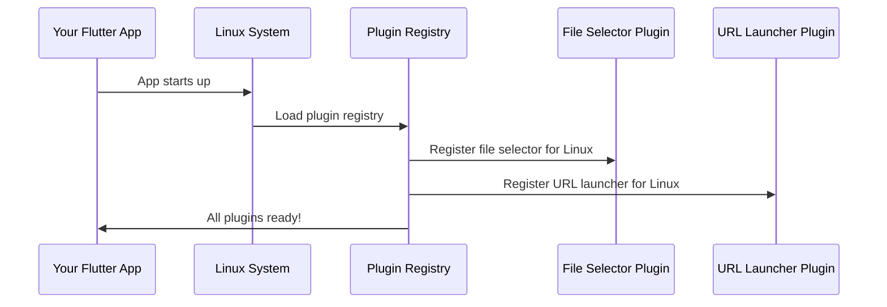

# Chapter 1: Cross-Platform Plugin Registration

## What Problem Are We Solving?

Imagine you're building a public safety app that needs to open files (like emergency documents) and launch web URLs (like safety resources). You want this app to work perfectly on Linux computers, Windows machines, and iOS devices. But here's the challenge: each operating system speaks a different "language" when it comes to handling these features.

Think of it like trying to use your phone charger in different countries. In the US, you need one type of plug adapter, in Europe you need another, and in the UK you need yet another. The electricity works the same way, but you need the right adapter for each location.

Flutter faces the same challenge. Your Dart code is like the electricity - it's the same everywhere. But to actually open files or launch URLs, Flutter needs "adapters" to connect with each platform's native capabilities.

## The Universal Translator Solution

Cross-Platform Plugin Registration is Flutter's automatic solution to this problem. It's like having a smart universal adapter that:

1. **Detects** what platform your app is running on
2. **Automatically connects** the right native features for that platform
3. **Translates** between Flutter's universal language and each platform's specific language

Let's see how this works with a concrete example.

## How Plugin Registration Works

### The Registration Files

When Flutter builds your app, it automatically creates special "registrant" files for each platform. These files are like instruction manuals that tell the platform how to connect Flutter features to native capabilities.

Here's what a Linux registration looks like:

```c
void fl_register_plugins(FlPluginRegistry* registry) {
  // Connect file selection capability
  file_selector_plugin_register_with_registrar(file_selector_linux_registrar);
  // Connect URL launching capability  
  url_launcher_plugin_register_with_registrar(url_launcher_linux_registrar);
}
```

This code tells Linux: "When the Flutter app asks to select files, use the Linux file selector. When it asks to launch URLs, use the Linux URL launcher."

### The Header Files

Each platform also gets a header file that declares what plugins are available:

```c
#ifndef GENERATED_PLUGIN_REGISTRANT_
#define GENERATED_PLUGIN_REGISTRANT_

// Registers Flutter plugins.
void fl_register_plugins(FlPluginRegistry* registry);

#endif
```

Think of this as a table of contents that lists all the available "adapters" for that platform.

## Step-by-Step: What Happens When Your App Starts

Let's trace through what happens when someone launches your public safety app on a Linux computer:



Here's what each step means:

1. **App starts**: Your public safety app launches on the Linux system
2. **Load registry**: The system reads the generated registration file
3. **Register plugins**: Each plugin (file selector, URL launcher) gets connected to Linux's native features
4. **Ready to use**: Your Flutter code can now seamlessly use these features

## Looking Under the Hood

### The Linux Implementation

Let's examine the actual generated code for Linux:

```c
#include <file_selector_linux/file_selector_plugin.h>
#include <url_launcher_linux/url_launcher_plugin.h>
```

This imports the Linux-specific implementations for file selection and URL launching.

```c
g_autoptr(FlPluginRegistrar) file_selector_linux_registrar =
    fl_plugin_registry_get_registrar_for_plugin(registry, "FileSelectorPlugin");
```

This line creates a "registrar" - think of it as getting the right adapter from the adapter box. It asks the registry: "Give me the Linux adapter for file selection."

```c
file_selector_plugin_register_with_registrar(file_selector_linux_registrar);
```

Finally, this connects the adapter. It's like plugging your charger adapter into the wall outlet.

### Cross-Platform Consistency

The beautiful part is that Windows and iOS have similar registration processes, but with platform-specific implementations. Your Flutter Dart code remains exactly the same:

```dart
// This same code works on Linux, Windows, and iOS!
final file = await FilePicker.platform.pickFiles();
await launchUrl(Uri.parse('https://emergency-resources.gov'));
```

The plugin registration system automatically ensures the right native implementation gets used on each platform.

## Real-World Example: Emergency Document Access

Let's say your public safety app needs to let users select and view emergency response documents. Here's how plugin registration makes this work seamlessly:

1. **User clicks "Open Document"** in your Flutter app
2. **Flutter calls** the file picker plugin
3. **Plugin registration** ensures the right native file picker appears:
   - On Linux: GTK file dialog
   - On Windows: Windows Explorer dialog  
   - On iOS: iOS document picker

The user gets a familiar, native experience on each platform, but you only wrote the Flutter code once!

## What We've Learned

Cross-Platform Plugin Registration is Flutter's automatic system for connecting your universal Flutter code to each platform's native capabilities. It works like a smart universal adapter that:

- **Automatically generates** the right "adapters" for each platform
- **Handles the connection** between Flutter and native features
- **Keeps your code consistent** across all platforms

This foundation makes it possible for your public safety app to work seamlessly whether it's running on a Linux emergency services computer, a Windows dispatch workstation, or an iOS field device.

In the next chapter, we'll explore how each platform uses this registration system during app startup in [Platform-Specific Application Bootstrap](02_platform_specific_application_bootstrap_.md).

