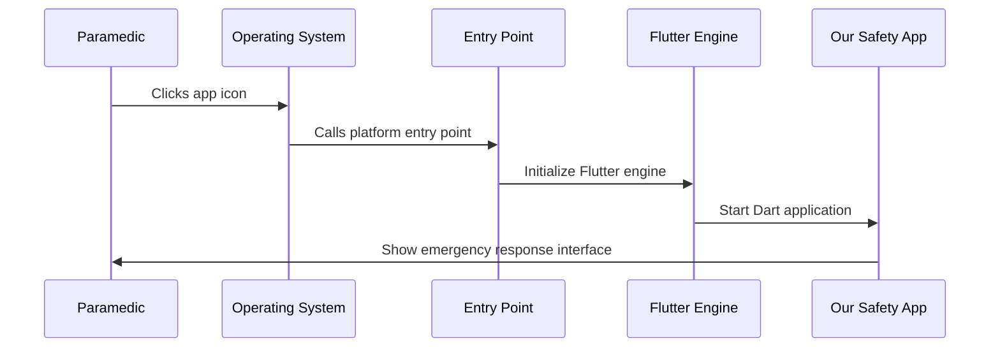

# Chapter 1: Platform Application Entry Points

Welcome to the first chapter of our Public Safety Application tutorial! Think of this as learning about the different ways people can enter a building - whether it's through the main lobby, a side entrance, or a security checkpoint. Each entrance might look different, but they all lead to the same place inside.

## What Problem Do Entry Points Solve?

Imagine you're building a house that needs to work in different countries. In some places, houses have front doors that open inward, while in others they open outward. Some have special security systems, and others have different electrical setups. But inside, you want the same comfortable living space regardless of the country.

This is exactly what happens with our Public Safety Application! We want the same Flutter app to run on Windows, Linux, and other operating systems. But each operating system has its own way of starting applications - its own "front door" requirements.

**Our main use case**: We need to create different entry points so our emergency response app can start properly on any device a first responder might use - whether it's a Windows laptop in a police car or a Linux tablet at a fire station.

## Understanding Entry Points: The Front Door Analogy

Let's break down what makes entry points special:

### 1. Platform-Specific Doors
Just like buildings in different countries have different entrance requirements, each operating system expects applications to start in a specific way.

### 2. Same Destination
No matter which entrance you use, you end up in the same Flutter application - just like all doors lead to the same house interior.

### 3. Startup Procedures
Each platform has its own "check-in" process when the app starts, similar to how some buildings require you to sign in at reception while others let you walk right in.

## How Entry Points Work: A Simple Example

Let's see how our Public Safety Application starts on different platforms:

### Linux Entry Point
```c
int main(int argc, char** argv) {
    g_autoptr(MyApplication) app = my_application_new();
    return g_application_run(G_APPLICATION(app), argc, argv);
}
```

This is like a simple front door for Linux. When someone "knocks" (runs the app), this code:
1. Creates a new application instance (`my_application_new()`)
2. Starts running it (`g_application_run()`)

**What happens**: The Linux system calls this `main` function, and our app springs to life, ready to help emergency responders!

### Windows Entry Point Setup
```cpp
class FlutterWindow : public Win32Window {
public:
    explicit FlutterWindow(const flutter::DartProject& project);
    
protected:
    bool OnCreate() override;
    void OnDestroy() override;
};
```

This is like a more sophisticated entrance with multiple security checkpoints. The Windows version:
1. Creates a special window class (`FlutterWindow`)
2. Handles window creation (`OnCreate`)
3. Manages cleanup when closing (`OnDestroy`)

**What happens**: Windows creates a window, and our Flutter app appears inside it, ready for first responders to use!

## Behind the Scenes: How Entry Points Work

Let's follow what happens when a paramedic clicks on our app icon:



### Step-by-Step Breakdown:

1. **User Action**: A paramedic clicks our app
2. **OS Takes Over**: The operating system looks for the right entry point file
3. **Entry Point Activates**: Our platform-specific code runs
4. **Flutter Starts**: The entry point wakes up the Flutter engine
5. **App Launches**: Our emergency response interface appears

## Platform-Specific Implementation Details

### Linux Implementation
The Linux entry point uses GTK (a common Linux interface toolkit):

```c
MyApplication* my_application_new() {
    // Creates a new GTK-based application
    // This is like setting up a Linux-style front desk
}
```

**What this does**: Creates an application that follows Linux conventions, so it feels natural to Linux users.

### Windows Implementation
The Windows version uses Win32 APIs:

```cpp
bool FlutterWindow::OnCreate() {
    // Set up Windows-specific window
    // Initialize Flutter controller
    // This is like setting up a Windows-style reception area
}
```

**What this does**: Creates a window that follows Windows design guidelines, so it feels familiar to Windows users.

## Key Files in Our Project

Our entry points live in specific folders:
- `linux/main.cc` - The Linux front door
- `windows/runner/` - The Windows entrance system
- Each contains the platform-specific startup code

These files act like different building entrances, but they all lead to the same Flutter app that helps emergency responders do their job.

## Conclusion

Platform Application Entry Points are the essential "front doors" of our Public Safety Application. They solve the challenge of making our single Flutter app work across different operating systems by providing each platform with the specific startup procedure it expects.

Just like how a hospital needs different entrances for ambulances, visitors, and staff - but they all lead to the same medical facility inside - our entry points provide the right "entrance" for each operating system while delivering the same powerful emergency response tools.

In the next chapter, we'll explore how these entry points connect to Flutter through the [Plugin Registration System](02_plugin_registration_system_.md), which is like the receptionist who knows how to direct visitors to the right departments within our application.

