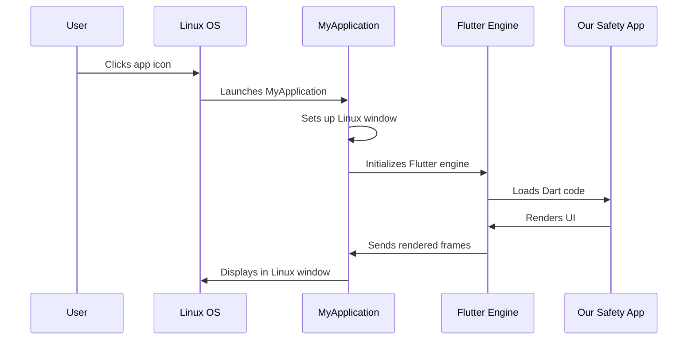

# Chapter 1: Platform-Specific Application Containers

Welcome to your journey into understanding how Flutter apps work on different operating systems! In this chapter, we'll explore one of the most fundamental concepts: Platform-Specific Application Containers.

## What Problem Do Application Containers Solve?

Imagine you've built a beautiful Flutter app for public safety - maybe it helps emergency responders coordinate during incidents. You want this app to run on Windows computers in dispatch centers and on Linux systems used by field coordinators. But here's the challenge: Windows and Linux are completely different operating systems with different ways of handling windows, mouse clicks, and app lifecycle events.

Think of it like this: you have a beautiful painting (your Flutter app), but you need different picture frames to hang it properly on different types of walls. A rustic wooden frame might be perfect for a cabin wall, while a sleek metal frame works better in a modern office. Similarly, your Flutter app needs different "containers" or "frames" to display properly on Windows versus Linux.

## What Are Platform-Specific Application Containers?

Platform-Specific Application Containers are the native "shells" that wrap your Flutter app for each operating system. They act as translators between your Flutter code and the specific requirements of each platform.

Let's break this down into key concepts:

### 1. The Container Concept

Just like how a shipping container protects cargo and makes it compatible with different ships, trucks, and trains, an application container protects your Flutter app and makes it compatible with different operating systems.

### 2. Platform-Specific Behavior

Each operating system has its own rules:
- Windows expects apps to behave a certain way when you click the X button
- Linux has different window management systems
- Each platform handles keyboard shortcuts differently

The container handles these differences so your Flutter app doesn't have to worry about them.

## How Application Containers Work in Our Public Safety App

Let's see how this works in practice with our public safety application.

### Windows Container: FlutterWindow

On Windows, our app uses a container called `FlutterWindow`. Here's how it's set up:

```cpp
class FlutterWindow : public Win32Window {
  // Creates a window that hosts our Flutter app
  explicit FlutterWindow(const flutter::DartProject& project);
};
```

This code creates a Windows-specific container that knows how to:
- Create a proper Windows window
- Handle Windows-specific events (like Alt+Tab)
- Manage the window lifecycle (minimize, maximize, close)

### Linux Container: MyApplication

On Linux, our app uses a different container called `MyApplication`:

```cpp
MyApplication* my_application_new();
```

This creates a Linux-specific container that understands:
- How to work with the GTK windowing system
- Linux-specific keyboard shortcuts
- How Linux manages application menus

### Starting the Application

Here's how our Linux app starts up:

```cpp
int main(int argc, char** argv) {
  g_autoptr(MyApplication) app = my_application_new();
  return g_application_run(G_APPLICATION(app), argc, argv);
}
```

This code:
1. Creates a new application container (`my_application_new()`)
2. Starts running the application (`g_application_run()`)
3. The container then loads and displays our Flutter app inside itself

## Under the Hood: How Containers Work

Let's trace through what happens when a user starts our public safety app on Linux:



Let's break down each step:

1. **User starts the app**: The user double-clicks our public safety app icon
2. **OS launches container**: Linux starts our `MyApplication` container
3. **Container preparation**: The container creates a proper Linux window with the right properties
4. **Flutter initialization**: The container starts up the Flutter engine inside itself
5. **App loading**: Flutter loads our Dart code (the actual safety app logic)
6. **Rendering**: Our app creates the user interface
7. **Display**: The container takes Flutter's output and shows it in the Linux window

## Deep Dive: Container Implementation

Let's look at how the Windows container handles the crucial moment when it's created:

### Windows FlutterWindow Creation

```cpp
class FlutterWindow : public Win32Window {
protected:
  bool OnCreate() override;
  void OnDestroy() override;
};
```

The `OnCreate()` method is called when Windows creates the window. Inside this method (defined in `windows/runner/flutter_window.cc`), the container:

1. **Sets up the Flutter engine**: Creates a connection to Flutter
2. **Configures the view**: Tells Flutter how big the window is
3. **Establishes communication**: Sets up ways for Flutter to talk back to Windows

### Linux MyApplication Structure

```cpp
G_DECLARE_FINAL_TYPE(MyApplication, my_application, MY, APPLICATION,
                     GtkApplication)
```

This declares that `MyApplication` is built on top of GTK (the Linux windowing system). The container inherits all the standard Linux app behaviors and adds Flutter-specific functionality on top.

## Why This Matters for Your Public Safety App

Understanding containers helps you realize why your app can:

- **Look native on each platform**: Windows users see Windows-style title bars, Linux users see Linux-style decorations
- **Handle platform events correctly**: Ctrl+C works on Windows, while the equivalent shortcut works on Linux
- **Integrate with the OS**: Your app appears properly in taskbars, dock areas, and system notifications

## Wrapping Up

In this chapter, we learned that Platform-Specific Application Containers are like specialized picture frames - they wrap your Flutter app in the right "shell" for each operating system. The `FlutterWindow` handles Windows-specific requirements while `MyApplication` takes care of Linux needs.

These containers are essential because they bridge the gap between your Flutter app's cross-platform code and each operating system's unique requirements. They handle the complex platform-specific details so your app can focus on its core functionality - helping keep communities safe.

In the next chapter, we'll explore how these containers manage system resources like memory and CPU usage: [Platform Resource Management](02_platform_resource_management_.md).

