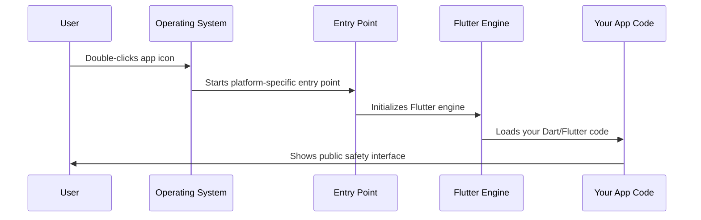

# Chapter 1: Platform-Specific Application Entry Points

Welcome to your first chapter in building a Public Safety Application with Flutter! In this chapter, we'll explore how your app starts up on different operating systems like Linux and Windows.

## What Problem Are We Solving?

Imagine you're building a public safety app that emergency responders can use on different types of computers - some running Linux, others running Windows. Each operating system is like a different country with its own language and customs. Your Flutter app needs to "speak" to each system in the way it understands.

Think of it like this: if you want to open a restaurant in different countries, you need different front doors that match local building codes, but inside, you're serving the same delicious food. That's exactly what platform-specific entry points do for your app!

## Key Concepts

### 1. Entry Points Are Like Front Doors

Every building needs a front door, and every app needs an entry point. This is simply where your program begins running. Different operating systems expect different types of "front doors":

- **Linux**: Uses a system called GTK (like a modern glass door)
- **Windows**: Uses Win32 APIs (like a traditional wooden door)

### 2. Same App, Different Wrapper

The beautiful thing about Flutter is that your main app code stays exactly the same. Only the "wrapper" - the entry point - changes for each platform.

## How Your App Starts Up

Let's see how this works in practice with our public safety application.

### Linux Entry Point

Here's how your app starts on Linux:

```c
int main(int argc, char** argv) {
  g_autoptr(MyApplication) app = my_application_new();
  return g_application_run(G_APPLICATION(app), argc, argv);
}
```

This tiny piece of code does three important things:
1. **Creates your app**: `my_application_new()` builds a new instance of your application
2. **Starts it running**: `g_application_run()` tells the Linux system to begin running your app
3. **Handles startup info**: `argc` and `argv` contain any special instructions given when starting the app

### Windows Entry Point

On Windows, the entry point looks different but does the same job:

```cpp
class FlutterWindow : public Win32Window {
 public:
  explicit FlutterWindow(const flutter::DartProject& project);
  
 private:
  flutter::DartProject project_;
  std::unique_ptr<flutter::FlutterViewController> flutter_controller_;
};
```

This Windows version:
1. **Creates a window**: Sets up the visual container where your app will appear
2. **Connects to Flutter**: Links the Windows system to your Flutter code
3. **Manages the display**: Handles how your app appears on screen

## What Happens Under the Hood

Let's trace through what happens when someone double-clicks your public safety app:



### Step-by-Step Breakdown

1. **User Action**: Emergency responder clicks on your app
2. **OS Recognition**: The operating system sees it's a Flutter app and loads the appropriate entry point
3. **Platform Setup**: The entry point prepares the native environment (GTK for Linux, Win32 for Windows)
4. **Flutter Initialization**: Your Flutter engine starts up
5. **App Launch**: Your actual public safety interface appears

## Looking at the Code Structure

### Linux Application Header

```c
G_DECLARE_FINAL_TYPE(MyApplication, my_application, MY, APPLICATION,
                     GtkApplication)

MyApplication* my_application_new();
```

This code creates a "blueprint" for your Linux app. Think of it as declaring "I'm going to build a house, and here's the architectural plan." The `GtkApplication` part tells Linux this app will use GTK for its interface.

### Windows Flutter Window

```cpp
explicit FlutterWindow(const flutter::DartProject& project);

bool OnCreate() override;
void OnDestroy() override;
```

The Windows version is like a manager that handles three key events:
- **Creation**: What to do when the app window first appears
- **Destruction**: How to cleanly shut down when closing
- **Project Management**: Keeping track of your Flutter code

## Real-World Example

Let's say you're deploying your public safety app to:
- **Police stations** (mostly Linux computers)
- **Fire departments** (mostly Windows computers)

Both will run the exact same emergency response features, mapping tools, and communication systems. The only difference is the few lines of platform-specific code that act as the "translator" between your Flutter app and each operating system.

## Conclusion

You've learned that platform-specific entry points are like having different keys for different doors - each operating system needs its own "key" to start your app, but once inside, everything works the same way. This design keeps your main application code simple while ensuring it works perfectly on every platform.

In the next chapter, we'll explore how your app registers and uses plugins across different platforms: [Cross-Platform Plugin Registration](02_cross_platform_plugin_registration_.md).

