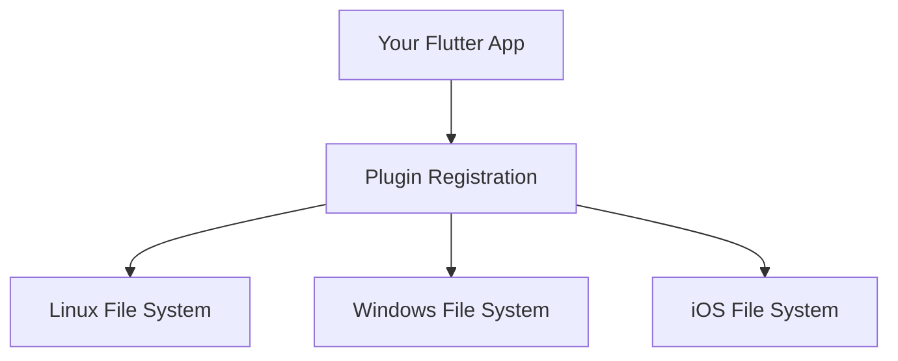
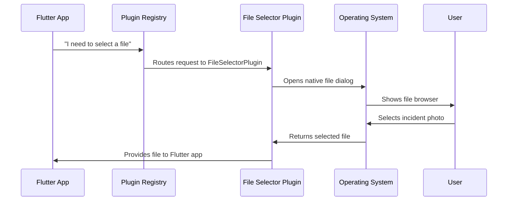

# Chapter 2: Cross-Platform Plugin Registration

Great work learning about [Platform-Specific Application Entry Points](01_platform_specific_application_entry_points_.md)! Now that your app can start up on different operating systems, let's explore how it connects to powerful platform features like opening files and launching web browsers.

## What Problem Are We Solving?

Imagine you're building a public safety app where emergency responders need to:
- **Open incident photos** from their computer's file system
- **Launch web browsers** to access online emergency databases
- **Use GPS location services** to track emergency vehicles

Here's the challenge: your Flutter code is the same across all platforms, but each operating system (Linux, Windows, iOS) handles these features completely differently. It's like trying to order food in different countries - you want the same meal, but you need to speak different languages!

This is where **Cross-Platform Plugin Registration** comes to the rescue. Think of it as having a personal translator who automatically connects your Flutter app with each platform's native capabilities.

## Key Concepts

### 1. What Are Plugins?

Plugins are like specialized tools that give your Flutter app superpowers. Each plugin handles one specific task:

- **File Selector Plugin**: Lets users browse and select files
- **URL Launcher Plugin**: Opens web browsers and external applications

### 2. The Universal Translator Concept

Just like a hotel concierge connects guests with local services, plugin registration connects your Flutter app with platform-specific features:



### 3. Automatic Setup

The beautiful thing is that this all happens automatically when your app starts - no manual work required!

## How Plugin Registration Works

Let's see how your public safety app gets connected to platform features.

### Step 1: Plugin Registry Creation

When your app starts, each platform creates a "registry" - think of it as a phone book that lists all available services:

```cpp
void RegisterPlugins(flutter::PluginRegistry* registry);
```

This line creates the master directory where all plugins will be registered. The `registry` is like a receptionist who knows how to connect you with different departments.

### Step 2: Individual Plugin Registration

Next, each plugin introduces itself to the registry. Here's how the file selector plugin registers on Linux:

```c
g_autoptr(FlPluginRegistrar) file_selector_linux_registrar =
    fl_plugin_registry_get_registrar_for_plugin(registry, "FileSelectorPlugin");
file_selector_plugin_register_with_registrar(file_selector_linux_registrar);
```

This code does two things:
1. **Gets a registrar**: Asks the registry for a connection point for the FileSelectorPlugin
2. **Registers the plugin**: Tells the system "This plugin is ready to help with file operations"

### Step 3: Multiple Plugin Registration

Your app registers several plugins at once. Here's the Linux version:

```c
void fl_register_plugins(FlPluginRegistry* registry) {
  // Register file selector
  g_autoptr(FlPluginRegistrar) file_selector_registrar =
      fl_plugin_registry_get_registrar_for_plugin(registry, "FileSelectorPlugin");
  file_selector_plugin_register_with_registrar(file_selector_registrar);
  
  // Register URL launcher
  g_autoptr(FlPluginRegistrar) url_launcher_registrar =
      fl_plugin_registry_get_registrar_for_plugin(registry, "UrlLauncherPlugin");
  url_launcher_plugin_register_with_registrar(url_launcher_registrar);
}
```

Each plugin gets its own "phone line" to the registry, ensuring they don't interfere with each other.

## What Happens Under the Hood

Let's trace through what happens when your public safety app needs to open a file:



### Step-by-Step Breakdown

1. **Request**: Your Flutter app says "I need the user to select a file"
2. **Routing**: The registry finds the right plugin for the current platform
3. **Translation**: The plugin translates your Flutter request into platform-specific commands
4. **Native Action**: The operating system opens its native file selection dialog
5. **User Interaction**: Emergency responder selects an incident photo
6. **Return Journey**: The file information travels back through the same chain to your app

## Platform-Specific Implementation

### Linux Plugin Registration

On Linux, plugins are registered using GTK-style code:

```c
#include <file_selector_linux/file_selector_plugin.h>
#include <url_launcher_linux/url_launcher_plugin.h>
```

These include statements bring in the Linux-specific versions of each plugin.

```c
void fl_register_plugins(FlPluginRegistry* registry) {
  // File operations for Linux
  // Web browsing for Linux
}
```

### Windows Plugin Registration

Windows uses a similar pattern but with different syntax:

```cpp
void RegisterPlugins(flutter::PluginRegistry* registry) {
  // Windows-specific plugin registration
}
```

Notice how the function name is slightly different (`RegisterPlugins` vs `fl_register_plugins`) - each platform has its own conventions!

### iOS Plugin Registration

iOS takes a different approach using a bridging header:

```objective-c
#import "GeneratedPluginRegistrant.h"
```

This single line gives your iOS app access to all registered plugins.

## Real-World Example: Emergency Response Scenario

Let's see how this works in practice. Imagine an emergency responder using your app:

1. **Taking Action**: Responder clicks "Attach Incident Photo" in your Flutter app
2. **Plugin Lookup**: Plugin registry finds the FileSelectorPlugin for the current platform
3. **Native Dialog**: System shows the appropriate file browser (GTK on Linux, Win32 on Windows)
4. **File Selection**: Responder selects a photo from their computer
5. **Seamless Return**: Photo appears in your Flutter app, ready to be uploaded

The amazing part? Your Flutter code for this feature is identical across all platforms - the plugin registration system handles all the platform differences automatically!

## Generated Files: The Magic Behind the Scenes

You'll notice files with names like `generated_plugin_registrant.cc` and `generated_plugin_registrant.h`. These are automatically created by Flutter based on your app's dependencies:

```c
// This file is automatically generated
// Do not edit manually!

void fl_register_plugins(FlPluginRegistry* registry) {
  // All your plugins are automatically listed here
}
```

Flutter reads your `pubspec.yaml` file, sees which plugins you're using, and generates the registration code for you. It's like having an assistant who automatically updates your phone book whenever you add new contacts!

## Conclusion

You've learned how Cross-Platform Plugin Registration acts as a universal translator, seamlessly connecting your Flutter app with native platform features. This system automatically handles all the complex platform differences, letting you focus on building great emergency response features instead of worrying about technical implementation details.

The registration happens automatically when your app starts, creating a bridge between your Flutter code and powerful native capabilities like file selection and web browsing. Each platform gets its own specialized registrant, but they all work toward the same goal: making native features available to your Flutter app.

In the next chapter, we'll explore how your app manages platform-specific resources like icons and configuration files: [Platform Resource Management](03_platform_resource_management_.md).

