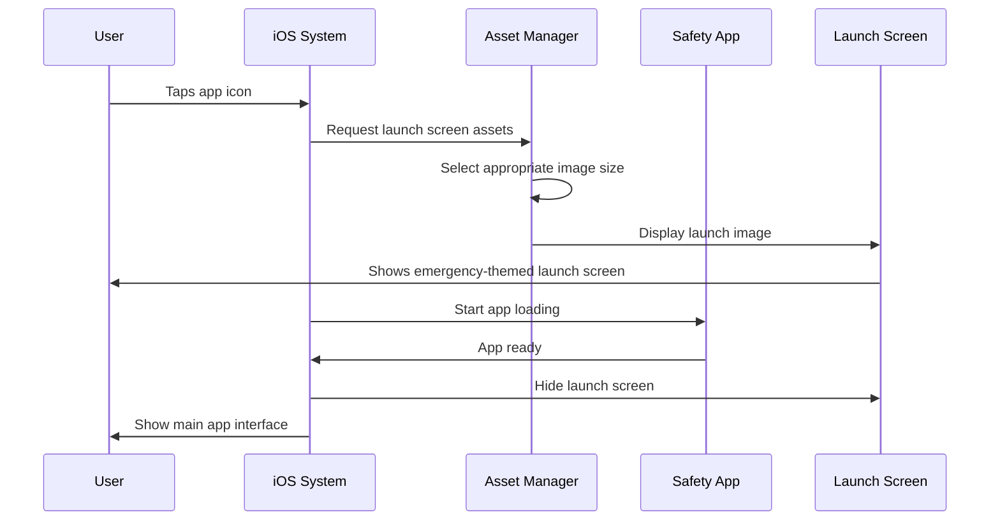

# Chapter 2: Platform Resource Management

Welcome back! In [Chapter 1: Platform-Specific Application Containers](01_platform_specific_application_containers_.md), we learned how your Flutter app gets wrapped in platform-specific "containers" to run properly on Windows and Linux. Now we need to tackle another important challenge: making your app look and feel like it truly belongs on each platform.

## What Problem Does Platform Resource Management Solve?

Imagine you're creating a public safety app that emergency responders will use across different devices. A dispatcher using Windows expects the app icon to appear crisp in their taskbar, while iOS users expect a beautiful launch screen when the app starts up. Each platform has its own visual language and technical requirements.

Think of it like opening a restaurant chain in different countries. While your core menu (the app functionality) stays the same, you need different signage, decorations, and even different ways to handle local regulations in each location. Platform Resource Management is like having a local manager in each country who knows exactly how to make your restaurant fit in perfectly.

Let's say you want your public safety app to have a distinctive red emergency icon. On Windows, you need specific file formats and sizes for the taskbar. On iOS, you need multiple icon sizes for different screen densities and a launch screen that appears while your app loads. Platform Resource Management handles all these details automatically.

## Breaking Down Platform Resource Management

Let's understand the key concepts that make this work:

### 1. Visual Assets (Icons and Launch Screens)

Each platform needs your app's visual elements in specific formats:
- **App Icons**: The small pictures users see and click to start your app
- **Launch Screens**: The screens users see while your app is loading

### 2. Platform-Specific Configurations

Different platforms have different rules about how these assets should be organized and what information they need.

### 3. Utility Functions

Behind the scenes, each platform needs different helper tools to handle text, process startup information, and manage system integration.

## How Platform Resource Management Works in Our Public Safety App

Let's see how our app handles resources on different platforms.

### iOS Launch Screen Assets

On iOS, when users tap your emergency app icon, they see a launch screen while the app loads. Here's how iOS organizes these assets:

```
ios/Runner/Assets.xcassets/LaunchImage.imageset/
├── README.md
└── [Launch screen images]
```

This folder structure tells iOS: "Here are the images to show while the Public Safety app is starting up." The system automatically picks the right image size for each device.

You can customize this launch screen by:
1. Opening your project in Xcode
2. Finding `Runner/Assets.xcassets` in the project navigator  
3. Dropping in your custom emergency-themed launch images

### Windows App Icons and Resources

On Windows, your app needs an icon that appears in the taskbar and Start menu. Here's how Windows manages this:

```cpp
// From windows/runner/resource.h
#define IDI_APP_ICON    101
```

This simple line tells Windows: "Our app has an icon, and its identifier is 101." When Windows needs to show your app icon anywhere in the system, it looks up this identifier and displays the associated image.

The resource system works like a filing cabinet:
- **IDI_APP_ICON**: The "folder label" Windows uses to find your icon
- **101**: The "file number" that uniquely identifies this resource

### Windows Utility Functions

Windows needs special helper functions to work properly with text and system information. Here's what our app includes:

```cpp
// From windows/runner/utils.h
void CreateAndAttachConsole();
```

This function creates a console window for debugging. When developers need to see what's happening inside the app, this utility makes it possible.

```cpp
std::string Utf8FromUtf16(const wchar_t* utf16_string);
```

This function converts text between different encoding formats. Windows uses one text format internally, but Flutter uses another, so this utility translates between them.

```cpp
std::vector<std::string> GetCommandLineArguments();
```

This function reads any special startup instructions passed to your app. For example, if someone launches your safety app with specific parameters, this utility captures and processes them.

## Under the Hood: How Resource Management Works

Let's trace through what happens when a user starts our public safety app on iOS:



Here's what happens step by step:

1. **User taps icon**: The user taps your emergency app icon on their iOS device
2. **iOS requests assets**: The system immediately looks for launch screen images
3. **Asset selection**: iOS automatically picks the right image size for the device (iPhone vs iPad, different screen resolutions)
4. **Display launch screen**: The emergency-themed launch image appears instantly
5. **App loading**: While the launch screen is visible, iOS starts loading your Flutter app
6. **App ready**: Your app finishes loading and signals it's ready
7. **Transition**: iOS smoothly transitions from the launch screen to your app's main interface

## Deep Dive: Resource Implementation

Let's examine how each platform handles resources differently.

### iOS Asset Management

iOS uses a sophisticated asset catalog system:

```
LaunchImage.imageset/
├── Contents.json          # Describes available images
├── LaunchImage.png        # Standard resolution
├── LaunchImage@2x.png     # High resolution
└── LaunchImage@3x.png     # Super high resolution
```

The `Contents.json` file acts like a menu, telling iOS:
- "For standard screens, use LaunchImage.png"
- "For retina displays, use LaunchImage@2x.png"  
- "For super retina displays, use LaunchImage@3x.png"

### Windows Resource Definition

On Windows, resources are defined in a resource file that gets compiled into your app:

```cpp
// In a .rc file (resource script)
IDI_APP_ICON    ICON    "app_icon.ico"
```

This line creates a permanent connection between:
- **IDI_APP_ICON**: The name your code uses to reference the icon
- **"app_icon.ico"**: The actual icon file on disk

When Windows compiles your app, it embeds the icon data directly into the executable file.

### Cross-Platform Utility Organization

The utility functions solve platform-specific challenges:

```cpp
// Text encoding utility
std::string Utf8FromUtf16(const wchar_t* utf16_string) {
    // Convert Windows text format to Flutter format
    // Implementation handles edge cases and errors
    return converted_string;
}
```

This function is crucial because:
- Windows applications often work with UTF-16 text encoding
- Flutter expects UTF-8 text encoding  
- Without proper conversion, text could appear garbled or cause crashes

## Why This Matters for Your Public Safety App

Understanding Platform Resource Management helps you realize why your app can:

- **Look professional**: Proper icons make your app appear trustworthy and official
- **Start quickly**: Optimized launch screens provide immediate feedback to users
- **Handle text correctly**: Utility functions ensure emergency messages display properly regardless of language or special characters
- **Integrate seamlessly**: Each platform sees your app as a "native citizen" rather than a foreign application

## Real-World Example: Emergency Response Scenario

Imagine a fire chief needs to quickly access your public safety app during an emergency:

1. **Quick Recognition**: The distinctive red emergency icon is immediately visible in their taskbar
2. **Fast Loading**: The professional launch screen appears instantly, showing the app is responding
3. **Reliable Text**: All emergency messages and location names display correctly, even with special characters
4. **Native Feel**: The app behaves exactly like other professional tools they use daily

All of this is possible because Platform Resource Management handled the technical details behind the scenes.

## Wrapping Up

In this chapter, we learned that Platform Resource Management is like having a specialized decorator for each platform - it ensures your app looks, feels, and behaves like it was designed specifically for that operating system. From iOS launch screens to Windows app icons to cross-platform utility functions, this system handles all the visual and technical details that make your app feel at home everywhere.

We explored how iOS manages multiple image sizes automatically, how Windows embeds resources directly into your app, and how utility functions solve tricky technical challenges like text encoding. These seemingly small details make a huge difference in creating a professional, reliable emergency response tool.

In the next chapter, we'll discover how your app connects different pieces of functionality together: [Plugin Registration System](03_plugin_registration_system_.md).

