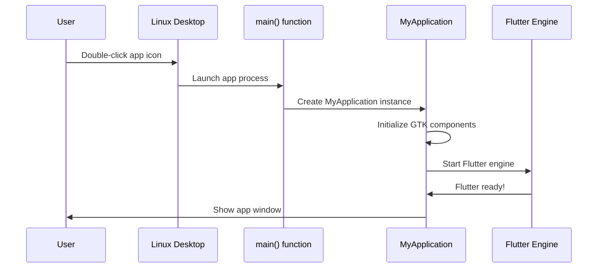

# Chapter 2: Platform-Specific Application Bootstrap

Building on our understanding of [Cross-Platform Plugin Registration](01_cross_platform_plugin_registration_.md), we now need to explore how your public safety app actually starts up on different operating systems. While plugin registration sets up the "adapters," the application bootstrap is what actually turns on the engine and gets everything running.

## What Problem Are We Solving?

Imagine you're setting up emergency response stations in different cities. Each city has different requirements:

- **Linux stations** might use GTK (a popular Linux interface toolkit) and need specific window management
- **Windows stations** use Win32 (Windows' native interface system) and have different security requirements
- **iOS devices** use Apple's frameworks and have unique app lifecycle rules

Even though your public safety app has the same core functionality everywhere, each platform needs its own "startup procedure" - just like how different emergency vehicles need different ignition sequences, but they all serve the same purpose of getting responders to emergencies quickly.

Platform-Specific Application Bootstrap solves this by providing custom startup code for each operating system while keeping your main Flutter app code identical across platforms.

## The Ignition System Analogy

Think of bootstrap code as the ignition system for your app:

- **Traditional Car**: Turn key → Engine starts → Dashboard lights up → Ready to drive
- **Push-Button Car**: Press button → Engine starts → Dashboard lights up → Ready to drive  
- **Electric Car**: Press power → Motor activates → Display turns on → Ready to drive

The end result is the same (a running vehicle), but each type needs a different startup sequence. Similarly:

- **Linux**: Initialize GTK → Create application window → Start Flutter → Ready to use
- **Windows**: Initialize Win32 → Create window → Start Flutter → Ready to use
- **iOS**: Initialize UIKit → Create view controller → Start Flutter → Ready to use

## Key Components of Bootstrap

### 1. Main Entry Point

Every platform needs a "main" function - the very first piece of code that runs when someone launches your app.

**Linux Example:**
```c
int main(int argc, char** argv) {
  g_autoptr(MyApplication) app = my_application_new();
  return g_application_run(G_APPLICATION(app), argc, argv);
}
```

This code says: "Create a new application instance, then run it with any command-line arguments the user provided."

**What happens here:**
1. `my_application_new()` creates your app instance
2. `g_application_run()` starts the app with any startup parameters
3. The function returns a status code (0 means success)

### 2. Application Class

Each platform needs a custom application class that knows how to work with that platform's specific requirements.

**Linux Header Example:**
```c
G_DECLARE_FINAL_TYPE(MyApplication, my_application, MY, APPLICATION,
                     GtkApplication)

MyApplication* my_application_new();
```

This declares that `MyApplication` is based on `GtkApplication` (GTK's application framework) and provides a function to create new instances.

**What this means:**
- Your app inherits all of GTK's standard application behaviors
- It can handle Linux-specific features like desktop notifications
- It follows Linux desktop environment conventions

### 3. Window Management

Each platform handles windows differently, so the bootstrap code must create and manage the main application window appropriately.

**Windows Example:**
```cpp
class FlutterWindow : public Win32Window {
public:
  explicit FlutterWindow(const flutter::DartProject& project);
  
protected:
  bool OnCreate() override;
  void OnDestroy() override;
};
```

This creates a Windows-specific window class that:
- Inherits from `Win32Window` (Windows' native window system)
- Takes a Flutter project as input
- Handles window creation and destruction

## Step-by-Step: App Startup Process

Let's trace what happens when a user double-clicks your public safety app icon on a Linux desktop:



Here's what each step involves:

1. **User interaction**: User clicks the app icon
2. **OS launches**: Linux starts your app process and calls the main() function
3. **Create application**: main() creates a MyApplication instance
4. **Platform setup**: MyApplication initializes GTK components and creates the window
5. **Start Flutter**: The Flutter engine starts and loads your Dart code
6. **Ready to use**: The app window appears and users can interact with it

## Looking Under the Hood: Linux Implementation

### The Main Function Deep Dive

```c
#include "my_application.h"

int main(int argc, char** argv) {
```

The `#include` brings in the application class definition. The main function receives `argc` (argument count) and `argv` (argument values) - these let users pass parameters like `myapp --debug`.

```c
  g_autoptr(MyApplication) app = my_application_new();
```

`g_autoptr` is a GTK feature that automatically cleans up memory when the variable goes out of scope - like having a self-cleaning coffee mug. `my_application_new()` creates your custom application instance.

```c
  return g_application_run(G_APPLICATION(app), argc, argv);
```

This starts the GTK application loop and passes along any command-line arguments. The app will keep running until the user closes it, then return a status code.

### The Application Header Structure

```c
#ifndef FLUTTER_MY_APPLICATION_H_
#define FLUTTER_MY_APPLICATION_H_
```

These "header guards" prevent the same code from being included multiple times - like putting a "Do Not Duplicate" stamp on important documents.

```c
#include <gtk/gtk.h>
```

This includes all the GTK toolkit functions your app needs to create windows, buttons, and other interface elements.

```c
G_DECLARE_FINAL_TYPE(MyApplication, my_application, MY, APPLICATION,
                     GtkApplication)
```

This GTK macro declares your application class. It's like filling out a form that says "My application is a type of GTK application with these specific characteristics."

## Platform Differences in Action

### Linux vs Windows Bootstrap

**Linux** uses the GTK toolkit:
```c
// Linux creates applications using GTK
g_autoptr(MyApplication) app = my_application_new();
return g_application_run(G_APPLICATION(app), argc, argv);
```

**Windows** uses Win32 API:
```cpp
// Windows creates applications using Win32
FlutterWindow window(project);
Win32Window::Point origin(10, 10);
window.CreateAndShow(L"Public Safety App", origin, size);
```

Both create and show a window, but they use completely different underlying systems. Your Flutter Dart code remains identical - only the bootstrap code changes.

## Real-World Example: Emergency Alert System

Let's say your public safety app needs to display urgent emergency alerts. Here's how bootstrap code enables this:

1. **App starts** using platform-specific bootstrap
2. **Window appears** using native platform conventions (GTK on Linux, Win32 on Windows)
3. **Flutter initializes** and loads your Dart code
4. **Alert system activates** - your Dart code can now display alerts using native UI components

The bootstrap ensures that alerts appear with the right look and feel for each platform, while your alert logic stays the same everywhere.

## What We've Learned

Platform-Specific Application Bootstrap is the "ignition system" that starts your Flutter app on different operating systems. Key takeaways:

- **Each platform needs its own startup code** but achieves the same goal
- **Main functions serve as entry points** that initialize platform-specific components  
- **Application classes handle platform requirements** like window management and system integration
- **Your Flutter Dart code stays identical** across all platforms

This bootstrap system ensures your public safety app starts reliably and looks native on Linux workstations, Windows dispatch centers, and iOS field devices, while maintaining consistent functionality everywhere.

Next, we'll explore how these bootstrapped applications integrate with each platform's unique interface requirements in [Platform UI Integration](03_platform_ui_integration_.md).

