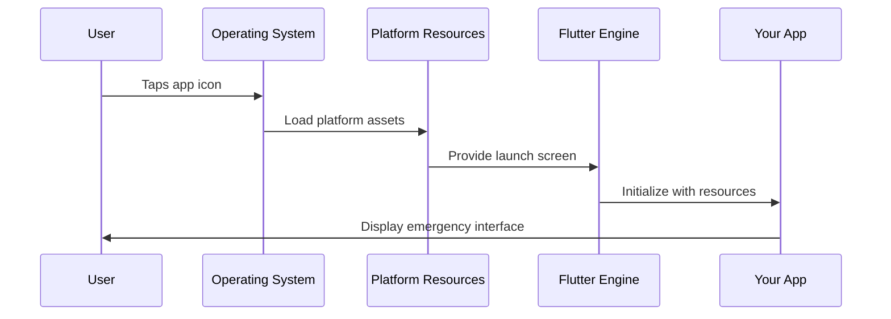
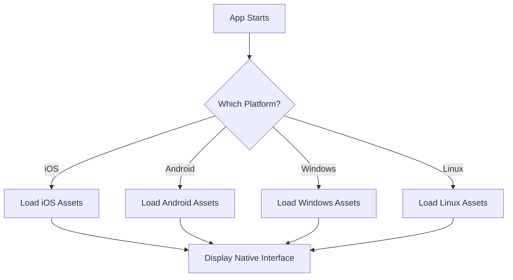

# Chapter 2: Platform-Specific Resource Management

Now that we understand how Flutter creates a [Cross-Platform Flutter Application Structure](01_cross_platform_flutter_application_structure_.md) with different entry points for each platform, let's explore how your app adapts its appearance and behavior to feel at home on each device.

## The Problem: Making Your App Look Native

Imagine you're wearing the same outfit to a beach party, a business meeting, and a hiking trip. While you're still the same person, you'd probably want to dress appropriately for each occasion! Your public safety app faces the same challenge - it needs to look and feel right whether it's running on an iPhone, Android tablet, or Windows computer.

Let's say you're building an emergency response app. On iOS, users expect rounded corners and specific icon styles. On Windows, they expect rectangular buttons and different fonts. Your app needs different "outfits" (resources) for each platform while keeping the same core functionality.

## Understanding Platform-Specific Resources

Platform-specific resources are like having a wardrobe for your app. Just as you have different clothes for different occasions, your app has different visual assets and configurations for different platforms.

Here's what each platform needs:

```
my_public_safety_app/
├── ios/
│   └── Runner/Assets.xcassets/    # iOS icons and launch screens
├── android/  
│   └── app/src/main/res/          # Android icons and resources
├── windows/
│   └── runner/                    # Windows icons and utilities
└── linux/
    └── icons/                     # Linux application icons
```

## Key Components of Platform Resources

### 1. App Icons - Your App's Face

Every platform displays your app icon differently. Think of it like having different profile pictures for different social media platforms:

**iOS Icons**: Need multiple sizes and rounded corners
**Android Icons**: Can be various shapes (circle, square, rounded)  
**Windows Icons**: Traditional square format with specific sizes
**Linux Icons**: Standard PNG format in system directories

### 2. Launch Screens - Your App's First Impression

When someone taps your emergency app, they see a launch screen while your app loads. It's like the "Please Wait" sign at a restaurant - each platform has its own style.

**iOS Launch Screens**: Use storyboards or image sets
**Android Splash Screens**: Use XML layouts or theme configurations
**Windows**: Integrated into the app window setup
**Linux**: Handled by the window manager

### 3. Platform Utilities - Behind-the-Scenes Helpers

Each platform needs special helper functions to work properly. Let's look at what Windows needs:

```cpp
// Windows utility functions
void CreateAndAttachConsole();
std::string Utf8FromUtf16(const wchar_t* utf16_string);
```

This code helps your app handle Windows-specific tasks like managing text encoding and console output.

## How Resource Management Works

Let's trace what happens when your emergency app starts up on different platforms:



Here's the step-by-step process:

1. **User taps icon**: The operating system recognizes your app
2. **OS loads assets**: Platform-specific resources (icons, launch screens) are loaded
3. **Launch screen appears**: User sees a loading screen while app initializes
4. **Flutter gets resources**: Your Flutter engine receives the platform-appropriate assets
5. **App launches**: Your emergency response interface appears with native styling

## Managing iOS Resources

iOS apps need their resources organized in a very specific way. Let's look at how launch images work:

### iOS Launch Image Setup

```
ios/Runner/Assets.xcassets/LaunchImage.imageset/
├── README.md
├── LaunchImage.png
├── LaunchImage@2x.png
└── LaunchImage@3x.png
```

The `README.md` file in your iOS assets explains how to customize these:

```markdown
# Launch Screen Assets

You can customize the launch screen with your own desired assets by replacing the image files in this directory.
```

This means you can replace the default Flutter logo with your emergency services badge or logo. The different file names (`@2x`, `@3x`) provide crisp images for different screen resolutions.

**How to use this:**
1. Create your emergency app logo in three sizes
2. Replace the default images in the `LaunchImage.imageset` folder  
3. When users open your app on iOS, they'll see your custom logo

## Managing Windows Resources

Windows apps use a different system for managing resources. Let's examine the resource management:

### Windows Resource Definitions

```cpp
#define IDI_APP_ICON    101
#define _APS_NEXT_RESOURCE_VALUE    102
```

This code from `resource.h` tells Windows: "I have an app icon, and it's resource number 101." When Windows needs to show your app icon in the taskbar or file explorer, it knows exactly where to find it.

### Windows Utility Functions

```cpp
void CreateAndAttachConsole();
std::string Utf8FromUtf16(const wchar_t* utf16_string);  
std::vector<std::string> GetCommandLineArguments();
```

These utility functions help your app handle Windows-specific tasks:

- `CreateAndAttachConsole()`: Creates a debug console for developers
- `Utf8FromUtf16()`: Converts Windows text encoding to standard UTF-8
- `GetCommandLineArguments()`: Handles command-line parameters when launching your app

**Why this matters**: If a dispatcher launches your emergency app with special parameters (like `--emergency-mode`), these utilities help your app understand and respond appropriately.

## The Magic of Automatic Resource Selection

Here's the beautiful part - Flutter automatically chooses the right resources for each platform! You don't need to write code saying "if iOS, use this icon; if Windows, use that icon." Flutter handles it automatically.

When your public safety app runs:



## Customizing Resources for Your Emergency App

Let's say you want to customize your emergency response app:

### Step 1: Prepare Your Assets
- Emergency badge logo (for app icon)
- Emergency red color theme (for launch screen)
- Agency name and contact info

### Step 2: Update Each Platform

**For iOS:**
```
Replace files in: ios/Runner/Assets.xcassets/LaunchImage.imageset/
- Add your emergency logo
- Use red emergency colors
```

**For Windows:**  
```
Update: windows/runner/resources/app_icon.ico
- Create .ico file with your badge
- Update resource.h if needed
```

**Result**: Your app will show the emergency badge on every platform, but each will display it in that platform's native style!

## Real-World Example: Emergency Alert Styling

Imagine your emergency app sends critical alerts. Each platform displays notifications differently:

- **iOS**: Rounded notification banners with iOS fonts
- **Android**: Material Design cards with system fonts  
- **Windows**: Toast notifications with Windows styling
- **Linux**: Desktop environment notifications

Your Flutter code stays the same:
```dart
showAlert("EMERGENCY: Severe Weather Warning");
```

But each platform's resources ensure the alert looks native and familiar to users on that device.

## What We've Learned

Platform-specific resource management is like having a personal stylist for your app on each platform. While your app's core functionality remains identical, each platform gets the visual assets, icons, and utilities it needs to feel at home.

Key takeaways:
- **App Icons**: Each platform needs icons in its preferred format and sizes
- **Launch Screens**: Users see platform-appropriate loading screens
- **Utility Functions**: Each platform provides helper functions for system integration
- **Automatic Selection**: Flutter automatically chooses the right resources for each platform
- **Easy Customization**: Replace default assets with your emergency service branding

Your emergency response app can now look professional and native on every platform while sharing the same codebase. Next, we'll explore how Flutter connects with platform-specific features through the [Plugin Registration System](03_plugin_registration_system_.md).

