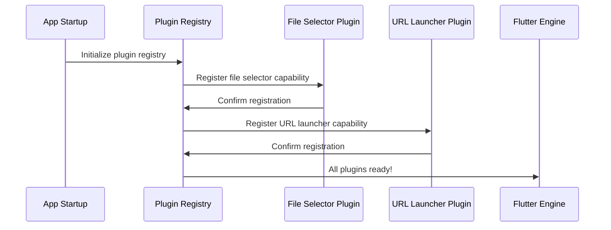

# Chapter 2: Plugin Registration System

Welcome back! In our [Platform Application Entry Points](01_platform_application_entry_points_.md) chapter, we learned how our Public Safety Application creates different "front doors" for each operating system. Now that we understand how our app starts up, let's explore what happens next - how our app connects to powerful platform-specific features through the Plugin Registration System.

## What Problem Does Plugin Registration Solve?

Imagine you're a new employee at a large hospital. On your first day, you need access to different departments - the pharmacy for medications, the lab for test results, and the imaging center for X-rays. Without a proper registration system, you'd have to wander around trying to find these departments and convince each one to let you in.

This is exactly the challenge our Public Safety Application faces! Our Flutter app needs to access platform-specific features like:
- **File selection** - When an officer needs to attach incident photos
- **URL launching** - When dispatchers need to open map links
- **Camera access** - When paramedics need to document injuries

**Our main use case**: When a paramedic opens our app and tries to attach a photo to an incident report, the app needs to know exactly how to open the file picker on their specific device (Windows laptop vs Linux tablet).

## Understanding Plugin Registration: The Hospital Directory Analogy

Let's break down how the Plugin Registration System works:

### 1. The Registration Desk
Just like a hospital has a central information desk that knows about all departments, our plugin registration system maintains a list of all available platform features.

### 2. The Directory
The system keeps a "phone book" that tells Flutter exactly how to reach each feature on each platform.

### 3. Automatic Setup
When our app starts, this system automatically registers all available plugins - no manual setup required!

## How Plugin Registration Works: A Simple Example

Let's see what happens when our app needs to let a user select a file:

### The Registration Process
```c
void fl_register_plugins(FlPluginRegistry* registry) {
  // Register file selector for Linux
  g_autoptr(FlPluginRegistrar) file_selector_registrar =
      fl_plugin_registry_get_registrar_for_plugin(registry, "FileSelectorPlugin");
  file_selector_plugin_register_with_registrar(file_selector_registrar);
}
```

This code is like setting up a directory entry. It tells Flutter:
1. "There's a service called FileSelectorPlugin available"
2. "Here's how to contact it when needed"
3. "It's ready to help with file selection tasks"

**What happens**: When a paramedic clicks "Attach Photo", Flutter knows exactly which plugin to call and how to reach it!

### Cross-Platform Compatibility
```cpp
// Windows version
void RegisterPlugins(flutter::PluginRegistry* registry) {
  // Same plugins, different platform implementation
  FileSelectorPluginRegisterWithRegistrar(
      registry->GetRegistrarForPlugin("FileSelectorPlugin"));
}
```

This is like having the same hospital departments but with different room numbers in different buildings. The service is the same (file selection), but the implementation details vary by platform.

**What happens**: Whether on Windows or Linux, our app can attach photos - the plugin system handles the platform differences automatically!

## Behind the Scenes: How Plugin Registration Works

Let's follow what happens when our app starts up and prepares its plugin directory:



### Step-by-Step Breakdown:

1. **App Starts**: Our Public Safety Application begins launching
2. **Registry Initializes**: The plugin registration system wakes up
3. **Plugins Register**: Each plugin (file selector, URL launcher) signs up
4. **Confirmation**: Each plugin confirms it's ready to work
5. **System Ready**: Flutter knows all available platform features

## Key Plugin Components in Our Safety App

### File Selector Plugin
```c
#include <file_selector_linux/file_selector_plugin.h>

file_selector_plugin_register_with_registrar(file_selector_linux_registrar);
```

**What this enables**: Officers can attach incident photos, reports can include documents, and evidence files can be selected from device storage.

**Real-world use**: When a police officer needs to attach a photo of accident damage to their report.

### URL Launcher Plugin
```c
#include <url_launcher_linux/url_launcher_plugin.h>

url_launcher_plugin_register_with_registrar(url_launcher_linux_registrar);
```

**What this enables**: Dispatchers can open GPS coordinates in mapping apps, emergency contacts can be called directly, and web-based resources can be accessed.

**Real-world use**: When a dispatcher needs to send location coordinates to emergency responders.

## The Generated Files: Your App's Phone Directory

Our project contains automatically generated files that act like a phone directory:

### Linux Directory (`generated_plugin_registrant.cc`)
```c
void fl_register_plugins(FlPluginRegistry* registry) {
  // File operations for Linux devices
  g_autoptr(FlPluginRegistrar) file_selector_linux_registrar =
      fl_plugin_registry_get_registrar_for_plugin(registry, "FileSelectorPlugin");
  
  // URL handling for Linux devices  
  g_autoptr(FlPluginRegistrar) url_launcher_linux_registrar =
      fl_plugin_registry_get_registrar_for_plugin(registry, "UrlLauncherPlugin");
}
```

**What this does**: Creates a Linux-specific directory that tells Flutter how to access file selection and URL launching on Linux devices.

### Windows Directory (`generated_plugin_registrant.h`)
```cpp
#ifndef GENERATED_PLUGIN_REGISTRANT_
#define GENERATED_PLUGIN_REGISTRANT_

void RegisterPlugins(flutter::PluginRegistry* registry);

#endif
```

**What this does**: Declares the same registration function for Windows, ensuring our app works identically across platforms.

## How Plugins Connect to Real Features

When a first responder uses our app, here's the invisible magic happening:

### User Action: "Attach Photo"
1. **User clicks**: Paramedic taps "Attach Photo" button
2. **Flutter calls**: App requests file selection capability
3. **Registry responds**: "FileSelectorPlugin is available at this address"
4. **Plugin activates**: File selector opens using platform-specific code
5. **User selects**: Photo is chosen and attached to incident report

### Platform-Specific Implementation
The same "Attach Photo" action works differently under the hood:
- **Linux**: Uses GTK file dialogs familiar to Linux users
- **Windows**: Uses Windows Explorer-style file selection
- **Result**: Same functionality, platform-appropriate interface

## Key Files in Our Project

The plugin registration system lives in these generated files:
- `linux/flutter/generated_plugin_registrant.cc` - Linux plugin directory
- `linux/flutter/generated_plugin_registrant.h` - Linux plugin declarations  
- `windows/flutter/generated_plugin_registrant.h` - Windows plugin declarations

**Important**: These files are automatically generated by Flutter - you never need to edit them manually! Flutter updates them whenever you add or remove plugins from your project.

## Conclusion

The Plugin Registration System is like a smart receptionist for our Public Safety Application. It automatically maintains a directory of all platform-specific features and helps Flutter connect to the right services when emergency responders need them.

Just like how a hospital's information system knows that "Pharmacy" is on the 2nd floor in Building A, our plugin registry knows that "FileSelectorPlugin" handles file operations and exactly how to reach it on each platform. This seamless connection allows paramedics, officers, and dispatchers to focus on their critical work instead of wrestling with technology.

In the next chapter, we'll explore how this registration system connects with Flutter through [Cross-Platform Bridge Configuration](03_cross_platform_bridge_configuration_.md), which acts as the communication bridge that makes all these platform-specific features work together smoothly.

