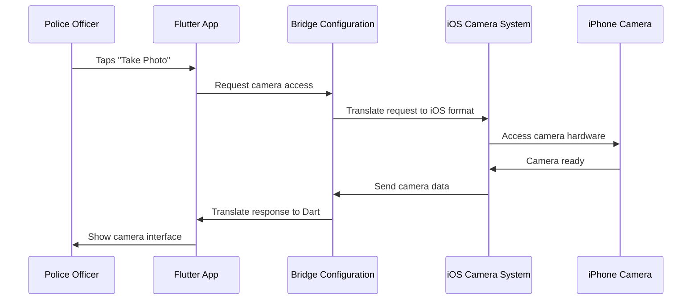

# Chapter 3: Cross-Platform Bridge Configuration

Welcome back! In our [Plugin Registration System](02_plugin_registration_system_.md) chapter, we learned how our Public Safety Application maintains a directory of platform-specific features. Now that we understand how plugins get registered, let's explore how Flutter actually communicates with these native platform features through Cross-Platform Bridge Configuration.

## What Problem Does Bridge Configuration Solve?

Imagine you're a paramedic who speaks only English, but you need to communicate with a Spanish-speaking patient during an emergency. You'd need a translator who understands both languages and can help you exchange vital information quickly and accurately.

This is exactly what happens in our Public Safety Application! Our Flutter code is written in Dart (like speaking English), but iOS devices use Objective-C and Swift (like speaking Spanish). When our app needs to access iPhone-specific features like the camera or GPS, we need a "translator" to help these different programming languages communicate.

**Our main use case**: When a paramedic using our app on an iPhone tries to take a photo for an incident report, Flutter needs to "ask" the iOS camera system for permission and access. The bridge configuration acts as the translator that makes this communication possible.

## Understanding Bridge Configuration: The Universal Translator Analogy

Let's break down what makes bridge configuration special:

### 1. The Translation Dictionary
Just like a translator uses a dictionary to convert words between languages, the bridge configuration contains "translation rules" that help Dart and native iOS code understand each other.

### 2. Two-Way Communication
The translator doesn't just convert English to Spanish - they also convert Spanish back to English. Similarly, our bridge allows Flutter to call iOS features AND allows iOS to send information back to Flutter.

### 3. Instant Translation
In an emergency, translation needs to be immediate. Our bridge configuration ensures that when Flutter needs a platform feature, the communication happens instantly without delays.

## How Bridge Configuration Works: A Simple Example

Let's see what our bridge configuration looks like:

### The Bridge Header File
```objc
#import "GeneratedPluginRegistrant.h"
```

This single line is like hiring a professional translator. It tells iOS:
1. "We have a translation service available"
2. "This service knows how to convert between Flutter and iOS languages"
3. "Use this service whenever Flutter needs to talk to iOS features"

**What happens**: When a paramedic taps the camera button in our app, this bridge ensures Flutter's request gets properly translated into iOS camera commands!

### The Bridge in Action
```objc
// When Flutter says: "I need camera access"
// The bridge translates this to iOS: "请求相机访问权限"
// iOS responds: "权限已授予"  
// The bridge translates back to Flutter: "Camera access granted"
```

This is a simplified view, but it shows how the bridge acts as a real-time translator between different programming languages.

**What happens**: Our emergency responders get seamless access to device features without ever knowing that complex translation is happening behind the scenes!

## Behind the Scenes: How Bridge Configuration Works

Let's follow what happens when a police officer tries to access the device camera through our app:



### Step-by-Step Breakdown:

1. **User Action**: Police officer taps "Take Photo" in our app
2. **Flutter Processes**: App recognizes the camera request in Dart
3. **Bridge Translates**: Bridge converts Dart request to iOS-compatible format
4. **iOS Responds**: Native iOS camera system activates
5. **Hardware Access**: iPhone camera hardware becomes available
6. **Return Translation**: Bridge converts iOS response back to Flutter format
7. **User Interface**: Officer sees the camera interface and can take photos

## Bridge Configuration Files: Your Translation Team

### The Main Bridge Header
```objc
#import "GeneratedPluginRegistrant.h"
```

This file (`Runner-Bridging-Header.h`) is like hiring the head translator. It:
- **Connects languages**: Links Dart/Flutter with Objective-C/Swift
- **Manages communication**: Ensures all plugin requests get properly translated
- **Handles registration**: Makes sure iOS knows about all available Flutter plugins

**Real-world impact**: This single line enables our entire Public Safety Application to work on iPhones and iPads!

### Generated Plugin Registrant
The `GeneratedPluginRegistrant.h` file (imported above) contains the actual translation rules:

```objc
// Simplified example of what's inside:
@interface GeneratedPluginRegistrant : NSObject
+ (void)registerWithRegistry:(NSObject<FlutterPluginRegistry>*)registry;
@end
```

**What this does**: Creates a registration system that tells iOS about all the Flutter plugins that need translation services.

## How Translation Happens: Real Examples

### Camera Access Translation
When our app needs camera access:

```objc
// Flutter request (conceptual): "camera.takePicture()"
// Bridge translates to iOS: [AVCaptureSession startRunning]
// iOS responds with image data
// Bridge translates back: "Here's your image file"
```

**Real-world use**: Paramedics can instantly capture patient information or accident scene photos without worrying about iOS complexity.

### GPS Location Translation
When dispatchers need location data:

```objc
// Flutter request: "location.getCurrentPosition()"  
// Bridge translates to iOS: [CLLocationManager requestLocation]
// iOS provides coordinates
// Bridge translates back: "Latitude: 40.7128, Longitude: -74.0060"
```

**Real-world use**: Emergency responders get precise location data for faster response times.

## Platform-Specific Bridge Benefits

### iOS Integration Advantages
Our bridge configuration provides:

1. **Native Performance**: Camera and GPS access runs at full iOS speed
2. **System Consistency**: File dialogs and alerts look like standard iOS interfaces  
3. **Security Compliance**: Follows iOS security protocols for sensitive emergency data
4. **Hardware Access**: Full access to iPhone/iPad sensors and capabilities

### Automatic Translation Management
```objc
// The bridge automatically handles:
// - Memory management between Flutter and iOS
// - Data type conversions (Dart strings ↔ NSString)
// - Error handling and reporting
// - Thread management for smooth performance
```

**What this means**: Emergency responders get a perfectly smooth iOS experience while Flutter developers can write simple, cross-platform code.

## Key Files in Our Project

The bridge configuration lives in these important files:
- `ios/Runner/Runner-Bridging-Header.h` - The main translation coordinator
- `ios/Runner/GeneratedPluginRegistrant.h` - The detailed translation rules (auto-generated)
- `ios/Runner/Assets.xcassets/` - iOS-specific app resources and icons

**Important**: The bridging header is manually maintained (you can customize it), while the plugin registrant is automatically generated by Flutter when you add or remove plugins.

## Bridge Configuration vs Plugin Registration

You might wonder: "How is this different from the [Plugin Registration System](02_plugin_registration_system_.md)?"

### Plugin Registration (Chapter 2)
- **What it does**: Creates a directory of available features
- **Analogy**: Like a phone book that lists all available services
- **Platform**: Works on Linux, Windows, etc.

### Bridge Configuration (Chapter 3)  
- **What it does**: Enables actual communication between Flutter and iOS
- **Analogy**: Like the translator who makes the phone calls possible
- **Platform**: Specifically handles iOS/macOS translation needs

**Together they work**: Registration creates the directory, and bridge configuration makes the communication happen!

## Conclusion

Cross-Platform Bridge Configuration is the essential "universal translator" of our Public Safety Application on iOS devices. It solves the challenge of making Flutter's Dart code communicate seamlessly with iOS's Objective-C and Swift systems, enabling emergency responders to access powerful native device features without any technical complexity.

Just like how a skilled medical interpreter ensures that doctors and patients can communicate life-saving information regardless of language barriers, our bridge configuration ensures that Flutter and iOS can exchange critical app functionality instantly and reliably.

The bridge header file might look simple - just one import statement - but it represents a sophisticated translation system that makes our entire emergency response app possible on iOS devices. Thanks to this bridge, paramedics, police officers, and firefighters can focus on saving lives instead of struggling with technology barriers.

This completes our foundational understanding of how our Public Safety Application works across different platforms. We've learned about entry points (the front doors), plugin registration (the service directory), and bridge configuration (the translator) - the three core systems that make cross-platform emergency response technology possible!

