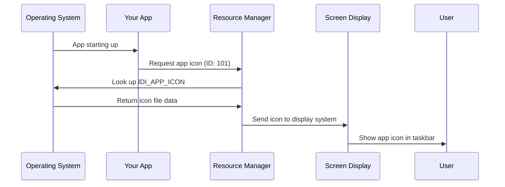

# Chapter 3: Platform Resource Management

Excellent progress! Now that you've learned about [Cross-Platform Plugin Registration](02_cross_platform_plugin_registration_.md) and how your app connects to native features, let's explore how your Public Safety Application manages the visual assets and resources that make it look and feel native on each platform.

## What Problem Are We Solving?

Imagine you're deploying your public safety app to emergency response teams across different platforms. Here's what you need:

- **Windows fire departments** expect apps to have `.ico` files for icons and follow Windows visual guidelines
- **iOS police units** need specific launch screens and app icons sized for mobile devices
- **Linux emergency management** requires icons in formats that work with their desktop environments

The challenge is that each platform has different requirements for app icons, splash screens, and configuration files. It's like having to provide different business cards for different countries - same information, but formatted according to local customs!

This is where **Platform Resource Management** comes to the rescue. Think of it as having a smart assistant who automatically provides the right "outfit" (icons, launch screens, utilities) for each platform your app runs on.

## Key Concepts

### 1. Platform-Specific Assets

Just like you wear different clothes for different occasions, your app needs different visual elements for each platform:

- **App Icons**: Windows uses `.ico`, iOS uses multiple PNG sizes
- **Launch Screens**: iOS shows launch images, Windows shows loading indicators differently
- **Configuration Files**: Each platform has its own way of storing app settings

### 2. Resource Identification System

Each platform uses a unique ID system to find and display your app's resources:

```cpp
#define IDI_APP_ICON  101
```

This line creates a "name tag" for your app icon that Windows can understand and use.

### 3. Utility Functions

Your app needs different helper tools on each platform to handle text, display, and system interactions properly.

## How Platform Resources Work

Let's see how your public safety app manages its visual identity across platforms.

### Windows Resource Management

On Windows, your app uses a resource header to organize its assets:

```cpp
#define IDI_APP_ICON  101
```

This simple line does something powerful:
1. **Creates an identifier**: `IDI_APP_ICON` becomes the "name" for your app's icon
2. **Assigns a number**: `101` is the unique ID Windows uses internally
3. **Enables lookup**: Windows can now find and display your icon when needed

### Platform Utility Functions

Each platform provides helper functions that make your app work smoothly. Here's what Windows offers:

```cpp
void CreateAndAttachConsole();
```

This function helps with debugging by:
1. **Creating a console window**: Provides a place to see diagnostic messages
2. **Attaching to output**: Connects your app's messages to the console
3. **Enabling debugging**: Lets developers see what's happening inside the app

### Text Processing Utilities

Different platforms handle text differently. Windows provides text conversion tools:

```cpp
std::string Utf8FromUtf16(const wchar_t* utf16_string);
```

This utility function:
1. **Takes Windows text**: Accepts text in Windows' native UTF-16 format
2. **Converts format**: Changes it to UTF-8 (universal text format)
3. **Returns usable text**: Provides text your Flutter app can easily use

## What Happens Under the Hood

Let's trace through what happens when your public safety app starts up and needs to display its icon:



### Step-by-Step Breakdown

1. **Startup**: Emergency responder launches your app
2. **Icon Request**: Your app asks the resource manager for its icon
3. **ID Lookup**: Resource manager uses ID `101` to find the right icon file
4. **File Retrieval**: Operating system locates and loads the icon data
5. **Display**: Icon appears in taskbar, window title, and other system locations

## Platform-Specific Implementation

### Windows Resource Configuration

Windows uses a header file to organize all app resources:

```cpp
#define IDI_APP_ICON  101

#ifdef APSTUDIO_INVOKED
#define _APS_NEXT_RESOURCE_VALUE  102
#endif
```

This configuration:
1. **Sets current icon ID**: `IDI_APP_ICON` gets ID number 101
2. **Reserves next ID**: `102` is ready for the next resource you add
3. **Manages numbering**: Prevents resource ID conflicts

### iOS Launch Screen Management

iOS handles visual startup differently, using asset catalogs:

```
ios/Runner/Assets.xcassets/LaunchImage.imageset/
```

This directory structure:
1. **Organizes launch images**: Keeps startup screens in the right place
2. **Supports multiple sizes**: iOS automatically picks the right size for each device
3. **Enables customization**: You can replace images with your own emergency response branding

### Cross-Platform Utility Functions

Each platform provides helper functions. Here's Windows' command-line processing:

```cpp
std::vector<std::string> GetCommandLineArguments();
```

This function:
1. **Reads startup commands**: Captures any special instructions given when launching
2. **Converts to standard format**: Changes Windows-specific text to universal format
3. **Returns organized list**: Provides arguments your Flutter code can easily use

## Real-World Example: Emergency Response Deployment

Let's see how this works when deploying to different emergency services:

### Fire Department (Windows)
- **Icon**: Uses `IDI_APP_ICON` (ID: 101) to display fire department customized icon
- **Text**: `Utf8FromUtf16()` ensures proper display of station names with special characters
- **Launch**: Windows resource system loads department-specific branding

### Police Department (iOS)
- **Launch Screen**: iOS automatically selects appropriate launch image size for tablets vs phones
- **Icon**: iOS asset catalog provides multiple icon sizes (small for notifications, large for home screen)
- **Branding**: Launch images can show police department logos and colors

### Emergency Management (Linux)
- **Integration**: Uses Linux desktop icon standards for system menu integration
- **Compatibility**: Resource management adapts to different Linux desktop environments
- **Accessibility**: Follows Linux accessibility guidelines for emergency response tools

## Asset Organization Structure

Your app organizes resources in a logical hierarchy:

```
Platform Resources
├── Windows
│   ├── Icons (.ico files)
│   ├── Resource definitions (resource.h)
│   └── Utility functions (utils.h)
├── iOS
│   ├── Launch screens (LaunchImage.imageset)
│   ├── App icons (multiple sizes)
│   └── Asset catalogs
└── Linux
    ├── Desktop icons (.png/.svg)
    ├── Application configs
    └── System integration files
```

Each platform gets exactly what it needs, organized the way it expects.

## Automatic Resource Selection

The beautiful part about platform resource management is that it works automatically:

```cpp
// Windows automatically uses IDI_APP_ICON when needed
// iOS automatically picks the right launch image size
// Linux automatically integrates with desktop environments
```

Your Flutter code doesn't need to worry about these details - the platform resource management system handles everything behind the scenes.

## Customization for Emergency Services

Platform resource management makes it easy to customize your app for different emergency services:

1. **Replace icon files** with department-specific designs
2. **Update launch screens** with service branding
3. **Modify resource definitions** to add new visual elements
4. **Keep Flutter code unchanged** - only platform resources change

## Conclusion

You've learned how Platform Resource Management acts like a smart wardrobe manager, automatically providing the right visual "outfit" for your app on each platform. This system ensures your Public Safety Application looks professional and native whether it's running on Windows computers in fire stations, iOS devices with police units, or Linux systems in emergency management centers.

The resource management handles icons, launch screens, and utility functions automatically, letting you focus on building great emergency response features instead of worrying about platform-specific asset requirements. Each platform gets exactly the resources it needs, organized the way it expects, all while keeping your main Flutter code completely unchanged.

You've now completed the foundation of understanding how Flutter apps adapt to different platforms - from startup entry points, through plugin registration, to resource management. These three concepts work together to create apps that feel truly native on every platform while sharing the same core functionality!

