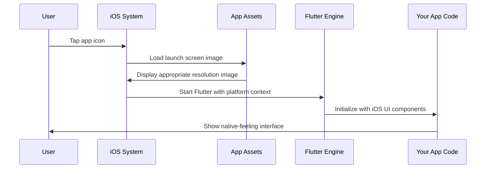

# Chapter 3: Platform UI Integration

Building on our understanding from [Platform-Specific Application Bootstrap](02_platform_specific_application_bootstrap_.md), we now need to explore how your public safety app actually looks and feels native on each platform. While bootstrap code gets your app running, Platform UI Integration is what makes it feel at home on each operating system.

## What Problem Are We Solving?

Imagine you're designing uniforms for emergency responders who work in different cities. Even though all responders do the same job, each city has its own uniform standards:

- **New York**: Navy blue with specific badge placement
- **Los Angeles**: Different shade of blue with different badge style  
- **Chicago**: Unique color scheme and patch requirements

The responders perform identical duties, but they need to look like they belong in their specific city. Similarly, your public safety app needs to look and behave like it naturally belongs on each operating system, even though the core functionality is identical.

Your app might display the same emergency information everywhere, but:
- **Linux users** expect GTK-style interfaces with specific window behaviors
- **Windows users** expect Win32-style dialogs and familiar Windows conventions
- **iOS users** expect Apple's design language and touch-optimized interfaces

Platform UI Integration solves this by providing the "costume department" resources that make your app look native on each platform.

## The Costume Department Analogy

Think of Platform UI Integration like a movie's costume department:

- **The Script (Your Flutter Code)**: The same story is told regardless of costumes
- **Period Costumes (Platform Resources)**: Different visual elements for different "time periods" (platforms)
- **Costume Designer (Flutter Framework)**: Automatically chooses the right costume for each scene (platform)

Just as actors need different costumes for different roles, your Flutter app needs platform-specific resources to blend in naturally with each operating system.

## Key Components of UI Integration

### 1. Launch Screens and Icons

Every platform needs visual elements that users see when your app starts and appears in their system.

**iOS Launch Screen Assets**:
```
ios/Runner/Assets.xcassets/LaunchImage.imageset/
├── LaunchImage.png          (1x resolution)
├── LaunchImage@2x.png       (2x resolution for Retina)  
├── LaunchImage@3x.png       (3x resolution for newer devices)
└── Contents.json            (tells iOS which image to use when)
```

This structure provides different image resolutions for different iOS devices. Think of it like having small, medium, and large versions of your emergency response team logo - iOS automatically picks the right size for each device.

### 2. Platform-Specific Resource Management

Each platform needs utilities to manage its specific UI requirements.

**Windows Resource Header**:
```c
#define IDI_APP_ICON    101

#ifdef APSTUDIO_INVOKED
#define _APS_NEXT_RESOURCE_VALUE    102
#endif
```

This code tells Windows "Resource number 101 is our app icon." It's like having a filing system where each visual element gets a specific number so Windows can find it quickly.

### 3. Platform Utility Functions

Each platform provides helper functions for common UI tasks.

**Windows Utility Functions**:
```c
// Creates a console for debugging
void CreateAndAttachConsole();

// Converts text between Windows and Flutter formats  
std::string Utf8FromUtf16(const wchar_t* utf16_string);
```

These utilities handle the "translation" between what Windows expects and what Flutter provides.

## Step-by-Step: How UI Integration Works

Let's trace what happens when a user launches your public safety app on an iOS device:



Here's what each step accomplishes:

1. **User taps icon**: iOS recognizes your app should start
2. **Load launch screen**: iOS automatically selects the right resolution launch image from your assets
3. **Display image**: User sees a native-looking launch screen while the app loads
4. **Start Flutter**: Flutter engine starts with iOS-specific UI context
5. **Initialize interface**: Your app code runs with access to iOS-style UI components
6. **Native experience**: User sees an interface that feels naturally iOS-like

## Looking Under the Hood: iOS Assets

### Launch Image Structure

```
LaunchImage.imageset/
├── LaunchImage.png      # Base resolution (1x)
├── LaunchImage@2x.png   # High resolution (2x) 
├── LaunchImage@3x.png   # Ultra-high resolution (3x)
```

iOS devices have different screen densities:
- **1x**: Older devices with standard screens
- **2x**: Retina displays (twice as sharp)
- **3x**: Super Retina displays (three times as sharp)

Flutter automatically provides the right image for each device - like having reading glasses that automatically adjust to the perfect prescription.

### Contents.json Configuration

```json
{
  "images": [
    {
      "filename": "LaunchImage.png",
      "scale": "1x"
    },
    {
      "filename": "LaunchImage@2x.png", 
      "scale": "2x"
    }
  ]
}
```

This JSON file is like an instruction manual that tells iOS: "For standard screens, use LaunchImage.png. For Retina screens, use LaunchImage@2x.png."

## Looking Under the Hood: Windows Resources

### Resource Definition

```c
#define IDI_APP_ICON    101
```

Windows uses numeric IDs to identify resources. This line creates a constant called `IDI_APP_ICON` with the value 101, so your code can say "load the app icon" instead of "load resource 101."

### Resource Value Management

```c
#ifdef APSTUDIO_INVOKED
#define _APS_NEXT_RESOURCE_VALUE    102
#define _APS_NEXT_COMMAND_VALUE     40001
#endif
```

This code helps Visual Studio (Microsoft's development tool) automatically assign new resource numbers. It's like having an automated filing system that assigns the next available folder number when you add new documents.

### Utility Functions Deep Dive

```c
std::string Utf8FromUtf16(const wchar_t* utf16_string);
```

This function converts text from Windows' preferred format (UTF-16) to Flutter's preferred format (UTF-8). Think of it as a translator that converts emergency messages between different radio protocols so all units can understand them.

```c
std::vector<std::string> GetCommandLineArguments();
```

This function captures any startup parameters passed to your app, like `myapp.exe --emergency-mode`. It returns them in a format Flutter can easily use.

## Platform Differences in Action

### iOS vs Windows UI Integration

**iOS** focuses on visual assets and touch interfaces:
```
Assets.xcassets/
├── AppIcon.iconset/     # App icons for home screen
├── LaunchImage.imageset/ # Launch screens  
└── Contents.json        # Asset configuration
```

**Windows** focuses on system integration and desktop conventions:
```c
// Windows resource management
#define IDI_APP_ICON    101
void CreateAndAttachConsole();  // Debug console
std::string Utf8FromUtf16();    // Text conversion
```

Both provide what their platform needs, but the implementations are completely different - like how emergency vehicles in different countries have different siren sounds but serve the same purpose.

## Real-World Example: Emergency Alert Display

Let's say your public safety app needs to show an urgent evacuation alert. Here's how UI integration ensures it looks native:

1. **Alert arrives**: Your Flutter code receives emergency data
2. **Platform integration activates**: Flutter uses platform-specific UI components
3. **Native appearance**: 
   - **iOS**: Alert uses iOS design language with rounded corners and system fonts
   - **Windows**: Alert uses Windows styling with standard system buttons
   - **Linux**: Alert uses GTK theming that matches user's desktop environment
4. **Consistent function**: All platforms show the same critical information, just styled appropriately

The emergency information is identical, but each platform presents it in a way that feels natural to users on that system.

## What We've Learned

Platform UI Integration is the "costume department" that makes your Flutter app look and feel native on each operating system. Key concepts:

- **Launch screens and icons** provide visual identity that matches platform conventions
- **Resource management systems** organize platform-specific assets efficiently  
- **Utility functions** handle the translation between Flutter and native platform requirements
- **Your core app logic stays identical** while the presentation adapts to each platform

This integration system ensures your public safety app feels at home whether it's running on an iOS field tablet, a Windows dispatch workstation, or a Linux emergency coordination center, while maintaining consistent functionality and data across all platforms.

With Platform UI Integration, we've completed our journey through the three foundational concepts that make cross-platform Flutter applications work seamlessly. Your app now has the plugin registration from [Chapter 1](01_cross_platform_plugin_registration_.md), the bootstrap system from [Chapter 2](02_platform_specific_application_bootstrap_.md), and the native UI integration we just explored - everything needed to create a truly native-feeling public safety application across all platforms.

