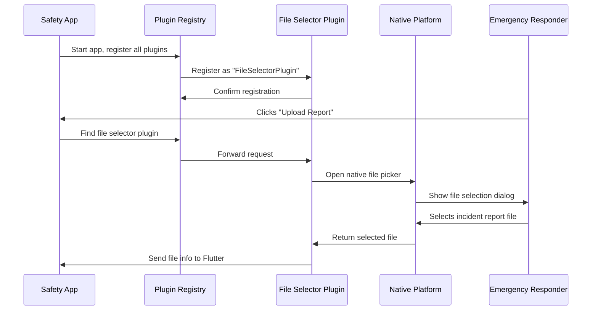

# Chapter 3: Plugin Registration System

Welcome back! In [Chapter 2: Platform Resource Management](02_platform_resource_management_.md), we learned how Flutter apps manage visual assets and platform-specific resources. Now we need to tackle another crucial challenge: how does your Flutter app actually use native platform features like opening files or launching web browsers?

## What Problem Does the Plugin Registration System Solve?

Imagine you're building a public safety app where emergency responders need to:
- Upload incident reports by selecting files from their computer
- Open emergency protocol websites in their default browser
- Access device-specific features like GPS or camera

Here's the challenge: Flutter runs in its own "bubble" and can't directly access these native platform features. It's like having a brilliant translator who speaks perfect "Flutter" but needs interpreters to communicate with the "native languages" of Windows, Linux, iOS, and Android.

Think of it like an international emergency response team. The Flutter coordinator (your app) needs to work with local specialists (native platform features). The Plugin Registration System acts like a universal communication hub that connects your Flutter coordinator with the right local expert for each task.

For example, when a user clicks "Upload Report" in your safety app, Flutter needs to ask the operating system to open a file picker. But Flutter doesn't know how to speak directly to Windows or Linux - it needs a plugin to translate this request.

## Breaking Down the Plugin Registration System

Let's understand the key concepts that make this translation possible:

### 1. Plugins as Translators

Plugins are specialized translators that know how to:
- Understand Flutter's requests ("I need to open a file picker")
- Translate those requests into native platform commands
- Send results back to Flutter in a format it understands

### 2. Registry as the Phone Book

The registry is like a phone book that keeps track of:
- Which plugins are available
- How to contact each plugin
- Which plugin handles which type of request

### 3. Automatic Registration

The system automatically connects all the plugins when your app starts, so Flutter knows exactly which translator to call for each task.

## How the Plugin Registration System Works in Our Public Safety App

Let's see how our app connects Flutter with native platform features.

### Available Plugins in Our App

Our public safety app uses two essential plugins:

```cpp
#include <file_selector_linux/file_selector_plugin.h>
#include <url_launcher_linux/url_launcher_plugin.h>
```

These two lines include the "translators" our app needs:
- **FileSelectorPlugin**: Handles file selection (like uploading incident reports)
- **UrlLauncherPlugin**: Handles opening web links (like emergency protocol websites)

### The Registration Process

Here's how the system registers these plugins on Linux:

```cpp
void fl_register_plugins(FlPluginRegistry* registry) {
  g_autoptr(FlPluginRegistrar) file_selector_linux_registrar =
      fl_plugin_registry_get_registrar_for_plugin(registry, "FileSelectorPlugin");
  file_selector_plugin_register_with_registrar(file_selector_linux_registrar);
}
```

Let's break this down step by step:

1. **Get a registrar**: The system creates a special "registration desk" for the FileSelectorPlugin
2. **Register the plugin**: The plugin signs up at this desk, saying "I'm available to handle file selection requests"

Think of this like checking into a hotel - the plugin gives its name at the front desk and gets a room key (the registrar) so the hotel staff can find it when needed.

### Cross-Platform Consistency

The same registration happens on Windows with slightly different syntax:

```cpp
void RegisterPlugins(flutter::PluginRegistry* registry);
```

Notice how the function name is different (`RegisterPlugins` vs `fl_register_plugins`) but the concept is identical. This shows how the Plugin Registration System adapts to each platform's conventions while maintaining the same core functionality.

## Under the Hood: How Plugin Registration Works

Let's trace through what happens when our public safety app starts up and needs to use a plugin:



Here's what happens step by step:

1. **App startup**: When the safety app starts, it calls the registration function
2. **Plugin registration**: Each plugin registers itself with a unique name
3. **Confirmation**: The registry confirms each plugin is available
4. **User action**: An emergency responder clicks "Upload Report"
5. **Plugin lookup**: Flutter asks the registry "Who handles file selection?"
6. **Request forwarding**: The registry connects Flutter to the FileSelectorPlugin
7. **Native interaction**: The plugin asks the operating system to show a file picker
8. **User interaction**: The responder selects their incident report file
9. **Result return**: The selected file information travels back through the chain to Flutter

## Deep Dive: Registration Implementation

Let's examine how the registration process works in detail.

### Linux Registration Function

```cpp
void fl_register_plugins(FlPluginRegistry* registry) {
  // Register file selector plugin
  g_autoptr(FlPluginRegistrar) file_selector_linux_registrar =
      fl_plugin_registry_get_registrar_for_plugin(registry, "FileSelectorPlugin");
  file_selector_plugin_register_with_registrar(file_selector_linux_registrar);
  
  // Register URL launcher plugin  
  g_autoptr(FlPluginRegistrar) url_launcher_linux_registrar =
      fl_plugin_registry_get_registrar_for_plugin(registry, "UrlLauncherPlugin");
  url_launcher_plugin_register_with_registrar(url_launcher_linux_registrar);
}
```

This function works like setting up a customer service department:

1. **Create service desks**: Each `get_registrar_for_plugin` call creates a dedicated service desk for a specific plugin
2. **Assign specialists**: Each `register_with_registrar` call assigns a specialist to handle requests at that desk
3. **Ready for business**: Once both plugins are registered, Flutter can send requests to either service desk

### The Registry Header File

```cpp
#ifndef GENERATED_PLUGIN_REGISTRANT_
#define GENERATED_PLUGIN_REGISTRANT_

#include <flutter_linux/flutter_linux.h>

// Registers Flutter plugins.
void fl_register_plugins(FlPluginRegistry* registry);

#endif
```

This header file acts like a business card that tells other parts of your app:
- "We have a plugin registration service available"
- "You can call `fl_register_plugins()` to set up all the translators"
- "Just provide a registry, and we'll handle the rest"

The `#ifndef` guards ensure this "business card" only gets printed once, even if multiple parts of your app try to include it.

### Automatic Generation

Notice the comment at the top of these files:

```cpp
//  Generated file. Do not edit.
```

This means Flutter automatically creates these files based on your app's configuration. When you add a new plugin to your `pubspec.yaml` file, Flutter updates these registration files automatically. It's like having an assistant who updates your phone book every time you hire a new specialist.

## Real-World Example: Emergency File Upload

Let's see how this works when an emergency coordinator needs to upload an incident report:

### The Flutter Side (What You Write)

```dart
// In your Flutter code
import 'package:file_selector/file_selector.dart';

// When user clicks upload button
final XFile? file = await openFile();
```

This simple Flutter code says "I need to open a file picker," but it doesn't know how to actually do it on Linux or Windows.

### The Plugin Connection (Automatic)

Thanks to the registration system, when this Flutter code runs:

1. Flutter looks up "Who handles file selection?" in the registry
2. The registry responds "FileSelectorPlugin handles that"
3. Flutter sends the request to FileSelectorPlugin
4. FileSelectorPlugin translates the request to native Linux/Windows commands
5. The native file picker appears
6. FileSelectorPlugin translates the result back to Flutter

All of this happens automatically because of the registration system we set up at app startup!

## Why This Matters for Your Public Safety App

Understanding the Plugin Registration System helps you realize why your app can:

- **Access native features**: File uploads, web browsers, GPS, camera - all through simple Flutter code
- **Work across platforms**: The same Flutter code works on Windows and Linux because different plugins handle the translation
- **Stay maintainable**: You write simple Flutter code while the plugins handle all the complex platform-specific details
- **Add new capabilities**: Need GPS access? Just add a location plugin to your `pubspec.yaml` and Flutter updates the registration automatically

## Extending Your App

As your public safety app grows, you might need additional plugins:

```yaml
# In pubspec.yaml
dependencies:
  file_selector: ^0.9.0
  url_launcher: ^6.0.0
  geolocator: ^9.0.0        # For GPS location
  camera: ^0.10.0           # For incident photos
  http: ^0.13.0             # For API communication
```

Each time you add a plugin, Flutter automatically updates the registration files to include the new translator. Your registration function might grow to look like:

```cpp
void fl_register_plugins(FlPluginRegistry* registry) {
  // File operations
  register_file_selector_plugin(registry);
  
  // Web and communication  
  register_url_launcher_plugin(registry);
  register_http_plugin(registry);
  
  // Hardware access
  register_geolocator_plugin(registry);
  register_camera_plugin(registry);
}
```

## Wrapping Up

In this chapter, we learned that the Plugin Registration System acts as a universal translator that connects your Flutter app with native platform features. Like an international emergency response team that needs interpreters to work with local specialists, your Flutter app uses plugins to communicate with platform-specific capabilities.

We explored how plugins register themselves as specialized translators, how the registry acts as a phone book to find the right plugin for each task, and how this entire system works automatically behind the scenes. Whether you're opening files on Linux or launching URLs on Windows, the same simple Flutter code works everywhere because the Plugin Registration System handles all the complex translation work.

This system is the bridge that makes Flutter truly cross-platform - your emergency response app can access native features on any platform while you focus on building great user experiences for first responders and emergency coordinators.

With these three foundational concepts - [Platform-Specific Application Containers](01_platform_specific_application_containers_.md), [Platform Resource Management](02_platform_resource_management_.md), and Plugin Registration System - you now understand how Flutter apps integrate seamlessly with different operating systems to create powerful, professional applications for public safety.

