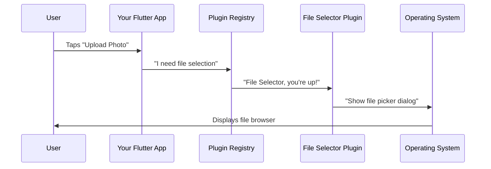
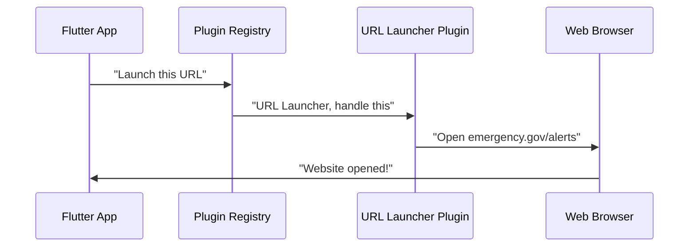
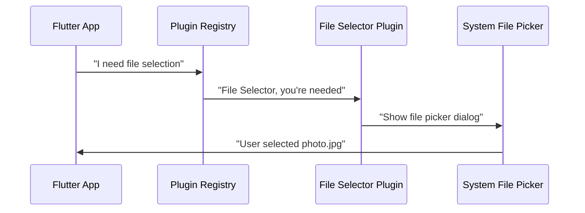
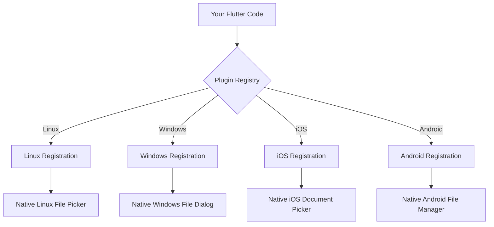

# Chapter 3: Plugin Registration System

Now that we understand how Flutter manages [Platform-Specific Resource Management](02_platform_specific_resource_management_.md) for different operating systems, let's explore how your app can access special features like opening files, launching websites, or using the camera. This is where the Plugin Registration System comes to the rescue!

## The Problem: Your App Needs Superpowers

Imagine you're building an emergency response app, and you need to:
- Let users select and upload incident photos from their device
- Open emergency websites when users tap "Get Help" 
- Access the device's GPS for location tracking
- Send emergency emails with attachments

Your Flutter app, by itself, can't directly access these device features. It's like being in a hotel room - you can control the lights and TV with the remote, but you need to call the front desk (the operating system) to access special services like room service or housekeeping.

That's where plugins come in! Plugins are like having a personal assistant who knows exactly who to call for each special service.

## What is the Plugin Registration System?

The Plugin Registration System is like a smart phone book that knows exactly which "assistant" (plugin) to call for each special task. When your emergency app says "I need to open a website," the registration system immediately knows: "Ah, you need the URL Launcher plugin on this platform!"

Think of it this way:
- **Your Flutter app**: "I need to let users select a file"
- **Plugin Registration System**: "Got it! Let me connect you to the File Selector plugin"
- **File Selector plugin**: "I'll handle that! Here's the native file picker for this device"

## Key Components: The Plugin Phone Book

Let's look at what plugins are registered in our public safety app. Here are the two main "assistants" we have available:

### 1. File Selector Plugin
This plugin helps users pick files from their device - perfect for uploading incident photos or documents.

### 2. URL Launcher Plugin  
This plugin opens websites and email apps - essential for emergency contact links and help resources.

Here's how they're registered on Linux:

```c
#include <file_selector_linux/file_selector_plugin.h>
#include <url_launcher_linux/url_launcher_plugin.h>
```

This code tells Linux: "Hey, I have two special assistants available - one for file selection and one for launching URLs. Here's where to find them!"

## How Plugin Registration Works

Let's trace what happens when a user wants to upload an emergency photo:



Here's what happens step by step:

1. **User action**: Someone taps the "Upload Incident Photo" button in your app
2. **App requests help**: Your Flutter code asks for file selection capability
3. **Registry finds helper**: The registration system looks up which plugin handles file selection
4. **Plugin takes over**: The File Selector plugin communicates with the operating system
5. **Native dialog appears**: The user sees their platform's familiar file picker

## Setting Up Plugin Registration

The beautiful thing about Flutter's plugin system is that it's **completely automatic**! You don't need to manually register plugins. When you add a plugin to your app, Flutter generates the registration code for you.

### Linux Plugin Registration

Let's examine how plugins are registered on Linux:

```c
void fl_register_plugins(FlPluginRegistry* registry) {
  g_autoptr(FlPluginRegistrar) file_selector_linux_registrar =
      fl_plugin_registry_get_registrar_for_plugin(registry, "FileSelectorPlugin");
  file_selector_plugin_register_with_registrar(file_selector_linux_registrar);
}
```

This code does three important things:

1. **Creates a registrar**: Think of this like getting a name tag for the File Selector plugin
2. **Gets the right plugin**: Asks the registry "Where's the FileSelectorPlugin?"  
3. **Registers the plugin**: Officially introduces the plugin to the system

The `g_autoptr` part is just Linux's way of saying "automatically clean up memory when we're done" - like automatically throwing away your coffee cup when you finish drinking.

### Windows Plugin Registration

Windows uses a simpler approach:

```cpp
void RegisterPlugins(flutter::PluginRegistry* registry);
```

This single line tells Windows: "Here's a function that will register all our plugins when the app starts." Windows then calls this function automatically during app startup.

## Real-World Example: Emergency Contact Features

Let's see how plugins work in practice with our emergency app:

### Scenario 1: Opening Emergency Website

```dart
// Your Flutter code (simplified)
onPressed: () {
  launch('https://emergency.gov/alerts');
}
```

**What happens behind the scenes:**



1. Your Flutter app calls `launch()` with the emergency website URL
2. The Plugin Registry finds the URL Launcher plugin
3. URL Launcher opens the device's default web browser
4. Users see the emergency alerts website

### Scenario 2: Uploading Incident Photos

```dart  
// Your Flutter code (simplified)
onPressed: () {
  selectFile();
}
```

**What happens behind the scenes:**



1. Your Flutter app calls `selectFile()` 
2. Plugin Registry connects to the File Selector plugin
3. File Selector opens the system's native file picker
4. User selects their incident photo, and it's returned to your app

## The Magic of Cross-Platform Registration

Here's the really cool part - the same Flutter code works on every platform, but each platform registers plugins in its own way:



When you write:
```dart
selectFile(); // Same code everywhere!
```

Each platform's registration system ensures users get their familiar, native file picker:
- **Linux users**: See their desktop environment's file manager
- **Windows users**: See the standard Windows file dialog  
- **iOS users**: See the iOS document picker
- **Android users**: See Android's file selector

## Understanding the Generated Files

Flutter automatically generates the registration files for you. Let's understand what they contain:

### Header Files (.h files)

```c
#ifndef GENERATED_PLUGIN_REGISTRANT_
#define GENERATED_PLUGIN_REGISTRANT_

void fl_register_plugins(FlPluginRegistry* registry);

#endif
```

This is like a table of contents that tells the system: "I have a function called `fl_register_plugins` that you can call to set up all plugins."

The `#ifndef` and `#endif` parts are just safety measures to prevent the same code from being included twice - like putting a "Do Not Duplicate" sticker on important documents.

### Implementation Files (.cc/.cpp files)

```c
void fl_register_plugins(FlPluginRegistry* registry) {
  // Register File Selector Plugin
  g_autoptr(FlPluginRegistrar) file_selector_registrar =
      fl_plugin_registry_get_registrar_for_plugin(registry, "FileSelectorPlugin");
  file_selector_plugin_register_with_registrar(file_selector_registrar);
  
  // Register URL Launcher Plugin  
  g_autoptr(FlPluginRegistrar) url_launcher_registrar =
      fl_plugin_registry_get_registrar_for_plugin(registry, "UrlLauncherPlugin");
  url_launcher_plugin_register_with_registrar(url_launcher_registrar);
}
```

This is the actual "phone book" that registers each plugin:

1. **Get a registrar**: Like getting a phone line for each plugin
2. **Register the plugin**: Connect the plugin to the phone line
3. **Repeat for each plugin**: Set up all the plugins your app needs

## Adding New Plugins to Your Emergency App

Want to add GPS location services to your emergency app? Here's how the plugin registration system makes it easy:

### Step 1: Add the Plugin
```yaml
# In your pubspec.yaml file
dependencies:
  geolocator: ^9.0.2
```

### Step 2: Flutter Updates Registration Automatically
When you run `flutter build`, Flutter automatically updates the registration files to include:

```c
// This gets added automatically!
#include <geolocator_linux/geolocator_plugin.h>

void fl_register_plugins(FlPluginRegistry* registry) {
  // Your existing plugins...
  
  // New GPS plugin gets registered automatically!
  g_autoptr(FlPluginRegistrar) geolocator_registrar =
      fl_plugin_registry_get_registrar_for_plugin(registry, "GeolocatorPlugin");
  geolocator_plugin_register_with_registrar(geolocator_registrar);
}
```

### Step 3: Use in Your App
```dart
// Now you can get the user's location for emergency dispatch!
Position position = await Geolocator.getCurrentPosition();
```

The plugin registration system automatically handles connecting your Flutter code to the device's GPS system!

## Why This System is Brilliant

The Plugin Registration System solves several challenges:

1. **Automatic Setup**: No manual configuration needed - Flutter handles everything
2. **Platform Native**: Each platform gets its familiar interface styles
3. **Type Safety**: Prevents calling plugins that don't exist on a platform
4. **Performance**: Only loads plugins that your app actually uses
5. **Easy Updates**: Adding new plugins is just one line in your config file

## Troubleshooting Plugin Registration

Sometimes you might encounter issues. Here are common problems and solutions:

### Problem: Plugin Not Found
**Error**: "No implementation found for method xyz"

**Solution**: The plugin isn't properly registered. Run:
```bash
flutter clean
flutter build
```

This regenerates the registration files with all your plugins included.

### Problem: Platform Not Supported
**Error**: Plugin works on Android but not Linux

**Solution**: Check if the plugin supports your target platform. Some plugins only work on mobile devices, while others work on desktop platforms too.

## What We've Learned

The Plugin Registration System is like having a smart personal assistant that knows exactly which specialist to call for each task. When your emergency response app needs special capabilities, the registration system automatically connects your Flutter code to the right native functionality on each platform.

Key takeaways:
- **Automatic Magic**: Flutter generates all registration code automatically
- **Cross-Platform Bridge**: Same Flutter code works on all platforms with native interfaces
- **Plugin Phone Book**: The registry knows exactly which plugin handles each capability  
- **Easy Extension**: Adding new features is as simple as adding a line to your config
- **Platform Native**: Users always see familiar, native dialogs and interfaces

Your public safety app can now access powerful device capabilities like file selection and URL launching, with each platform providing its own native experience. The plugin registration system ensures everything works seamlessly without you having to write platform-specific code.

This completes our journey through Flutter's core architecture! You now understand how Flutter creates a [Cross-Platform Flutter Application Structure](01_cross_platform_flutter_application_structure_.md), manages [Platform-Specific Resource Management](02_platform_specific_resource_management_.md), and connects to native features through the Plugin Registration System. You're ready to build amazing cross-platform applications!

