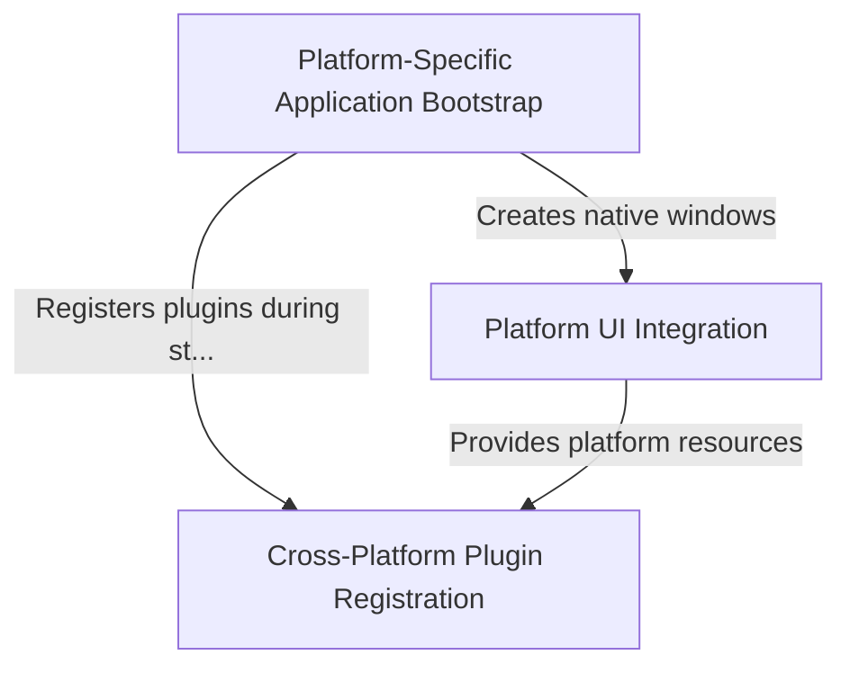

# Tutorial: Public_Safety_Application

This is a **Flutter-based Public Safety Application** that runs across multiple platforms including *iOS, Linux, and Windows*. 
The project contains the **platform-specific foundation code** that allows a single Flutter app to launch and function 
natively on different operating systems. It includes *plugin registration* for features like file selection and URL launching, 
*bootstrap code* to start the app on each platform, and *UI integration* components that make the app look and feel native 
on each device.

**Source Repository:** [https://github.com/pruthvirajt24/Public_Safety_Application](https://github.com/pruthvirajt24/Public_Safety_Application)

## Chapters

1. [Cross-Platform Plugin Registration
](01_cross_platform_plugin_registration_.md)
2. [Platform-Specific Application Bootstrap
](02_platform_specific_application_bootstrap_.md)
3. [Platform UI Integration
](03_platform_ui_integration_.md)
