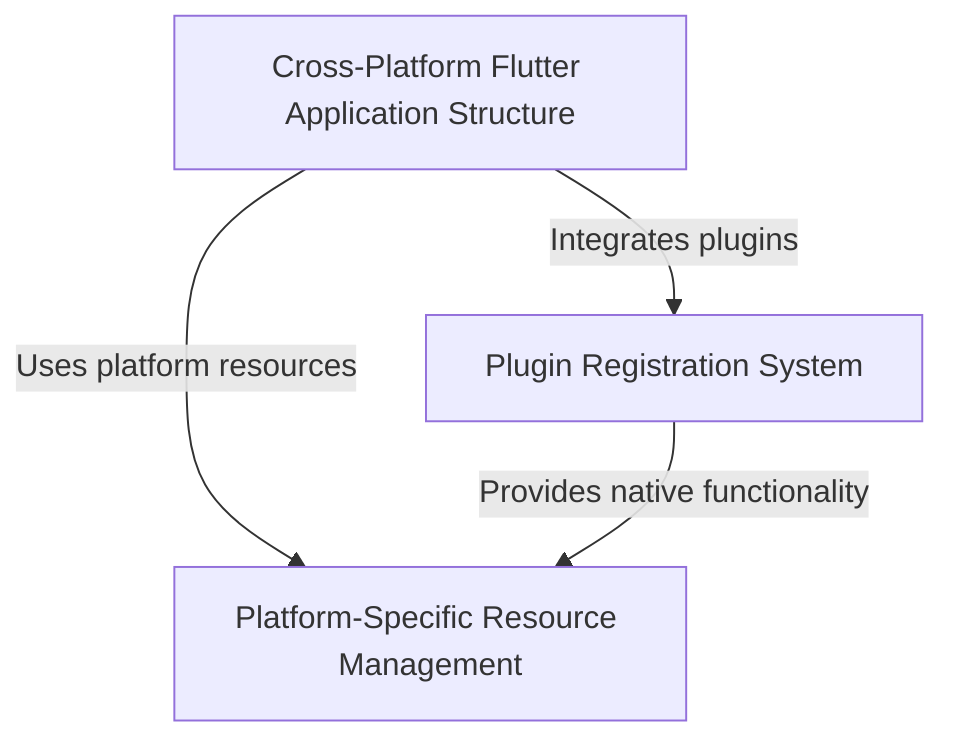

# Tutorial: Public_Safety_Application

This is a **Public Safety Application** built with *Flutter* that can run on multiple platforms including **iOS**, **Linux**, and **Windows**. 
The app uses Flutter's *cross-platform framework* to share the same core code across different operating systems, while each platform has its own specific setup files and native integrations. 
The application includes features like **file selection** and **URL launching** capabilities that work seamlessly on all supported platforms.

**Source Repository:** [https://github.com/pruthvirajt24/Public_Safety_Application](https://github.com/pruthvirajt24/Public_Safety_Application)

## Chapters

1. [Cross-Platform Flutter Application Structure
](01_cross_platform_flutter_application_structure_.md)
2. [Platform-Specific Resource Management
](02_platform_specific_resource_management_.md)
3. [Plugin Registration System
](03_plugin_registration_system_.md)
