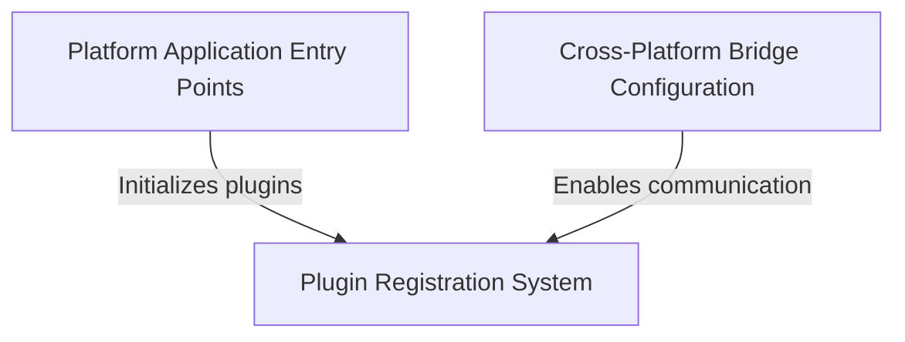

# Tutorial: Public_Safety_Application

The **Public Safety Application** is a **cross-platform Flutter app** that runs on multiple operating systems including *iOS*, *Linux*, and *Windows*. 
The app uses Flutter's framework to provide a unified user experience across different platforms while accessing **platform-specific features** 
like file selection and URL launching. Think of it as a safety-related mobile and desktop application that can work seamlessly whether you're 
using an iPhone, a Linux computer, or a Windows machine, all while maintaining the same core functionality but adapting to each platform's unique requirements.

**Source Repository:** [https://github.com/pruthvirajt24/Public_Safety_Application](https://github.com/pruthvirajt24/Public_Safety_Application)

## Chapters

1. [Platform Application Entry Points
](01_platform_application_entry_points_.md)
2. [Plugin Registration System
](02_plugin_registration_system_.md)
3. [Cross-Platform Bridge Configuration
](03_cross_platform_bridge_configuration_.md)
