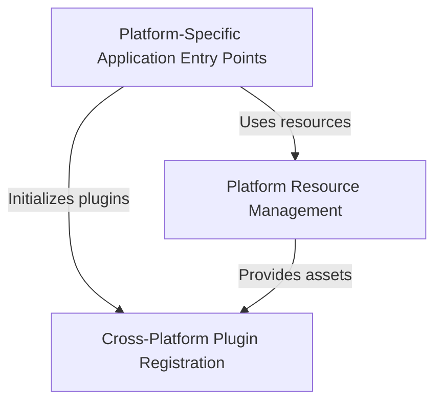

# Tutorial: Public_Safety_Application

This is a **Flutter-based Public Safety Application** that can run on multiple platforms including *iOS*, *Linux*, and *Windows*. 
The project uses Flutter's cross-platform framework to create a single app that works natively on different operating systems, 
with each platform having its own **entry point** and **plugin registration system** to connect Flutter with native platform features 
like *file selection* and *web browsing*. The app includes platform-specific resources and utilities to ensure it looks and behaves 
appropriately on each operating system.

**Source Repository:** [https://github.com/pruthvirajt24/Public_Safety_Application](https://github.com/pruthvirajt24/Public_Safety_Application)

## Chapters

1. [Platform-Specific Application Entry Points
](01_platform_specific_application_entry_points_.md)
2. [Cross-Platform Plugin Registration
](02_cross_platform_plugin_registration_.md)
3. [Platform Resource Management
](03_platform_resource_management_.md)
