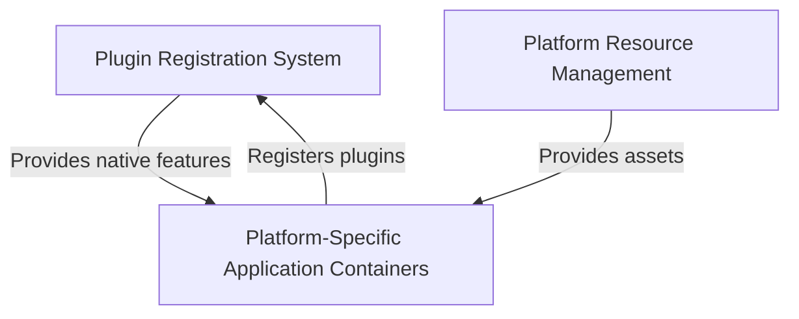

# Tutorial: Public_Safety_Application

This is a **Flutter-based Public Safety Application** that runs on multiple platforms (iOS, Android, Windows, Linux). 
Flutter is a *cross-platform framework* that allows developers to write one app that works on different operating systems.
The project includes **native platform containers** that wrap the Flutter app for each OS, a **plugin system** that connects 
Flutter to platform-specific features like file selection and URL launching, and **platform resources** like app icons 
and launch screens that make the app look native on each device.

**Source Repository:** [https://github.com/pruthvirajt24/Public_Safety_Application](https://github.com/pruthvirajt24/Public_Safety_Application)

## Chapters

1. [Platform-Specific Application Containers
](01_platform_specific_application_containers_.md)
2. [Platform Resource Management
](02_platform_resource_management_.md)
3. [Plugin Registration System
](03_plugin_registration_system_.md)
