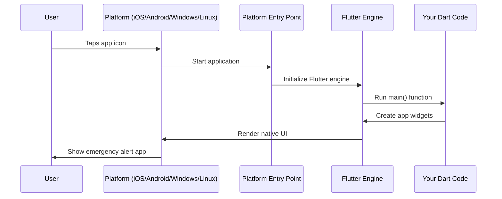

# Chapter 1: Cross-Platform Flutter Application Structure

Welcome to your journey into Flutter app development! In this chapter, we'll explore how Flutter creates apps that can run on different operating systems like iOS, Android, Windows, and Linux - all from the same codebase.

## What Problem Does This Solve?

Imagine you want to build a public safety app that emergency responders can use on their phones, tablets, and desktop computers. Without Flutter, you'd need to:

- Write one app in Swift for iOS devices
- Write another app in Java/Kotlin for Android
- Write a third app in C++ for Windows
- Write a fourth app in C for Linux

That's four completely different codebases to maintain! Flutter solves this by letting you write your app once and run it everywhere.

**Our Use Case**: We want to create a simple public safety app that displays an emergency alert. This same app should work whether a first responder is using an iPhone, Android tablet, or Windows laptop.

## The House Blueprint Analogy

Think of Flutter like a house blueprint. The blueprint (your Flutter code) describes what the house should look like - where the rooms go, how big the windows are, etc. But when you actually build the house, you need different foundations depending on the terrain:

- **Rocky ground (iOS)**: Needs a concrete foundation
- **Sandy soil (Android)**: Needs deep pilings  
- **Clay soil (Windows)**: Needs a basement foundation
- **Mountain terrain (Linux)**: Needs a stone foundation

Flutter works the same way - your main app code is the "blueprint," but each platform needs its own "foundation" to run properly.

## Key Concepts Breakdown

### 1. The Shared Flutter Core

This is your main app code written in Dart. It contains:
- Your app's screens and user interface
- Business logic (like processing emergency alerts)
- Shared functionality that works the same everywhere

```dart
// This is your main Flutter app code
void main() {
  runApp(PublicSafetyApp());
}
```

This single piece of code starts your app on any platform! Flutter handles the complexity of making it work everywhere.

### 2. Platform-Specific Entry Points

Each operating system needs its own "front door" to start your Flutter app. Let's look at how each platform creates this entry point:

**Linux Entry Point:**
```cpp
int main(int argc, char** argv) {
  MyApplication* app = my_application_new();
  return g_application_run(app, argc, argv);
}
```

This is Linux saying "Hey Flutter, start the app!" It creates a new application and tells Linux to run it.

**Windows Entry Point:**
```cpp
class FlutterWindow : public Win32Window {
  explicit FlutterWindow(const flutter::DartProject& project);
  // ... window setup code
};
```

Windows creates a special window that can host your Flutter app, like preparing a picture frame for your artwork.

**iOS Entry Point:**
```objc
#import "GeneratedPluginRegistrant.h"
```

iOS imports the necessary tools to register Flutter plugins and start your app.

### 3. The Connection Bridge

Each platform needs a way to connect its native system to your Flutter code. This is like having translators who can speak both the platform's native language and Flutter's language.

## Solving Our Use Case

Let's see how this structure helps us build our emergency alert app:

**Step 1: Write the Flutter App Once**
```dart
class EmergencyAlert extends StatelessWidget {
  Widget build(BuildContext context) {
    return Text('🚨 Emergency Alert: Evacuation Required');
  }
}
```

**Step 2: Flutter Handles Platform Differences**
- On iOS: Shows as native iOS text
- On Android: Shows as Material Design text  
- On Windows: Shows as Windows-styled text
- On Linux: Shows as GTK-styled text

The same code produces native-looking results on each platform!

## What Happens Under the Hood

Here's the step-by-step process when someone launches your public safety app:



Let's break this down:

1. **User Action**: Someone taps your app icon
2. **Platform Activation**: The operating system wakes up
3. **Entry Point**: The platform-specific code starts running
4. **Flutter Startup**: The Flutter engine initializes
5. **Your Code Runs**: Your Dart code executes
6. **UI Creation**: Flutter builds your user interface
7. **Native Rendering**: Each platform displays it in its native style

## Deep Dive: Platform Entry Points

Let's examine how each platform sets up its "foundation":

**Linux Foundation:**
```cpp
// Creates the application structure
MyApplication* my_application_new() {
  // Sets up GTK application
  // Prepares Flutter engine
  return new_app;
}
```

Linux uses GTK (a graphical toolkit) to create windows and handle user interactions. Your Flutter app runs inside this GTK container.

**Windows Foundation:**
```cpp
class FlutterWindow {
  flutter::DartProject project_;
  std::unique_ptr<flutter::FlutterViewController> controller_;
};
```

Windows creates a special window class that:
- Holds your Flutter project (`project_`)
- Contains a controller to manage the Flutter view (`controller_`)
- Handles Windows-specific events like clicking and resizing

The beauty is that you never have to write this platform-specific code yourself - Flutter generates it automatically!

## Resource Management Preview

Different platforms store and access files differently. Your emergency alert app might need to:
- Store alert sounds in different locations per platform
- Access device features like GPS or cameras
- Handle different screen sizes and orientations

Flutter's cross-platform structure handles these differences through [Platform-Specific Resource Management](02_platform_specific_resource_management_.md), which we'll explore in the next chapter.

## Conclusion

You've learned how Flutter creates a unified structure that works across all platforms while respecting each platform's unique requirements. The key insight is that Flutter acts like a universal translator - you write code once, and Flutter makes it speak each platform's native language.

In our next chapter, [Platform-Specific Resource Management](02_platform_specific_resource_management_.md), we'll explore how Flutter handles the different ways each platform manages files, images, and other resources that your public safety app will need.

Remember: You focus on building great emergency response features, and Flutter handles making them work everywhere!

