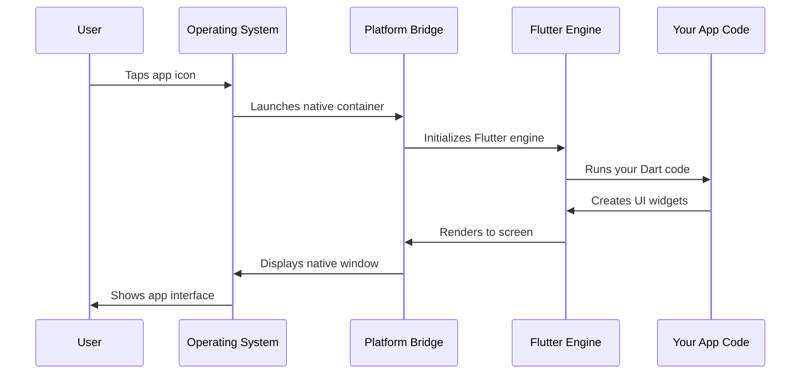

# Chapter 1: Cross-Platform Flutter Application Structure

## What Problem Does This Solve?

Imagine you want to build a public safety app that emergency responders can use whether they have an iPhone, Android phone, Windows laptop, or Linux computer. Traditionally, you'd need to write separate code for each platform - that's like writing the same book four times in different languages!

Flutter's cross-platform structure solves this by letting you write your app once and run it everywhere. It's like having a universal translator that takes your single Flutter codebase and makes it speak the native language of each operating system.

## The Real-World Use Case

Let's say you're building a Public Safety Application where:
- Police officers use iPhones in the field
- Dispatchers use Windows computers at headquarters  
- Emergency coordinators use Android tablets
- Some departments use Linux workstations

Instead of building four separate apps, Flutter's cross-platform structure lets you build one app that works on all these devices with the same features and user experience.

## Key Concepts Breakdown

### 1. The Universal Codebase
Think of your Flutter app like a recipe. The main recipe (your Flutter code) stays the same, but each kitchen (platform) might need slightly different tools to prepare it.

### 2. Platform-Specific Folders
Your Flutter project contains special folders for each platform:

```
my_safety_app/
├── lib/          # Your main Flutter code (universal)
├── ios/          # iPhone/iPad specific files
├── android/      # Android specific files
├── windows/      # Windows specific files
└── linux/        # Linux specific files
```

This is like having different instruction booklets for assembling the same piece of furniture in different countries - the end result is the same, but the assembly process is adapted to local standards.

### 3. Platform Bridges
Each platform folder contains "bridge" code that connects your Flutter app to the operating system, similar to how an interpreter helps two people speaking different languages communicate.

## How It Works: A Step-by-Step Walkthrough

Let's trace what happens when someone launches your public safety app:


```mermaid
sequenceDiagram
    participant User
    participant OS as Operating System
    participant Bridge as Platform Bridge
    participant Flutter as Flutter Engine
    participant App as Your App Code

    User->>OS: Taps app icon
    OS->>Bridge: Launches native container
    Bridge->>Flutter: Initializes Flutter engine
    Flutter->>App: Runs your Dart code
    App->>Flutter: Creates UI widgets
    Flutter->>Bridge: Renders to screen
    Bridge->>OS: Displays native window
    OS->>User: Shows app interface
```

## Platform-Specific Entry Points

Each platform needs its own "front door" to start your app. Let's look at how this works:

### Linux Entry Point
```cpp
#include "my_application.h"

int main(int argc, char** argv) {
  g_autoptr(MyApplication) app = my_application_new();
  return g_application_run(G_APPLICATION(app), argc, argv);
}
```

This is like the main entrance to a Linux building - it creates the application and tells the Linux system to run it. The `main` function is the first thing that runs when someone clicks your app icon on Linux.

### Windows Entry Point
```cpp
class FlutterWindow : public Win32Window {
 public:
  explicit FlutterWindow(const flutter::DartProject& project);
  
 protected:
  bool OnCreate() override;
  void OnDestroy() override;
};
```

The Windows version creates a special window class that knows how to host Flutter apps. Think of it as a picture frame that's specifically designed to hold Flutter paintings - it provides the right environment for your app to display properly on Windows.

### iOS Configuration
```
ios/Runner/Assets.xcassets/LaunchImage.imageset/
└── README.md  # Instructions for customizing launch screen
```

iOS uses a different approach with asset catalogs and launch images. This is like having a welcome mat that shows while your app is loading - it gives users immediate feedback that something is happening.

## Under the Hood: How the Magic Happens

### Step 1: Platform Detection
When you run `flutter build`, Flutter automatically detects which platform you're targeting and uses the appropriate folder:

```bash
flutter build ios     # Uses ios/ folder
flutter build windows # Uses windows/ folder  
flutter build linux   # Uses linux/ folder
```

### Step 2: Code Compilation
Flutter takes your Dart code and compiles it differently for each platform:
- **iOS/Android**: Compiles to native ARM code for performance
- **Windows/Linux**: Compiles to native x64 code
- All platforms get the same app logic, just in their preferred "language"

### Step 3: Platform Integration
Each platform folder contains configuration files that tell the operating system:
- What permissions your app needs
- What the app icon looks like  
- How much memory to allocate
- Which system services to connect to

This is like having different business licenses for the same store in different cities - the store sells the same products, but each city has its own paperwork requirements.

## Practical Example: Adding a New Feature

When you add a new feature to your public safety app (like GPS tracking), you only write the code once in the `lib/` folder:

```dart
// lib/gps_service.dart
class GPSService {
  Future<Location> getCurrentLocation() {
    // Your GPS logic here
    return location;
  }
}
```

Flutter automatically makes this feature available on all platforms! The cross-platform structure handles translating your GPS request into:
- Core Location calls on iOS
- Location Manager calls on Android  
- Native location APIs on Windows/Linux

## Why This Structure Matters for Public Safety

For a public safety application, this cross-platform structure provides crucial benefits:

1. **Consistent Experience**: All responders see the same interface regardless of device
2. **Faster Updates**: Fix a bug once, and it's fixed everywhere
3. **Cost Effective**: One development team instead of four
4. **Easier Training**: Personnel only need to learn one app interface

## Conclusion

Flutter's cross-platform application structure is like having a universal remote that works with any TV brand. You write your app once, and Flutter's platform-specific folders ensure it runs natively on iOS, Android, Windows, and Linux with optimal performance and proper integration.

The key insight is that while your main app code stays the same, each platform gets its own "adapter" that makes everything work smoothly with that operating system's expectations and requirements.

In the next chapter, we'll dive deeper into how these [Platform-Specific Application Containers](02_platform_specific_application_containers_.md) actually work and how you can customize them for your public safety application's specific needs.

