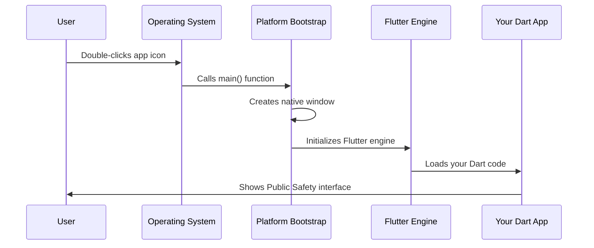

# Chapter 1: Platform Application Bootstrap

Welcome to your journey into understanding Flutter's platform-specific code! In this chapter, we'll explore how Flutter applications start up on different operating systems like Windows, Linux, and iOS.

## What Problem Does This Solve?

Imagine you've built a beautiful Flutter app for public safety - maybe it helps emergency responders coordinate during incidents. Your app works great, but here's the challenge: **every operating system speaks a different language when it comes to starting applications**.

Think of it like this: if your Flutter app is a universal translator, each platform (Windows, Linux, iOS) is like a different country with its own customs for welcoming visitors. The Platform Application Bootstrap is like having a local guide in each country who knows exactly how to introduce your app to that specific operating system.

Let's say you want your public safety app to run on a Linux computer in a dispatch center, a Windows laptop for field coordinators, and iPads for first responders. Each of these devices needs a different "startup procedure" to launch your Flutter app properly.

## Key Concepts Breakdown

### 1. The Ignition System Analogy

Just like a car's ignition system starts the engine differently for different car models, Platform Application Bootstrap handles the startup sequence for each operating system:

- **Linux**: Uses GTK (a graphics toolkit) to create windows
- **Windows**: Uses Win32 APIs to create native Windows
- **iOS**: Uses UIKit framework (we'll focus on Linux and Windows in our examples)

### 2. Native Environment Setup

Each platform needs to:
1. Create a main application window
2. Initialize the Flutter engine
3. Connect Flutter to the native operating system features

## How to Use Platform Application Bootstrap

Let's see how this works in practice with our Public Safety Application:

### Linux Startup Process

Here's how your app starts on Linux:

```cpp
int main(int argc, char** argv) {
  g_autoptr(MyApplication) app = my_application_new();
  return g_application_run(G_APPLICATION(app), argc, argv);
}
```

This tiny piece of code is like pressing the "power button" on Linux. Here's what happens:
1. `my_application_new()` creates a new application instance
2. `g_application_run()` actually starts the application
3. The function returns an exit code when the app closes

**Input**: Command line arguments (like `./my_app --debug`)
**Output**: Your Flutter app window appears on the Linux desktop!

### Application Definition (Linux)

The application is defined in a header file:

```cpp
G_DECLARE_FINAL_TYPE(MyApplication, my_application, MY, APPLICATION,
                     GtkApplication)

MyApplication* my_application_new();
```

This is like creating a blueprint for your app. It tells Linux: "Hey, I'm creating a new type of application called MyApplication, and it's based on GTK."

### Windows Startup Process

On Windows, the startup looks different:

```cpp
class FlutterWindow : public Win32Window {
 public:
  explicit FlutterWindow(const flutter::DartProject& project);
  
 protected:
  bool OnCreate() override;
  void OnDestroy() override;
};
```

This creates a Windows-specific window class. Think of it as designing a picture frame that perfectly fits Windows' style, then putting your Flutter app inside that frame.

**Input**: A Dart project configuration
**Output**: A native Windows window hosting your Flutter application

## Internal Implementation Walkthrough

Let's trace through what happens when someone double-clicks your Public Safety app icon:



### Step-by-Step Breakdown

1. **User Action**: Someone clicks your app icon or runs it from command line
2. **OS Handoff**: The operating system looks for the main entry point
3. **Bootstrap Takes Over**: Platform-specific code creates the foundation
4. **Flutter Initialization**: The Flutter engine starts up within the native environment
5. **Your App Appears**: Your Dart/Flutter code finally runs and shows the UI

### Deep Dive: Linux Implementation

In the Linux version, here's what happens under the hood:

```cpp
// This is the entry point Linux calls
int main(int argc, char** argv) {
  // Create our application instance
  g_autoptr(MyApplication) app = my_application_new();
```

The `g_autoptr` is like having an automatic assistant that cleans up memory for you. It creates your application and will automatically delete it when done.

```cpp
  // Hand control over to the GTK system
  return g_application_run(G_APPLICATION(app), argc, argv);
}
```

This line says: "GTK system, please take my app and run it according to Linux conventions!"

### Deep Dive: Windows Implementation

The Windows version uses a class-based approach:

```cpp
class FlutterWindow : public Win32Window {
  flutter::DartProject project_;
  std::unique_ptr<flutter::FlutterViewController> flutter_controller_;
};
```

This creates a specialized window that:
- Inherits from `Win32Window` (gets all standard Windows behavior)
- Stores a reference to your Dart project
- Contains a Flutter controller to manage the Flutter engine

## Real-World Example

When a dispatcher opens your Public Safety Application:

1. **Linux Dispatch Center**: GTK creates a window, Flutter engine loads, your emergency response interface appears
2. **Windows Field Laptop**: Win32 creates a native Windows window, Flutter renders your incident management UI
3. **Result**: Same Flutter app, perfectly integrated with each platform's look and feel

## Conclusion

Platform Application Bootstrap is your app's multilingual introduction service! It ensures your Flutter application can properly introduce itself to any operating system and start up using that platform's native conventions.

The key takeaway: you write your Flutter app once, but each platform needs its own "launching pad" to get your app running smoothly.

In the next chapter, we'll explore how these platform-specific environments connect to Flutter plugins and native device features through the [Platform Plugin Registry](02_platform_plugin_registry_.md).

