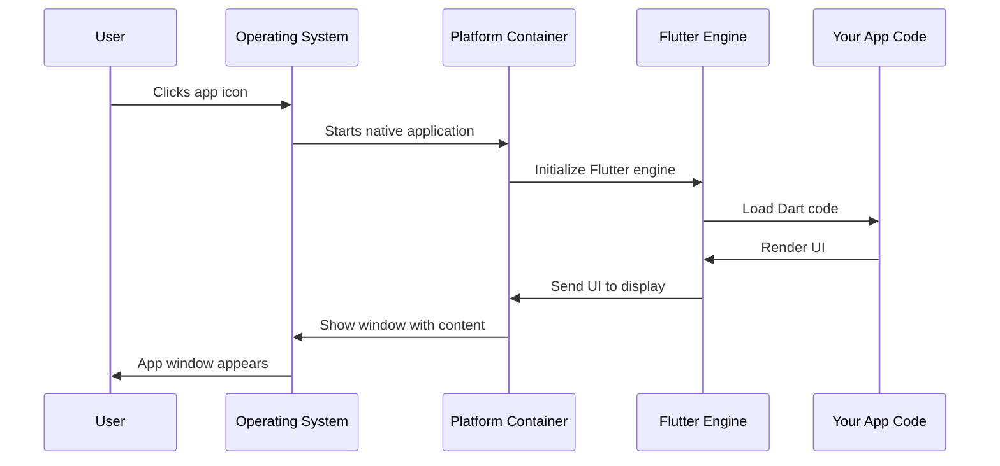

# Chapter 1: Platform Application Containers

Welcome to the exciting world of building cross-platform applications! In this chapter, we'll explore one of the fundamental concepts that makes your Flutter app work seamlessly across different operating systems: **Platform Application Containers**.

## The Picture Frame Problem

Imagine you've created a beautiful digital artwork (your Flutter app) and you want to display it in different rooms of your house. Each room has different lighting, wall colors, and available space. You can't just stick the artwork directly on the wall - you need the right frame for each room to make it look perfect and stay securely mounted.

This is exactly the challenge Flutter apps face when running on different operating systems like Linux and Windows. Your beautiful Flutter UI needs a "frame" - a native container that knows how to talk to each operating system and display your app properly.

Let's say you're building a **Public Safety Application** that emergency responders will use on both Linux and Windows computers. The core functionality (maps, incident reporting, communication tools) is the same, but each operating system needs its own "wrapper" to make everything work smoothly.

## What Are Platform Application Containers?

Platform Application Containers are special pieces of code that act as the "shells" or "wrappers" for your Flutter app on each operating system. Think of them as:

- **The window frame** that holds your app's content
- **The translator** that speaks the native language of each OS
- **The foundation** where your Flutter UI gets displayed

Each platform (Linux, Windows, macOS, etc.) has its own container because each operating system has different ways of creating windows, handling events, and managing applications.

## Key Components of Platform Containers

Let's break down the essential parts that make these containers work:

### 1. The Entry Point

Every application needs a starting point - like the front door of your house:

```cpp
int main(int argc, char** argv) {
  g_autoptr(MyApplication) app = my_application_new();
  return g_application_run(G_APPLICATION(app), argc, argv);
}
```

This is the Linux entry point from `linux/main.cc`. When someone clicks on your app icon, this code runs first. It creates a new application instance and tells the operating system "Hey, start running this app!"

### 2. The Application Class

The application class is like the blueprint for your app's window:

```cpp
G_DECLARE_FINAL_TYPE(MyApplication, my_application, MY, APPLICATION,
                     GtkApplication)
```

This line from `linux/my_application.h` tells Linux "We're creating a new type of application based on GTK (Linux's windowing system)." It's like saying "We want a window that follows Linux's rules and appearance."

### 3. The Flutter Window Container

On Windows, we have a specialized container that hosts Flutter content:

```cpp
class FlutterWindow : public Win32Window {
 public:
  explicit FlutterWindow(const flutter::DartProject& project);
  virtual ~FlutterWindow();
```

This Windows container from `windows/runner/flutter_window.h` inherits from `Win32Window`, meaning it knows how to be a proper Windows application while hosting Flutter content.

## How Platform Containers Solve Our Use Case

Let's walk through how these containers help our Public Safety Application work on both Linux and Windows:

**On Linux:**
```cpp
MyApplication* my_application_new();
```
- Creates a GTK-based application that follows Linux desktop conventions
- Integrates with Linux system menus and window management
- Handles Linux-specific events like keyboard shortcuts

**On Windows:**
```cpp
FlutterWindow(const flutter::DartProject& project);
```
- Creates a Win32-based window that looks and feels native to Windows
- Integrates with Windows taskbar and system notifications
- Handles Windows-specific events like window resizing and focus

## Under the Hood: How It All Works Together

Here's what happens when a user launches your Public Safety Application:



Let's examine the key steps:

### Step 1: Native Application Startup

When the user clicks your app, the OS runs the platform-specific entry point:

```cpp
// Linux version
int main(int argc, char** argv) {
  g_autoptr(MyApplication) app = my_application_new();
```

This creates a native application object that the operating system recognizes and can manage.

### Step 2: Window Creation and Setup

The platform container creates and configures the main window:

```cpp
// Windows version
bool OnCreate() override;
void OnDestroy() override;
```

These methods handle the window lifecycle - what happens when the window is created, resized, or closed.

### Step 3: Flutter Engine Integration

The container initializes the Flutter engine within the native window:

```cpp
std::unique_ptr<flutter::FlutterViewController> flutter_controller_;
```

This controller manages the Flutter rendering engine and ensures your Dart/Flutter code can draw into the native window.

## The Beauty of This Architecture

The brilliant thing about Platform Application Containers is that they handle all the complex, platform-specific details so you don't have to. Your Flutter code for the Public Safety Application - the maps, forms, buttons, and business logic - remains exactly the same across platforms. Only these thin container layers change.

Think of it like having different picture frames for the same artwork - the art stays the same, but each frame is perfectly suited to its environment.

## What We've Learned

In this chapter, we discovered that:

- Platform Application Containers are the native "shells" that hold Flutter apps
- Each operating system needs its own container type (GTK for Linux, Win32 for Windows)
- These containers handle window management, system integration, and Flutter engine hosting
- Your actual app code stays the same across platforms - only the containers change

This foundation makes it possible for Flutter to be truly cross-platform while still feeling native on each operating system.

Next, we'll explore how Flutter communicates between your Dart code and these native containers through [Cross-Platform Bridge Headers](02_cross_platform_bridge_headers_.md), which act as the translation layer between different programming languages and systems.

