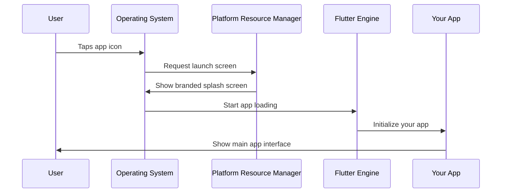
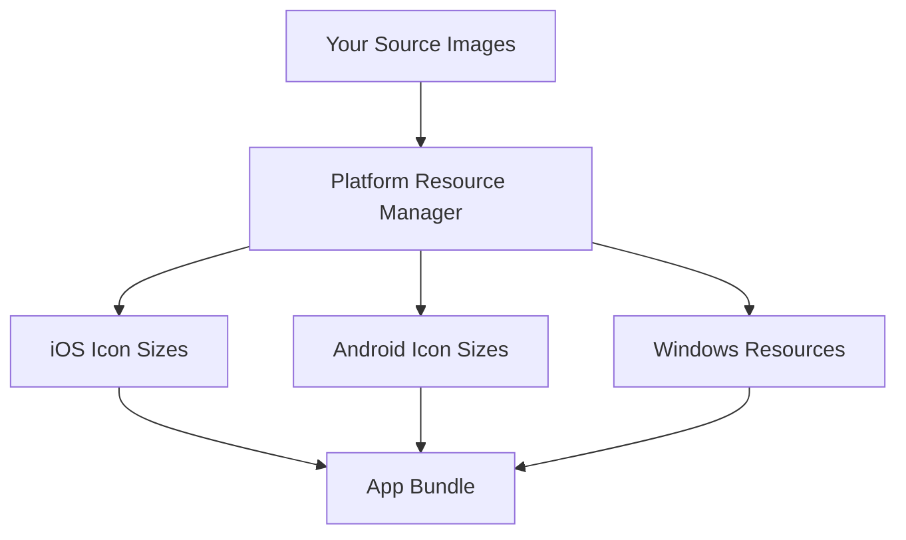

# Chapter 1: Platform Resource Management

Welcome to your first chapter in understanding how Flutter apps look professional and polished on different devices! Let's start with something you see every day but might not think about much.

## The Problem: Making Your App Look Professional

Imagine you've built an amazing public safety app that can help people in emergencies. But when users download your app, they see a generic Flutter logo instead of your custom emergency services icon. When they open the app, they're greeted with a plain white screen instead of a branded splash screen that shows your app's purpose.

This is like having a great restaurant but forgetting to put up a proper sign or having a welcoming entrance. People judge apps by their first impression, just like they judge restaurants!

**Platform Resource Management** solves this problem. It's the system that manages all the visual assets that represent your app to users - things like icons, splash screens, and other branding elements that appear before your main app even loads.

## What Are Platform Resources?

Think of platform resources as your app's "business card" or "storefront display." They include:

1. **App Icons** - The small pictures that appear on your phone's home screen
2. **Launch/Splash Screens** - The first screen users see while your app is loading
3. **Visual Assets** - Other images and graphics that help brand your app

Let's break these down one by one.

### App Icons: Your App's Face

Your app icon is like a tiny billboard for your app. It needs to look good at different sizes and on different platforms (iOS, Android, Windows, etc.).

```dart
// This is handled automatically by Flutter's build system
// You just need to provide the right image files
```

Each platform has different requirements for icon sizes. iOS might need a 1024x1024 pixel version, while Android needs multiple sizes. Platform Resource Management handles this complexity for you!

### Launch Screens: The First Impression

A launch screen appears immediately when someone taps your app icon. It's shown while your app loads in the background.

```yaml
# In your pubspec.yaml file
flutter_icons:
  android: true
  ios: true
  image_path: "assets/icon/app_icon.png"
```

This simple configuration tells Flutter to generate all the different icon sizes needed for both Android and iOS platforms automatically.

## How Platform Resource Management Works

Let's walk through what happens when a user taps your app icon:



Here's what each step means:

1. **User taps icon**: The operating system looks for your app's icon (managed by Platform Resource Management)
2. **Launch screen appears**: While your app loads, the system shows your custom splash screen
3. **App loads**: Flutter starts up your actual app code
4. **Transition**: The splash screen disappears and your main app appears

## Setting Up Your App Resources

Let's solve our use case: making your Public Safety App look professional. Here's how you'd set up the basic resources:

### Step 1: Prepare Your Assets

First, create a high-quality app icon (at least 1024x1024 pixels):

```
assets/
  icons/
    app_icon.png    # Your main app icon
  images/
    splash_logo.png # Logo for splash screen
```

### Step 2: Configure Icon Generation

Add this to your `pubspec.yaml`:

```yaml
dev_dependencies:
  flutter_launcher_icons: ^0.13.1

flutter_icons:
  android: "launcher_icon"
  ios: true
  image_path: "assets/icons/app_icon.png"
```

This tells Flutter to automatically create all the different icon sizes needed for each platform.

### Step 3: Set Up Launch Screens

For iOS, you'll work with the launch screen assets:

```
ios/Runner/Assets.xcassets/LaunchImage.imageset/
  LaunchImage.png
  LaunchImage@2x.png
  LaunchImage@3x.png
```

Each file is a different resolution of the same launch screen image for different device types.

## Under the Hood: How It All Works

When you build your Flutter app, the Platform Resource Management system does several things automatically:

### Resource Processing



The system takes your single source image and creates dozens of different sizes and formats needed by each platform.

### Platform-Specific Handling

Looking at the Windows resources as an example:

```cpp
// From windows/runner/resource.h
#define IDI_APP_ICON  101
```

This code tells Windows where to find your app's icon. Each platform has its own way of handling resources, but Platform Resource Management abstracts this complexity away from you.

### Build-Time Generation

When you run `flutter build`, the system:

1. **Reads** your configuration from `pubspec.yaml`
2. **Processes** your source images
3. **Generates** platform-specific resource files
4. **Embeds** them into your app bundle

```bash
flutter packages pub run flutter_launcher_icons:main
```

This command processes all your icons and creates the platform-specific versions automatically.

## The Result: Professional App Presentation

After setting up Platform Resource Management, your Public Safety App will:

- Display a professional emergency services icon on users' home screens
- Show a branded splash screen with your logo when opening
- Look consistent and polished across iOS, Android, and other platforms
- Load with the visual professionalism that builds user trust

This is especially important for a public safety app where users need to trust that your app is legitimate and professional.

## What We've Learned

Platform Resource Management is your app's "dress code" - it ensures your app always looks professional and branded correctly. It handles the complex task of creating the right visual assets for each platform, so you can focus on building great features instead of worrying about icon sizes and splash screen formats.

In our next chapter, we'll explore the [Plugin Registration System](02_plugin_registration_system_.md), which manages how your Flutter app connects with platform-specific features like GPS, cameras, and emergency calling capabilities.

