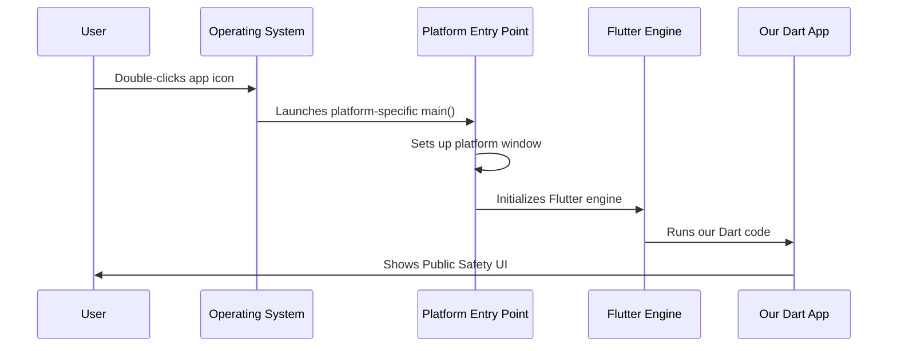

# Chapter 1: Platform-Specific Application Entry Points

Welcome to the Public Safety Application tutorial! In this first chapter, we'll explore one of the most fundamental concepts in cross-platform app development: **Platform-Specific Application Entry Points**.

## What Problem Do Entry Points Solve?

Imagine you're building a house that needs to work in different countries. In Japan, you might need a genkan (entrance area for removing shoes), while in the United States, you might need a front porch. The core house is the same, but each country has different expectations for how you enter and interact with it.

This is exactly the challenge our Public Safety Application faces! We want to create one Flutter app that works on both Linux and Windows, but each operating system has its own "rules" for how applications should start up and behave.

**Our Use Case**: We need our Public Safety Application to launch properly on both Linux (which uses GTK) and Windows (which uses Win32 APIs), even though these systems work very differently under the hood.

## Key Concepts

Let's break this down into simple, digestible pieces:

### 1. The "Front Door" Concept

Each platform needs its own "front door" - a special file that knows how to:
- Start the application using that platform's rules
- Create a window using that platform's graphics system  
- Handle basic lifecycle events (like closing the app)

### 2. Platform Separation

Rather than trying to make one file work everywhere (which would be messy!), we create separate entry points:
- **Linux**: Uses `main.cc` and follows GTK conventions
- **Windows**: Uses `main.cpp` and follows Win32 conventions

## How It Works: A Step-by-Step Walkthrough

Let's trace what happens when a user double-clicks our Public Safety Application:



Now let's see this in action with real code!

## Linux Entry Point

On Linux, our entry point is beautifully simple:

```c
#include "my_application.h"

int main(int argc, char** argv) {
    g_autoptr(MyApplication) app = my_application_new();
    return g_application_run(G_APPLICATION(app), argc, argv);
}
```

This code does three important things:
1. **Creates our app**: `my_application_new()` builds a new instance
2. **Starts the app**: `g_application_run()` begins the GTK application lifecycle  
3. **Returns status**: When the app closes, it returns a status code to Linux

The `g_autoptr` is a helpful GTK feature that automatically cleans up memory - think of it as an automatic janitor!

## Windows Entry Point Structure

Windows needs a bit more setup. Let's look at the window creation header:

```cpp
class FlutterWindow : public Win32Window {
public:
    explicit FlutterWindow(const flutter::DartProject& project);
    virtual ~FlutterWindow();
};
```

This creates a special window class that:
- **Inherits from Win32Window**: Gets basic Windows window behavior
- **Takes a DartProject**: Knows which Flutter app to run inside the window
- **Has a destructor**: Cleans up resources when the window closes

The Windows entry point also includes helpful utilities:

```cpp
// Creates a console for debugging
void CreateAndAttachConsole();

// Converts Windows text encoding to standard UTF-8
std::string Utf8FromUtf16(const wchar_t* utf16_string);
```

These utilities solve Windows-specific challenges like text encoding and debugging support.

## Under the Hood: What Really Happens

When you launch the Public Safety Application, here's the detailed process:

### Linux Launch Sequence
1. **Linux starts our main()**: The operating system calls our `main.cc` file
2. **GTK initialization**: `my_application_new()` sets up GTK graphics system
3. **Window creation**: GTK creates a window using Linux's display system
4. **Flutter embedding**: The Flutter engine gets embedded in the GTK window
5. **Dart code runs**: Our actual Public Safety app logic starts running

### Windows Launch Sequence  
1. **Windows starts our main()**: The operating system calls our Windows-specific main file
2. **Win32 initialization**: Windows graphics APIs are initialized
3. **Flutter window creation**: Our `FlutterWindow` class creates a Windows-native window
4. **Flutter embedding**: The Flutter engine gets embedded in the Win32 window  
5. **Dart code runs**: Our Public Safety app logic starts running

## Real-World Example

Let's say a police officer needs to quickly open our Public Safety Application:

**On Linux (Ubuntu police computer):**
```bash
# Officer double-clicks the app icon
# Linux runs: ./public_safety_app
# Our main.cc gets called
# GTK creates a native Linux window
# Flutter renders our emergency interface
```

**On Windows (Windows police laptop):**
```cmd
# Officer double-clicks the app icon  
# Windows runs: public_safety_app.exe
# Our Windows main.cpp gets called
# Win32 creates a native Windows window
# Flutter renders the same emergency interface
```

The amazing thing? Even though the entry points are completely different, the officer sees the exact same Public Safety interface on both systems!

## Why This Approach Works

This platform-specific approach gives us several benefits:

1. **Native Feel**: Each platform gets windows and behaviors that feel "right" for that system
2. **Performance**: We use each platform's optimized graphics systems directly
3. **Maintenance**: Platform-specific code stays separate and manageable
4. **Flexibility**: We can add platform-specific features when needed

## Conclusion

Platform-Specific Application Entry Points are like having different keys for different doors - each one is perfectly shaped for its specific lock. By creating separate entry points for Linux and Windows, our Public Safety Application can launch smoothly on both platforms while providing a native experience for users.

The entry points handle all the complex platform-specific setup work, so our main Flutter application code can focus on what really matters: helping keep communities safe.

In the next chapter, we'll explore how these entry points manage platform-specific resources like memory, graphics, and system APIs: [Platform Resource Management](02_platform_resource_management_.md).

