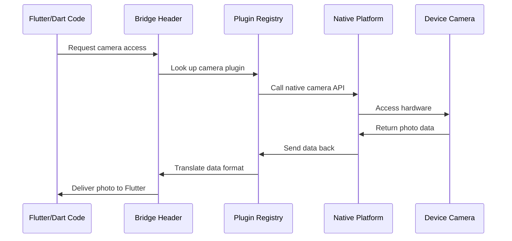

# Chapter 2: Cross-Platform Bridge Headers

In [Chapter 1: Platform Application Containers](01_platform_application_containers_.md), we learned how Flutter apps get wrapped in native containers to run on different operating systems. Now we need to solve another crucial puzzle: how does your Flutter code (written in Dart) actually communicate with the native platform code (written in languages like Swift or C++)?

This is where **Cross-Platform Bridge Headers** come to the rescue! Think of them as universal translators that help different programming languages have conversations with each other.

## The Language Barrier Problem

Imagine you're building our Public Safety Application, and you need to access the device's camera to let emergency responders take photos of incidents. Here's the challenge:

- Your Flutter UI is written in **Dart** 🎯
- iOS camera functionality is written in **Swift/Objective-C** 🍎
- Android camera functionality is written in **Java/Kotlin** 🤖
- Windows camera functionality is written in **C++** 🪟

It's like having a team meeting where everyone speaks a different language! Without a translator, nobody can understand each other, and your app can't access those important native features.

## What Are Cross-Platform Bridge Headers?

Bridge headers are special files that act as **translation dictionaries** between Flutter's Dart code and the native platform code. They define a common "language" that both sides can understand.

Think of them like this:
- **A menu translator** at an international restaurant - the same dish described in multiple languages
- **A diplomatic interpreter** who helps leaders from different countries communicate
- **A universal remote control** that can talk to different TV brands

Let's look at a real example from our Public Safety Application:

```h
#import "GeneratedPluginRegistrant.h"
```

This simple line in `ios/Runner/Runner-Bridging-Header.h` tells iOS: "Hey, I want to use all the Flutter plugins that have been set up for this app."

## Key Components of Bridge Headers

### 1. The iOS Bridge Header

On iOS, the bridge header connects Swift/Objective-C code with Flutter:

```h
// ios/Runner/Runner-Bridging-Header.h
#import "GeneratedPluginRegistrant.h"
```

This file is like saying: "iOS, please make all the Flutter plugins available so Swift code can use them." It's the entry point that makes camera plugins, location services, and other native features accessible to your Flutter app.

### 2. Windows Resource Headers

On Windows, we have resource definition files that help the system understand our app:

```h
// windows/runner/resource.h
#define IDI_APP_ICON    101
```

This tells Windows: "Our app has an icon, and its ID number is 101." When Windows needs to show your app icon in the taskbar or file explorer, it knows exactly which image to use.

### 3. Utility Headers

These provide helper functions that make cross-platform communication easier:

```h
// windows/runner/utils.h
std::string Utf8FromUtf16(const wchar_t* utf16_string);
```

This function is like a text translator - it converts text from Windows format (UTF-16) to Flutter's preferred format (UTF-8). Without this, text might appear as gibberish when passed between the systems.

## How Bridge Headers Solve Our Camera Use Case

Let's walk through what happens when a user taps the camera button in our Public Safety Application:

**Step 1: Flutter Code (Dart)**
```dart
// Your Flutter app
await camera.takePicture();
```

**Step 2: Bridge Header Translation**
```h
#import "GeneratedPluginRegistrant.h"
```

**Step 3: Native iOS Code**
```swift
// iOS handles the actual camera
func capturePhoto() { /* Native camera code */ }
```

The bridge header acts as the middleman, making sure the message gets translated correctly at each step.

## Under the Hood: The Translation Process

Here's what happens when your Flutter code needs to access native functionality:



Let's break down each step:

### Step 1: Flutter Makes a Request

Your Dart code calls a plugin method:
```dart
final image = await ImagePicker().pickImage(source: ImageSource.camera);
```

This is like saying "I need a photo from the camera" in Flutter language.

### Step 2: Bridge Header Routes the Request

The bridge header file kicks in:
```h
#import "GeneratedPluginRegistrant.h"
```

This line ensures that when Flutter asks for camera access, the system knows which native code to call. It's like a phone operator connecting your call to the right department.

### Step 3: Native Code Takes Over

The platform-specific code handles the actual camera:
```swift
// iOS camera code runs here
UIImagePickerController().present()
```

This opens the native camera interface that users are familiar with on their device.

### Step 4: Data Translation Back to Flutter

When the user takes a photo, the bridge helps convert the native image format back to something Flutter can understand:

```h
// Helper function in utils.h
std::string Utf8FromUtf16(const wchar_t* utf16_string);
```

This ensures file paths, metadata, and other information are properly formatted for Flutter.

## The Magic of Generated Code

Notice that our iOS bridge header imports `GeneratedPluginRegistrant.h`. This file is automatically created by Flutter when you build your app. It's like having an assistant who automatically updates your translation dictionary every time you add a new plugin.

When you add a camera plugin to your `pubspec.yaml`:
```yaml
dependencies:
  image_picker: ^0.8.6
```

Flutter automatically updates the generated code to include camera translation rules in your bridge headers.

## Windows-Specific Bridge Elements

On Windows, bridge headers work a bit differently. Let's look at the resource header:

```h
#define IDI_APP_ICON    101
```

This creates a numbered reference to your app's icon. When Windows needs to display your Public Safety Application in the taskbar, it uses this number to find the right icon file.

The utility functions help with text encoding:
```h
std::vector<std::string> GetCommandLineArguments();
```

This function translates command-line arguments from Windows format to a format that Flutter can easily work with.

## Why This Architecture Is Brilliant

Bridge headers solve several problems at once:

1. **Language Translation**: They let Dart talk to Swift, C++, and other languages
2. **Automatic Updates**: Generated files stay in sync with your plugin choices
3. **Platform Optimization**: Each platform gets native performance
4. **Developer Simplicity**: You write Dart code once, and it works everywhere

It's like having a universal translator that gets smarter every time you travel to a new country!

## Common Bridge Header Patterns

Most bridge headers follow similar patterns:

**Import/Include Statements**:
```h
#import "GeneratedPluginRegistrant.h"  // iOS
#include <flutter/flutter_view_controller.h>  // Windows
```

**Resource Definitions**:
```h
#define IDI_APP_ICON    101
#define APP_NAME        "Public Safety App"
```

**Utility Functions**:
```h
std::string ConvertText(const char* input);
bool ValidatePermissions();
```

## What We've Learned

In this chapter, we discovered that:

- Bridge headers are translation layers between Flutter and native platform code
- They make it possible for Dart code to access cameras, GPS, notifications, and other native features
- Generated files automatically stay updated when you add new plugins
- Each platform has its own bridge format, but they all serve the same translation purpose
- The architecture keeps your Flutter code simple while enabling powerful native functionality

Bridge headers are the unsung heroes that make Flutter's "write once, run anywhere" promise actually work in practice.

Next, we'll explore how all these plugins get organized and registered in the [Plugin Registration System](03_plugin_registration_system_.md), which acts like a directory that helps your app find and use all its available native features.

