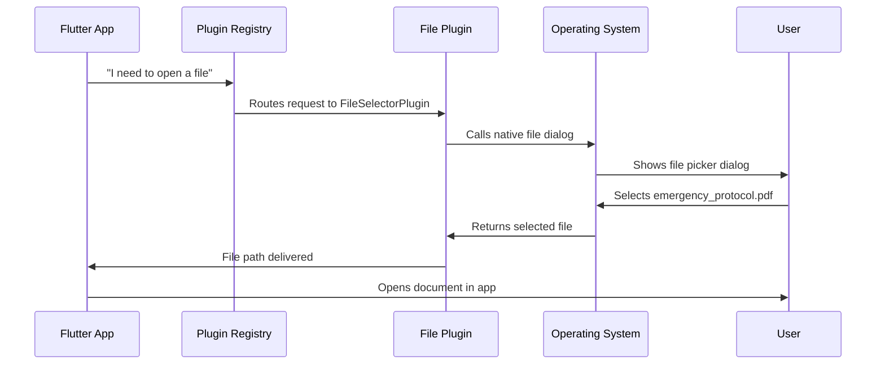

# Chapter 2: Platform Plugin Registry

Now that we've learned how [Platform Application Bootstrap](01_platform_application_bootstrap_.md) gets your Flutter app started on different operating systems, let's explore how your app actually connects to the device's built-in features like the camera, file system, or web browser.

## What Problem Does This Solve?

Imagine you're building a Public Safety Application and you need some powerful features:
- **Taking photos** of incident scenes using the device's camera
- **Opening files** like emergency protocol documents 
- **Launching web links** to access online resources

Here's the challenge: Your Flutter app is written in Dart, but these device features (camera, file system, web browser) are controlled by platform-specific code written in completely different languages. It's like you speak English, but the camera speaks "Windows language" and the file system speaks "Linux language."

The **Platform Plugin Registry** acts like a universal translator and phone directory combined! It knows exactly which "native helper" to call for each feature and automatically sets up all the connections when your app starts.

## Key Concepts Breakdown

### 1. The Phone Directory Analogy

Think of the Platform Plugin Registry like a smart phone directory:

- **Your Flutter App**: "I need to take a photo!"
- **Plugin Registry**: "Let me look that up... ah yes, you need the Camera Plugin at extension #247"
- **Camera Plugin**: "Got it! I'll handle the platform-specific camera code for you"

### 2. Automatic Registration Process

Just like how a new employee gets automatically added to the company directory, plugins get automatically registered when your app starts up. You don't have to manually connect each one!

### 3. Platform-Specific Implementations

Each operating system has its own version of the registry:
- **Linux**: Uses GTK-based plugins
- **Windows**: Uses Win32-based plugins
- **Same Interface**: Your Flutter code stays the same!

## How the Plugin Registry Works

Let's see how this magic happens in our Public Safety Application:

### The Registration Process

When your app starts, this function runs automatically:

```cpp
void fl_register_plugins(FlPluginRegistry* registry) {
  // Register file selector plugin
  g_autoptr(FlPluginRegistrar) file_selector_registrar =
      fl_plugin_registry_get_registrar_for_plugin(registry, "FileSelectorPlugin");
  file_selector_plugin_register_with_registrar(file_selector_registrar);
}
```

Let's break this down:
1. `fl_plugin_registry_get_registrar_for_plugin` - "Hey registry, I need to register a plugin called FileSelectorPlugin"
2. `file_selector_plugin_register_with_registrar` - "Ok plugin, you're now officially connected to the app!"

**Input**: Plugin name ("FileSelectorPlugin")
**Output**: Plugin is now available for your Flutter app to use!

### Multiple Plugin Registration

Your app can register several plugins at once:

```cpp
void fl_register_plugins(FlPluginRegistry* registry) {
  // File operations
  register_file_selector(registry);
  
  // Web browser launching  
  register_url_launcher(registry);
}
```

This is like setting up multiple phone extensions at once - one for files, one for web browsing, etc.

### Platform Differences Made Simple

The beautiful part is that Windows and Linux use the same concept but different implementations:

**Linux version:**
```cpp
void fl_register_plugins(FlPluginRegistry* registry) {
  // Linux-specific plugin registration
}
```

**Windows version:**
```cpp
void RegisterPlugins(flutter::PluginRegistry* registry) {
  // Windows-specific plugin registration  
}
```

Notice the function names are slightly different, but they do the exact same job!

## Internal Implementation Walkthrough

Let's trace what happens when your Public Safety app needs to open a file:



### Step-by-Step Breakdown

1. **Flutter Request**: Your Dart code calls `FilePicker.platform.pickFiles()`
2. **Registry Lookup**: Plugin registry finds the registered FileSelectorPlugin
3. **Platform Translation**: Plugin converts Flutter request to native OS call
4. **Native Execution**: Operating system shows its native file picker
5. **Result Return**: Selected file path travels back through the chain
6. **Flutter Receives**: Your Dart code gets the file path to work with

### Deep Dive: Linux Registration

Let's look at the Linux registration code in detail:

```cpp
#include <file_selector_linux/file_selector_plugin.h>
#include <url_launcher_linux/url_launcher_plugin.h>
```

These imports are like saying: "I'm going to need the Linux versions of these plugins."

```cpp
g_autoptr(FlPluginRegistrar) file_selector_registrar =
    fl_plugin_registry_get_registrar_for_plugin(registry, "FileSelectorPlugin");
```

This line creates a "registrar" - think of it as getting a registration form for the FileSelectorPlugin. The `g_autoptr` automatically handles memory cleanup (like having an assistant who files paperwork for you).

```cpp
file_selector_plugin_register_with_registrar(file_selector_registrar);
```

This actually fills out and submits the registration form, making the plugin officially available.

### Deep Dive: Windows Registration

The Windows version follows the same pattern but uses Windows-specific types:

```cpp
void RegisterPlugins(flutter::PluginRegistry* registry) {
  FileSelector::RegisterWithRegistrar(
      registry->GetRegistrarForPlugin("file_selector_windows"));
}
```

Same concept, different syntax! It's like filling out the same form but in a different language.

## Real-World Example: Public Safety File Access

When an emergency responder needs to access a protocol document:

1. **User Action**: Taps "Open Emergency Protocol" in your Flutter app
2. **Registry Magic**: Plugin registry routes the request to the appropriate file plugin
3. **Native Dialog**: The operating system's native file picker appears
4. **File Selection**: User selects "Hurricane_Response_Protocol.pdf" 
5. **Seamless Return**: File opens in your app, ready to help save lives!

The beauty is that this works identically on Linux dispatch computers and Windows field laptops - same Flutter code, platform-appropriate file dialogs.

## Generated vs Manual Code

You might notice these files are marked as "Generated file. Do not edit." That's because Flutter automatically creates the registration code based on your `pubspec.yaml` dependencies:

```yaml
dependencies:
  file_selector: ^0.9.2
  url_launcher: ^6.1.7
```

When you run `flutter build`, Flutter sees these dependencies and automatically generates the appropriate registration code for each platform. It's like having a secretary who automatically updates the company directory whenever someone new joins!

## Conclusion

The Platform Plugin Registry is your app's automatic connection service! It ensures that when your Flutter code needs to use device features, the right platform-specific helper is immediately available and properly connected.

Key takeaways:
- **Automatic Setup**: Plugins register themselves when your app starts
- **Universal Interface**: Same Flutter code works across platforms  
- **Generated Code**: Flutter handles the complex registration automatically
- **Seamless Translation**: Converts Flutter requests to native platform calls

In our next chapter, we'll explore how these registered plugins actually communicate between Flutter and native code through the [Cross-Platform Bridge Interface](03_cross_platform_bridge_interface_.md).

