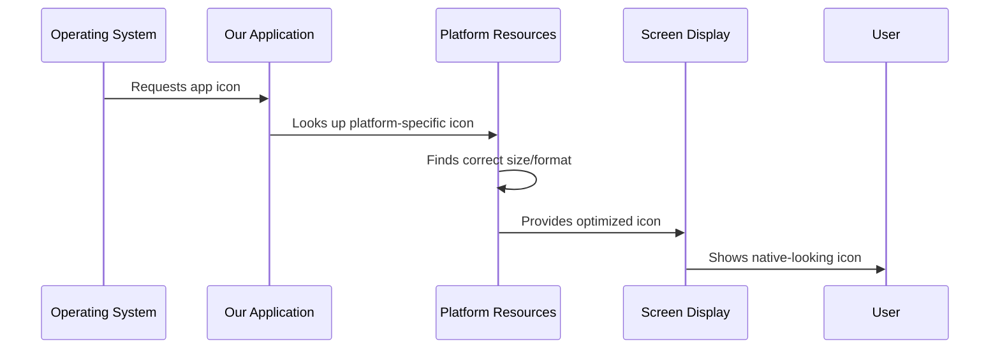

# Chapter 2: Platform Resource Management

Great job learning about [Platform-Specific Application Entry Points](01_platform_specific_application_entry_points_.md)! Now that we understand how our Public Safety Application starts up differently on each platform, let's explore what happens next: managing the resources that make our app look and feel right on each system.

## What Problem Does Resource Management Solve?

Imagine you're a police officer who uses the same uniform but needs different accessories for different situations. In winter, you need a heavy coat and gloves. In summer, you need lighter gear and sunglasses. The core uniform (your identity as an officer) stays the same, but the accessories change based on the environment.

This is exactly what happens with our Public Safety Application! The core functionality remains identical, but each platform needs different "accessories" - different icons, different launch screens, and different visual elements that make the app feel native to that operating system.

**Our Use Case**: We need our Public Safety Application to display the perfect app icon on both iOS and Windows, show appropriate launch screens, and follow each platform's visual guidelines - all while maintaining the same emergency response functionality.

## Key Concepts

Let's break down Platform Resource Management into digestible pieces:

### 1. The "Digital Wardrobe" Concept

Each platform has its own "wardrobe" of visual assets:
- **App Icons**: Different sizes and formats for different platforms
- **Launch Screens**: What users see while the app starts up
- **Platform Assets**: Visual elements that follow each system's design rules

### 2. Resource Organization

Instead of trying to use one icon everywhere (which would look wrong!), we organize resources by platform:
- **iOS**: Uses specific image formats and sizing requirements
- **Windows**: Uses different icon formats and resource definitions
- **Each platform gets exactly what it needs**

## How It Works: A Step-by-Step Walkthrough

Let's trace what happens when our Public Safety Application needs to display its icon:



Now let's see this in action with real examples!

## iOS Resource Management

On iOS, resources are organized in a special folder structure called Assets. Let's look at how launch images work:

### Launch Screen Structure
```
ios/Runner/Assets.xcassets/LaunchImage.imageset/
├── README.md
├── LaunchImage.png
├── LaunchImage@2x.png
└── LaunchImage@3x.png
```

This structure does something clever:
1. **LaunchImage.png**: Standard resolution for older devices
2. **LaunchImage@2x.png**: High resolution for Retina displays  
3. **LaunchImage@3x.png**: Ultra-high resolution for newest devices

iOS automatically picks the right image based on the device's screen quality!

### Customizing Launch Assets

The iOS platform provides helpful guidance:

```markdown
# Launch Screen Assets

You can customize the launch screen with your own desired assets 
by replacing the image files in this directory.
```

This means we can easily replace the default images with Public Safety-themed graphics - maybe a badge logo or emergency services branding.

### Platform Integration Bridge

iOS uses a special bridging system:

```objc
#import "GeneratedPluginRegistrant.h"
```

This tiny line does something powerful:
- **Connects Flutter to iOS**: Bridges our cross-platform code with iOS-specific features
- **Registers plugins**: Makes sure iOS-specific functionality (like camera access) works properly
- **Automatic generation**: Flutter creates this bridge automatically

## Windows Resource Management

Windows takes a different approach to managing resources. Let's examine how it defines and organizes assets:

### Resource Definitions

```cpp
#define IDI_APP_ICON                    101
```

This simple line creates a "resource ID" - think of it as a name tag for our app icon:
- **IDI_APP_ICON**: A human-readable name for developers
- **101**: A number that Windows uses internally to find the icon
- **Standardized naming**: Follows Windows conventions (IDI = Icon Identifier)

### Resource Numbering System

```cpp
#define _APS_NEXT_RESOURCE_VALUE        102
#define _APS_NEXT_COMMAND_VALUE         40001
#define _APS_NEXT_CONTROL_VALUE         1001
```

Windows uses a numbering system to organize resources:
- **102**: The next available slot for new icons or images
- **40001**: The next available slot for menu commands
- **1001**: The next available slot for user interface controls

This prevents conflicts when we add more visual elements to our Public Safety Application.

## Under the Hood: Resource Loading Process

When our Public Safety Application needs to display resources, here's what happens:

### iOS Resource Loading
1. **App requests icon**: iOS asks for the app icon to display on the home screen
2. **Asset catalog lookup**: iOS checks the Assets.xcassets folder
3. **Device detection**: iOS determines the device's screen resolution
4. **Optimal selection**: iOS picks the best-quality image (@1x, @2x, or @3x)
5. **Display rendering**: The perfect-sized icon appears on screen

### Windows Resource Loading
1. **App requests icon**: Windows asks for the app icon for the taskbar
2. **Resource table lookup**: Windows checks the resource definitions (resource.h)
3. **ID resolution**: Windows finds IDI_APP_ICON (ID 101) in the resource table
4. **File loading**: Windows loads the corresponding icon file
5. **Display rendering**: The icon appears in Windows' native style

## Real-World Example

Let's see how this helps our police officer users:

**Officer Sarah launches the app on her iPhone:**
```
1. Sarah taps the app icon on her iPhone 12
2. iOS detects: "This is a Retina display device"
3. iOS loads: LaunchImage@3x.png (highest quality)
4. Result: Crystal-clear Public Safety logo appears
```

**Officer Mike launches the app on his Windows laptop:**
```
1. Mike clicks the app icon on his taskbar
2. Windows looks up: IDI_APP_ICON (resource ID 101)  
3. Windows loads: The Windows-format icon file
4. Result: Sharp, Windows-styled icon appears
```

Both officers see perfectly native-looking icons, even though they're using completely different devices!

## Platform-Specific Optimization

Each platform optimizes resources differently:

### iOS Optimization Benefits
- **Automatic scaling**: iOS picks the perfect image size automatically
- **Memory efficiency**: Only loads the needed resolution, saving device memory
- **Retina support**: Crisp graphics on high-resolution Apple displays

### Windows Optimization Benefits  
- **Resource compression**: Windows can compress icons and images efficiently
- **Fast lookup**: Numbered IDs allow super-fast resource finding
- **System integration**: Icons blend perfectly with Windows visual themes

## Customizing for Public Safety

Here's how we can tailor resources for emergency services:

### iOS Customization
Replace launch images with:
- Police badge logos
- Emergency service colors (red, blue, white)
- Clean, professional typography

### Windows Customization
Update resource definitions:
```cpp
#define IDI_EMERGENCY_BADGE            102
#define IDI_FIRST_AID_ICON            103  
#define IDI_RADIO_COMMUNICATION       104
```

This allows multiple themed icons for different Public Safety functions.

## Managing Multiple Platforms

The beauty of this system is organization:

```
Platform Resources/
├── iOS/
│   └── Professional emergency service assets
├── Windows/  
│   └── Windows-styled emergency graphics
└── Shared/
    └── Common branding elements
```

Each platform gets exactly what it needs, while shared elements stay consistent.

## Why This Approach Works

Platform Resource Management provides several key benefits:

1. **Native appearance**: Apps look like they belong on each platform
2. **Performance**: Each platform uses its most efficient resource formats
3. **User experience**: Familiar visual patterns reduce learning time for officers
4. **Maintainability**: Platform-specific resources stay organized and separate

## Conclusion

Platform Resource Management is like having a smart costume designer for your app - it ensures your Public Safety Application always wears the perfect "outfit" for each platform. Whether it's a crisp icon on iOS or a properly integrated resource on Windows, users get a professional, native experience that builds trust and confidence.

The resource management system handles all the technical details of formats, sizing, and platform integration, so we can focus on creating compelling visual designs that serve our emergency responder users effectively.

In the next chapter, we'll explore how our platforms work together through plugins and shared functionality: [Cross-Platform Plugin Registration](03_cross_platform_plugin_registration_.md).

