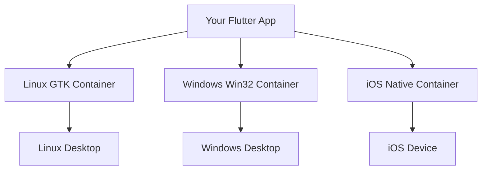
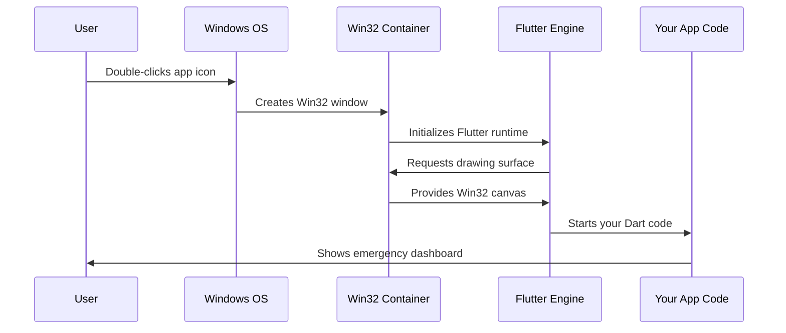

# Chapter 2: Platform-Specific Application Containers

Building on what we learned about Flutter's [Cross-Platform Flutter Application Structure](01_cross_platform_flutter_application_structure_.md), we now need to understand how your single Flutter app actually becomes a "native citizen" on each platform. This is where platform-specific application containers come into play.

## What Problem Does This Solve?

Imagine you're a world traveler who needs to fit into different cultures. You might be the same person inside, but in Japan you need to bow properly, in France you need to know dining etiquette, and in America you need to understand local customs. Your Flutter app faces the same challenge!

When your public safety application runs on different platforms, it needs to "speak the local language" and follow each platform's rules. A Linux user expects certain keyboard shortcuts, Windows users expect specific menu layouts, and iOS users expect particular gestures. Platform-specific application containers are like cultural adapters that help your app behave like a native citizen on each platform.

## The Real-World Use Case

Let's continue with our Public Safety Application scenario. Your emergency responders are using:
- **Linux workstations**: Need GTK-style menus and keyboard shortcuts
- **Windows laptops**: Expect Win32 window behavior and system integration  
- **iOS devices**: Must follow Apple's Human Interface Guidelines

Without platform containers, your app would look and feel foreign on each platform, potentially slowing down emergency response times when every second counts.

## Key Concepts Breakdown

### 1. The Container Concept
Think of platform containers like different types of picture frames. You have one beautiful painting (your Flutter app), but you need different frames for different rooms:



### 2. Platform-Specific Wrappers
Each container is essentially a wrapper that translates between your Flutter app and the operating system. It's like having different translators who all speak Flutter but can communicate with different operating systems.

### 3. Native Integration Points
These containers handle the "boring but important" stuff like:
- Window management (resize, minimize, close)
- System notifications
- File system access
- Hardware integration

## How Platform Containers Work: Step-by-Step

Let's trace what happens when a dispatcher launches your app on their Windows computer:



## Platform Container Examples

Let's look at how each platform creates its container:

### Linux GTK Container
```cpp
// Creates a GTK application container
MyApplication* my_application_new() {
  return MY_APPLICATION(g_object_new(my_application_get_type(), NULL));
}
```

This tiny function creates a GTK application object. Think of GTK as Linux's "window factory" - it knows how to create windows that look and feel right on Linux desktops. When you call this function, you're essentially saying "Hey Linux, please give me a proper Linux-style container for my app."

### Windows Win32 Container  
```cpp
// Creates a Windows-style window
class FlutterWindow : public Win32Window {
  bool OnCreate() override {
    // Set up Flutter engine in Windows container
    return flutter::DartProject(L"data").run_engine() != nullptr;
  }
};
```

The Windows container inherits from `Win32Window`, which gives it all the standard Windows window behaviors (like the minimize, maximize, and close buttons). The `OnCreate()` method is like a setup function that runs when Windows creates the window - it starts up the Flutter engine inside this Windows-native container.

### iOS Native Container
```objc
// iOS app lifecycle integration  
@UIApplicationMain
class AppDelegate: FlutterAppDelegate {
  // iOS handles container creation automatically
}
```

iOS is a bit different - it automatically creates the container when you use the `@UIApplicationMain` attribute. This tells iOS "this is the main entry point for my app" and iOS creates all the necessary containers and lifecycle management for you.

## Under the Hood: Container Creation Process

### Step 1: Platform Detection and Initialization
When you build your app, Flutter creates platform-specific entry points:

```bash
flutter build linux   # Creates GTK-based container
flutter build windows # Creates Win32-based container  
flutter build ios     # Creates UIKit-based container
```

Each build command generates a different type of container, like ordering different types of gift wrapping for the same present.

### Step 2: Container Bootstrapping
Each platform container goes through a similar startup process:

1. **Create Native Window**: The OS creates a window using its native toolkit
2. **Initialize Flutter Engine**: The container starts up Flutter inside this window
3. **Establish Communication**: Sets up two-way communication between Flutter and the OS
4. **Hand Over Control**: Flutter takes over and starts running your Dart code

### Step 3: Runtime Translation
Once running, the container acts as a real-time translator:

```dart
// Your Flutter code (same everywhere)
showDialog(
  context: context,
  builder: (context) => AlertDialog(
    title: Text('Emergency Alert'),
    content: Text('New incident reported'),
  ),
);
```

This single Flutter dialog code gets translated by each container into:
- **Linux**: GTK dialog with Linux styling
- **Windows**: Win32 dialog with Windows styling  
- **iOS**: Native iOS alert with iOS styling

## Practical Example: Window Management

Let's see how containers handle something as simple as closing the app:

### Linux Container Handling Close
```cpp
// Linux GTK container
static void my_application_activate(GApplication* application) {
  GtkWindow* window = gtk_application_window_new(GTK_APPLICATION(application));
  // GTK automatically handles close button behavior
}
```

When a user clicks the X button on Linux, GTK (through the container) automatically handles the close event according to Linux desktop standards.

### Windows Container Handling Close
```cpp
// Windows Win32 container  
void FlutterWindow::OnDestroy() {
  // Clean up Flutter engine when window closes
  if (flutter_controller_) {
    flutter_controller_ = nullptr;
  }
}
```

The Windows container has its own cleanup method that runs when the window closes. It makes sure to properly shut down the Flutter engine and free up memory - something Windows expects well-behaved applications to do.

## Customizing Your Containers

You can customize how your public safety app behaves on each platform by modifying the container code:

### Adding a Custom Window Title (Linux)
```cpp
// In linux/my_application.cc
gtk_window_set_title(window, "Emergency Response System v2.1");
gtk_window_set_default_size(window, 1200, 800);  // Good size for dashboards
```

This code sets a custom title and default size that's appropriate for emergency dashboards. The container handles making sure this integrates properly with the Linux desktop environment.

### Setting Windows App Properties
```cpp
// In windows/runner/main.cpp
flutter_window.CreateAndShow(L"Public Safety Command Center", origin, size);
```

Similarly, you can customize how your app appears in the Windows taskbar and title bar. The Win32 container ensures this follows Windows conventions.

## Why Containers Matter for Public Safety

Platform-specific containers are crucial for emergency response applications because they provide:

1. **Familiar User Experience**: Responders can focus on emergencies, not learning new interfaces
2. **System Integration**: Proper notifications, file access, and hardware integration
3. **Performance**: Native containers provide optimal performance for each platform
4. **Accessibility**: Each container supports platform-specific accessibility features

## Real-World Impact

Consider this scenario: During an emergency, a dispatcher needs to quickly minimize your app to check another system. If your app doesn't respond to the standard Windows Alt+Tab behavior because it lacks proper container integration, those lost seconds could be critical.

Platform containers ensure your app behaves exactly like other native applications, making it intuitive and reliable when it matters most.

## Conclusion

Platform-specific application containers are the invisible heroes that make your Flutter app feel at home on each operating system. They're like skilled diplomatic translators who ensure your app speaks fluent "Linux," "Windows," and "iOS" while maintaining its core functionality.

These containers handle the complex work of integrating with each platform's windowing system, input methods, and user interface conventions, so you can focus on building great emergency response features rather than worrying about platform-specific implementation details.

In our next chapter, we'll explore how the [Plugin Registration System](03_plugin_registration_system_.md) allows your app to access platform-specific features like GPS, cameras, and system notifications through these very same containers.

