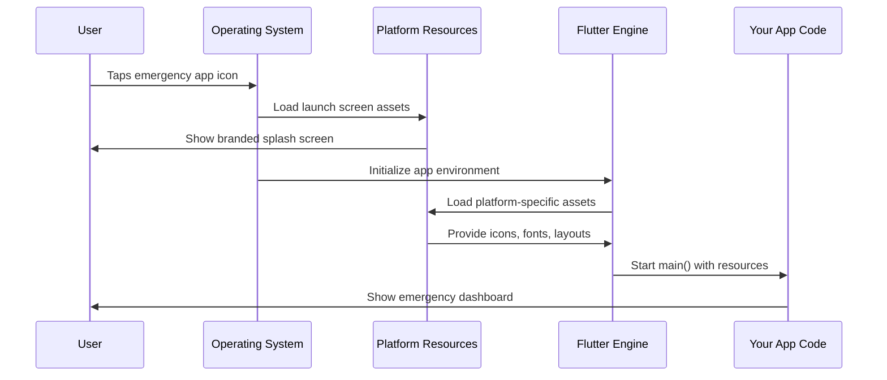

# Chapter 2: Platform-Specific Resource Management

Building on what we learned about [Cross-Platform Flutter Application Structure](01_cross_platform_flutter_application_structure_.md), we now understand that Flutter creates apps that run everywhere. But there's another challenge: each platform has its own way of handling visual elements and system integration. This chapter explores how Flutter manages these platform-specific resources.

## What Problem Does This Solve?

Imagine you're developing our public safety app, and you want it to feel truly native on each platform. You need:

- An app icon that follows iOS design guidelines on iPhones
- A launch screen that matches Android's Material Design on Android devices  
- Window management that feels natural on Windows desktops
- File access that works with Linux's permission system

Without proper resource management, your emergency response app might look like a generic, out-of-place application that doesn't integrate well with the user's device.

**Our Use Case**: We want our public safety app to have a professional emergency services icon, a branded launch screen, and smooth window behavior that makes first responders feel confident using it on their preferred devices.

## The Restaurant Chain Analogy

Think of your Flutter app like a global restaurant chain. While the core menu (your app functionality) stays the same, each location adapts to local customs:

- **Tokyo location**: Uses chopsticks, serves tea, has tatami seating
- **Paris location**: Uses proper silverware, serves wine, has café-style seating
- **New York location**: Uses casual utensils, serves coffee, has booth seating

Similarly, your Flutter app adapts its "presentation" to match each platform's expectations while keeping the core functionality identical.

## Key Concepts Breakdown

### 1. Launch Screens (The First Impression)

A launch screen is what users see while your app starts up. Each platform has different requirements:

**iOS Launch Screens:**
```yaml
# ios/Runner/Info.plist configuration
UILaunchScreen:
  UIImageName: "emergency_logo"
  UIColorName: "emergency_red"
```

This tells iOS: "While the app loads, show the emergency logo on a red background."

**Android Launch Screens:**
```xml
<!-- android/app/src/main/res/values/styles.xml -->
<style name="LaunchTheme">
    <item name="android:windowBackground">@drawable/emergency_splash</item>
</style>
```

This tells Android: "Use the emergency splash image as the launch background."

### 2. App Icons (Your Digital Identity)

Each platform expects icons in different sizes and formats:

**iOS Icons:**
- Multiple sizes: 20x20, 29x29, 40x40, 60x60, 76x76, 83.5x83.5, 1024x1024
- Must be PNG format
- Should follow Apple's design guidelines

**Android Icons:**
- Adaptive icons with foreground and background layers
- Multiple density folders: mdpi, hdpi, xhdpi, xxhdpi, xxxhdpi
- Can be PNG or vector format

Flutter automatically handles placing your icons in the correct locations for each platform.

### 3. Window Management (Desktop Behavior)

On desktop platforms, your app needs to behave like a proper desktop application:

**Windows Window Management:**
```cpp
flutter::DartProject project(L"data");
controller_ = std::make_unique<flutter::FlutterViewController>(
    window_->GetWidth(), window_->GetHeight(), project);
```

This creates a window controller that:
- Handles resizing when users drag window corners
- Manages minimize/maximize buttons
- Integrates with Windows taskbar

### 4. Utility Functions (Platform Helpers)

Each platform provides helper functions to make integration smooth:

**Windows Utilities:**
```cpp
std::string Utf8FromUtf16(const wchar_t* utf16_string) {
  // Converts Windows text format to Flutter format
  return converted_string;
}
```

This function helps your Flutter app understand text from Windows system dialogs.

## Solving Our Use Case

Let's build our professional emergency services app with proper platform integration:

**Step 1: Design the App Icon**
```yaml
# pubspec.yaml
flutter_icons:
  android: true
  ios: true
  image_path: "assets/emergency_badge.png"
```

Flutter takes your single emergency badge image and creates all the required icon sizes for both platforms.

**Step 2: Create Launch Screens**
```dart
// Your main app starts while launch screen shows
void main() {
  runApp(PublicSafetyApp());
}

class PublicSafetyApp extends StatelessWidget {
  Widget build(BuildContext context) {
    return MaterialApp(
      title: 'Emergency Response',
      home: EmergencyDashboard(),
    );
  }
}
```

While this code initializes, users see your branded launch screen instead of a blank white screen.

**Step 3: Handle Desktop Windows**
On Windows and Linux, Flutter automatically creates resizable windows with proper title bars and controls.

## What Happens Under the Hood

Here's what occurs when a user launches your emergency app:



Let's break this down:

1. **User Interaction**: User taps your professional emergency services icon
2. **OS Recognition**: The operating system recognizes the app and loads its resources
3. **Launch Display**: Your branded launch screen appears immediately
4. **Flutter Startup**: Flutter engine initializes with platform-specific settings
5. **Resource Loading**: Platform resources (icons, fonts, layouts) load
6. **App Launch**: Your app code runs with all resources available

## Deep Dive: Platform Resource Management

### iOS Resource Management

iOS stores resources in specific bundle structures:

```
ios/Runner/Assets.xcassets/
├── AppIcon.appiconset/
│   ├── Icon-20.png
│   ├── Icon-29.png
│   └── Icon-60.png
└── LaunchImage.imageset/
    ├── LaunchImage.png
    └── LaunchImage@2x.png
```

Each file serves a specific purpose:
- `Icon-20.png`: Used for settings screens
- `Icon-60.png`: Used for the home screen
- `LaunchImage@2x.png`: High-resolution launch screen

### Windows Resource Management

Windows uses a resource definition system:

```cpp
// windows/runner/resource.h
#define IDI_APP_ICON 101

// windows/runner/Runner.rc  
IDI_APP_ICON ICON "resources\\app_icon.ico"
```

This tells Windows:
- `IDI_APP_ICON` is identifier 101
- The actual icon file is `app_icon.ico`
- Windows should use this for taskbar, window title, and Alt+Tab

### Android Resource Management

Android organizes resources by screen density:

```
android/app/src/main/res/
├── mipmap-mdpi/ic_launcher.png     (48x48)
├── mipmap-hdpi/ic_launcher.png     (72x72)
├── mipmap-xhdpi/ic_launcher.png    (96x96)
└── mipmap-xxhdpi/ic_launcher.png   (144x144)
```

Android automatically chooses the right icon size based on the device's screen resolution.

## Utility Functions in Action

Let's see how platform utilities help our emergency app:

**Windows Text Handling:**
```cpp
std::string GetEmergencyMessage() {
  wchar_t* windows_text = GetSystemMessage();
  return Utf8FromUtf16(windows_text);
}
```

This function:
1. Gets a message from Windows (in Windows format)
2. Converts it to UTF-8 (Flutter format) 
3. Returns it for your Flutter app to display

**Command Line Arguments:**
```cpp
std::vector<std::string> args = GetCommandLineArguments();
// Now your app can handle: emergency_app.exe --alert-level=high
```

This lets your app receive startup parameters, useful for emergency dispatch systems.

## Resource Loading Process

When your emergency app starts, here's how resources load:

**Step 1: Platform Detection**
```dart
import 'dart:io';

if (Platform.isIOS) {
  // Load iOS emergency alert sounds
} else if (Platform.isAndroid) {
  // Load Android emergency notifications  
}
```

**Step 2: Asset Bundle Loading**
```dart
String emergencySound = await rootBundle.loadString('assets/alert.mp3');
```

Flutter automatically finds the right version of your alert sound for each platform.

**Step 3: Native Integration**
Each platform's resource manager ensures your assets appear with proper:
- Icon styling (rounded corners on iOS, adaptive on Android)
- Launch screen timing (immediate on iOS, smooth transition on Android)
- Window behavior (resizable on desktop, fullscreen options on mobile)

## Integration with Cross-Platform Structure

Remember from [Cross-Platform Flutter Application Structure](01_cross_platform_flutter_application_structure_.md) how each platform has its own entry point? Those entry points work with the resource management system:

**iOS Integration:**
```objc
// iOS entry point loads iOS resources
@UIApplicationMain
@objc class AppDelegate: FlutterAppDelegate {
  // iOS automatically loads Assets.xcassets resources
}
```

**Windows Integration:**  
```cpp
// Windows entry point loads Windows resources
FlutterWindow window(project);
// Windows automatically loads .ico and .rc resources
```

The entry points and resource management work together seamlessly.

## Conclusion

You've learned how Flutter makes your public safety app feel native on every platform by managing platform-specific resources automatically. The key insight is that Flutter acts like a skilled diplomat - it knows how to present your app appropriately in each platform's "cultural context" while maintaining your app's core identity.

Your emergency response app now has:
- Professional icons that follow each platform's design guidelines
- Branded launch screens that appear instantly
- Proper window behavior on desktop platforms
- Utility functions that handle platform-specific text and system integration

In our next chapter, [Plugin Registration System](03_plugin_registration_system_.md), we'll explore how Flutter connects your app to device-specific features like GPS, cameras, and emergency communication systems that are crucial for public safety applications.

Remember: Flutter handles the complexity of platform differences so you can focus on building life-saving emergency response features!

