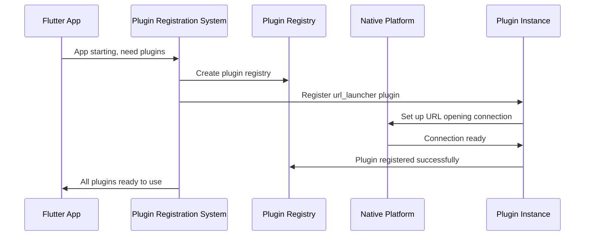

# Chapter 2: Plugin Registration System

Now that we've learned about [Platform Resource Management](01_platform_resource_management_.md) and how it makes your app look professional, let's explore how your Flutter app actually connects to the powerful features built into your device.

## The Problem: Connecting to Device Features

Imagine your Public Safety App needs to make an emergency call or open a map with directions to the nearest hospital. Your Flutter app is great at creating beautiful interfaces, but it can't directly access your phone's dialer or the device's default map application. It's like being a talented chef who needs to use a kitchen, but you don't know where the stove, refrigerator, or utensils are located!

Your Flutter code might want to do something like:
- Open a website with emergency information
- Let users select a file (like a photo of an incident)
- Make a phone call to emergency services
- Access the device's GPS location

But Flutter alone doesn't know how to talk to these native device features. Each platform (iOS, Android, Windows, Linux) has completely different ways of handling these tasks.

**The Plugin Registration System** solves this problem by acting like a universal translator and phone book. It tells your Flutter app exactly how to find and communicate with each platform's native features.

## What Is the Plugin Registration System?

Think of the Plugin Registration System as a smart receptionist at a large office building. When you need to reach a specific department (like "File Selection" or "URL Opening"), the receptionist knows exactly which extension to call and how to connect you.

Here's what it manages:

1. **Plugin Discovery** - Finding all available native features
2. **Connection Setup** - Establishing communication channels
3. **Message Translation** - Converting Flutter requests into platform-specific commands

## How Plugins Work: The Phone Book Analogy

Let's break this down with a simple analogy. Imagine you're in a foreign country and need to:
- Call a taxi
- Find a restaurant
- Get directions

You don't speak the local language, but you have a helpful translator (the Plugin Registration System) who:

1. **Knows the right phone numbers** for each service
2. **Speaks both languages** (Flutter and the local platform)
3. **Can translate your requests** into the local language
4. **Brings back the responses** in a language you understand

## Setting Up Plugin Registration

Let's see how this works in practice. When your app starts, the Plugin Registration System automatically sets up connections to native features.

### Step 1: Declaring Your Needs

In your `pubspec.yaml`, you tell Flutter what native features you need:

```yaml
dependencies:
  url_launcher: ^6.1.0
  file_selector: ^0.9.0
```

This is like telling the receptionist: "I'll need to access the URL opening service and file selection service today."

### Step 2: Automatic Registration

When your app builds, Flutter automatically creates registration code. Here's what it looks like for Linux:

```cpp
void fl_register_plugins(FlPluginRegistry* registry) {
  // Register file selection capability
  file_selector_plugin_register_with_registrar(registrar);
  // Register URL opening capability  
  url_launcher_plugin_register_with_registrar(registrar);
}
```

This code runs when your app starts and tells the system: "Here are all the native features this app will need to use."

### Step 3: Using the Registered Plugins

Now you can use these features in your Flutter code:

```dart
import 'package:url_launcher/url_launcher.dart';

// Open emergency services website
final url = Uri.parse('https://emergency.gov');
if (await canLaunchUrl(url)) {
  await launchUrl(url);
}
```

The Plugin Registration System handles all the complex platform-specific details behind the scenes!

## Under the Hood: How Registration Works

Let's follow what happens when your app starts up and needs to register plugins:



Here's what each step means:

1. **App starts**: Your Flutter app begins launching
2. **Registry creation**: The system creates a "phone book" to track all plugins
3. **Plugin registration**: Each plugin (like URL launcher) gets registered with the system
4. **Native connection**: Each plugin establishes a connection to platform-specific features
5. **Ready to use**: Your app can now use native device features

## Deep Dive: The Registration Code

Let's look at the actual registration code that gets generated automatically:

### Linux Registration

```cpp
#include <file_selector_linux/file_selector_plugin.h>
#include <url_launcher_linux/url_launcher_plugin.h>

void fl_register_plugins(FlPluginRegistry* registry) {
  g_autoptr(FlPluginRegistrar) file_selector_registrar =
      fl_plugin_registry_get_registrar_for_plugin(registry, 
                                                   "FileSelectorPlugin");
}
```

This code does three important things:
1. **Includes the plugin headers** - Like importing the contact information for each service
2. **Gets a registrar** - Creates a connection point for the specific plugin
3. **Registers the plugin** - Officially adds it to the phone book

### The Registry Pattern

The Plugin Registry follows a common software pattern:

```cpp
FlPluginRegistry* registry;  // The main phone book
FlPluginRegistrar* registrar;  // Individual contact for each plugin
```

Think of it like:
- **Registry** = The entire phone book
- **Registrar** = One specific phone number entry

## Solving Our Use Case: Emergency Features

Let's apply this to our Public Safety App. We need two key features:

### Feature 1: Opening Emergency Websites

```dart
// This simple Flutter code...
await launchUrl(Uri.parse('https://emergency.gov'));
```

Becomes this complex platform-specific operation behind the scenes:
- **Linux**: Uses system default browser
- **Windows**: Uses Windows Shell Execute
- **iOS**: Uses UIApplication openURL
- **Android**: Uses Android Intent system

The Plugin Registration System handles all these differences automatically!

### Feature 2: Selecting Incident Photos

```dart
// This simple Flutter code...
final file = await openFile(
  acceptedTypeGroups: [XTypeGroup(extensions: ['jpg', 'png'])]
);
```

Behind the scenes, this triggers:
- **Linux**: GTK file dialog
- **Windows**: Windows file picker
- **macOS**: Cocoa file panel
- **Web**: HTML file input

Again, the Plugin Registration System manages all the complexity!

## When Things Go Wrong: Plugin Not Registered

Sometimes you might see an error like:
```
MissingPluginException: No implementation found for method launch
```

This means the Plugin Registration System couldn't find the connection for that feature. It's like calling a phone number that's not in the phone book!

The solution is usually:
1. Make sure the plugin is listed in `pubspec.yaml`
2. Run `flutter clean` and `flutter pub get`
3. Rebuild your app so registration code gets regenerated

## The Magic: Generated Files

The Plugin Registration System creates these files automatically:

```
linux/flutter/
  generated_plugin_registrant.h    # Header declarations
  generated_plugin_registrant.cc   # Registration implementation

windows/flutter/
  generated_plugin_registrant.h    # Windows version
  generated_plugin_registrant.cc   # Windows implementation
```

These files are like automatically generated phone books - they're created based on what plugins you've declared you need.

## What We've Learned

The Plugin Registration System is your app's universal translator and connection manager. It:

- **Discovers** what native features your app needs
- **Registers** connections to platform-specific implementations
- **Translates** your Flutter requests into native platform commands
- **Manages** all the complex differences between platforms

This system is what allows your simple Flutter code to access powerful device features like opening URLs, selecting files, making phone calls, and accessing sensors - all while looking the same in your code regardless of whether it runs on iOS, Android, Windows, or Linux.

For our Public Safety App, this means we can easily add features like emergency calling, map integration, and file sharing without worrying about the underlying platform complexity.

In our next chapter, we'll explore the [Platform Application Wrapper](03_platform_application_wrapper_.md), which manages how your Flutter app integrates with each platform's application lifecycle and system expectations.

