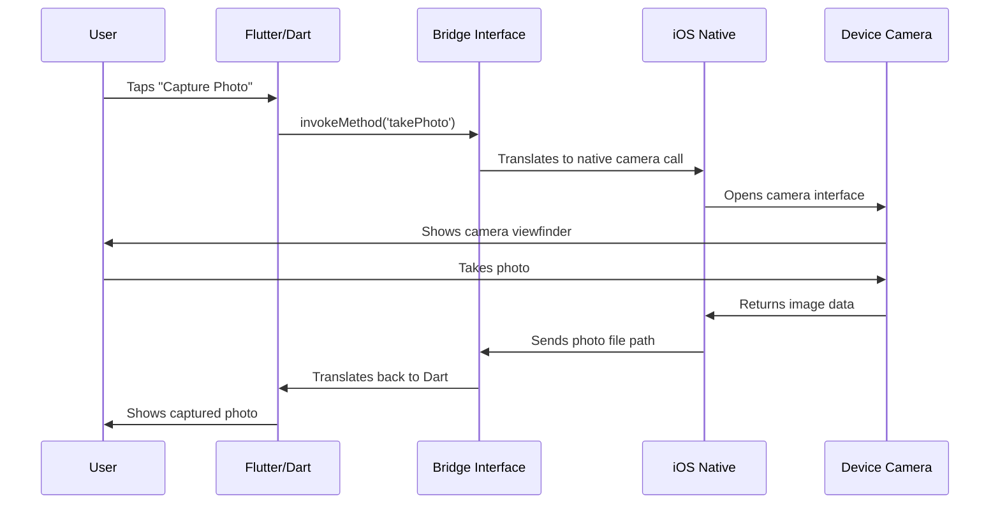

# Chapter 3: Cross-Platform Bridge Interface

Now that we've learned how the [Platform Plugin Registry](02_platform_plugin_registry_.md) automatically connects plugins to your Flutter app, let's explore the fascinating world of how Flutter actually talks to native platform code. This is where the magic of cross-platform communication happens!

## What Problem Does This Solve?

Imagine you're working on your Public Safety Application and you need to access the device's camera to take photos of emergency incidents. Here's the challenge: **your Flutter code speaks Dart, but the camera speaks completely different languages** - Swift/Objective-C on iOS, Kotlin/Java on Android, C++ on Windows, etc.

It's like you're an English-speaking emergency coordinator who needs to communicate with rescue teams that only speak French, Spanish, and German. You need a skilled translator who can instantly convert your English instructions into the right language and bring back responses you can understand.

The **Cross-Platform Bridge Interface** is exactly that translator! It takes your Flutter/Dart requests (like "take a photo"), translates them into the native platform's language, executes the native code, and then translates the results back to Flutter.

## Key Concepts Breakdown

### 1. The Universal Translator Analogy

Think of the Bridge Interface like a super-smart interpreter at the United Nations:

- **Your Flutter Code**: "I need to access the camera!" (spoken in Dart)
- **Bridge Interface**: Instantly translates to iOS: "UIImagePickerController.present()" 
- **iOS Native Code**: Takes the photo and responds in Swift
- **Bridge Interface**: Translates back to Flutter: "Here's your image data!"

### 2. Method Channels - The Communication Highway

The bridge uses something called "Method Channels" - think of these like dedicated phone lines between Flutter and native code:

```dart
// Flutter side - calling across the bridge
final result = await platform.invokeMethod('takPhoto');
```

This single line triggers a complex translation process behind the scenes!

### 3. Bidirectional Communication

The bridge works both ways:
- **Flutter → Native**: Your Dart code can call native functions
- **Native → Flutter**: Native code can send data back to Flutter

## How to Use the Cross-Platform Bridge

Let's see how this works in practice with our Public Safety Application:

### Flutter Side - Making the Call

Here's how your Flutter app requests a native feature:

```dart
class CameraService {
  static const platform = MethodChannel('public_safety/camera');
  
  static Future<String> capturePhoto() async {
    final result = await platform.invokeMethod('takePhoto');
    return result;
  }
}
```

**Input**: Method name ('takePhoto') and optional parameters
**Output**: A Future that will contain the photo file path

This is like picking up a special phone that's directly connected to the camera department!

### Native Side - Receiving the Call (iOS Example)

On the iOS side, native code listens for these calls:

```objc
FlutterMethodChannel* channel = [FlutterMethodChannel
    methodChannelWithName:@"public_safety/camera"
    binaryMessenger:controller.binaryMessenger];

[channel setMethodCallHandler:^(FlutterMethodCall* call, FlutterResult result) {
  if ([@"takePhoto" isEqualToString:call.method]) {
    // Take photo using iOS camera APIs
    NSString* photoPath = [self capturePhotoWithCamera];
    result(photoPath);
  }
}];
```

**Input**: Flutter method call with name "takePhoto"
**Output**: Photo file path sent back to Flutter

This is the "camera department" answering the phone and doing the actual work!

### Complete Communication Flow

Here's how you'd use it in your emergency response app:

```dart
// In your Flutter widget
ElevatedButton(
  onPressed: () async {
    String photoPath = await CameraService.capturePhoto();
    // Now you can display or save the emergency incident photo
  },
  child: Text('Capture Incident Photo'),
)
```

**Input**: User button tap
**Output**: Emergency incident photo ready to be processed

## Internal Implementation Walkthrough

Let's trace what happens when an emergency responder taps "Capture Photo":



### Step-by-Step Breakdown

1. **User Interaction**: Emergency responder taps the photo button
2. **Flutter Method Call**: Dart code calls `platform.invokeMethod('takePhoto')`
3. **Bridge Translation**: Bridge converts Dart call to native iOS message
4. **Native Execution**: iOS code opens the camera using UIKit APIs
5. **Camera Operation**: Device camera captures the photo
6. **Return Journey**: Photo path travels back through the same chain in reverse
7. **Flutter Response**: Your Dart code receives the photo path string

### Deep Dive: The Bridge Header File

Let's look at the iOS bridge setup. The `Runner-Bridging-Header.h` file is crucial:

```objc
#import "GeneratedPluginRegistrant.h"
```

This tiny line is incredibly important! It's like importing a master directory that knows about all available plugins. The `GeneratedPluginRegistrant` is automatically created by Flutter and contains all the bridge connections.

Think of it as importing a phone book that has all the numbers for every native feature your app might need to call.

### Deep Dive: Method Channel Creation

Here's how a method channel gets established:

```dart
static const MethodChannel _channel = 
    MethodChannel('public_safety/camera');
```

This creates a named communication channel. The name 'public_safety/camera' is like a specific radio frequency - both Flutter and native code need to tune to the same frequency to communicate.

```objc
FlutterMethodChannel* channel = [FlutterMethodChannel
    methodChannelWithName:@"public_safety/camera"
    binaryMessenger:controller.binaryMessenger];
```

The native side creates its end of the same channel, ensuring both sides are "tuned to the same frequency."

### Deep Dive: Message Handling

When Flutter sends a message across the bridge:

```dart
final result = await platform.invokeMethod('takePhoto', {
  'quality': 0.8,
  'maxWidth': 1920
});
```

The native handler receives both the method name and parameters:

```objc
[channel setMethodCallHandler:^(FlutterMethodCall* call, FlutterResult result) {
  if ([@"takePhoto" isEqualToString:call.method]) {
    NSDictionary* arguments = call.arguments;
    double quality = [arguments[@"quality"] doubleValue];
    // Use the parameters to configure camera settings
  }
}];
```

It's like sending a detailed email with specific instructions, and the recipient can read both the subject line (method name) and the message body (parameters).

## Real-World Example: Emergency Documentation

When a first responder documents an incident scene:

1. **Flutter UI**: Responder taps "Document Scene" in your app
2. **Bridge Call**: Flutter calls native camera functionality via the bridge
3. **Native Execution**: iOS camera interface opens with emergency-optimized settings
4. **Photo Capture**: High-resolution photo taken and saved securely
5. **Return Path**: Photo metadata flows back to Flutter through the bridge
6. **Integration**: Photo is tagged with GPS coordinates and timestamp in your Flutter app

The amazing part: the exact same Flutter code works on Android, iOS, and other platforms - only the native implementation behind the bridge changes!

## Error Handling Across the Bridge

The bridge also handles errors gracefully:

```dart
try {
  final result = await platform.invokeMethod('takePhoto');
} catch (e) {
  // Handle camera permission denied, hardware issues, etc.
  print('Camera error: $e');
}
```

If something goes wrong on the native side (camera permission denied, hardware malfunction), the error gets translated back through the bridge so your Flutter code can handle it appropriately.

## Conclusion

The Cross-Platform Bridge Interface is your app's universal translator service! It enables seamless communication between Flutter's Dart code and native platform features, making it possible to access device capabilities while maintaining a single codebase.

Key takeaways:
- **Universal Translation**: Converts between Dart and native platform languages
- **Method Channels**: Named communication highways between Flutter and native code
- **Bidirectional**: Data flows both ways across the bridge
- **Error Handling**: Problems on either side get properly communicated
- **Platform Consistency**: Same Flutter code, platform-appropriate native implementations

This bridge interface is what makes Flutter truly cross-platform - you write once in Dart, but gain access to the full power of each native platform through this sophisticated translation layer.

You've now completed the core foundation of Flutter's platform integration! You understand how apps bootstrap on different platforms, how plugins get registered, and how Flutter communicates with native code. These concepts form the backbone that enables your Public Safety Application to work seamlessly across all devices while accessing the full capabilities of each platform.

