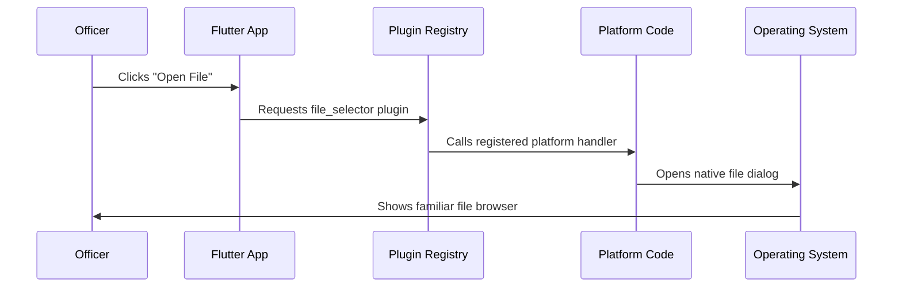

# Chapter 3: Cross-Platform Plugin Registration

Excellent progress! We've learned about [Platform-Specific Application Entry Points](01_platform_specific_application_entry_points_.md) and [Platform Resource Management](02_platform_resource_management_.md). Now let's explore a crucial bridge that connects our Flutter app to powerful native platform features: **Cross-Platform Plugin Registration**.

## What Problem Does Plugin Registration Solve?

Imagine you're a police dispatcher who needs to use different radio systems depending on which jurisdiction you're working in. In City A, you use a Motorola radio system. In City B, you use a different brand entirely. As a dispatcher, you don't want to learn completely different procedures for each radio - you want one consistent interface that automatically connects to the right radio system based on where you are.

This is exactly the challenge our Public Safety Application faces! Our Flutter app needs to perform actions like opening files (to view incident reports) and launching URLs (to access emergency databases), but each operating system has completely different ways of handling these tasks.

**Our Use Case**: When an officer clicks "Open incident report" in our app, we need the system to automatically use the right file-opening method - whether that's Linux's GTK file dialogs or Windows' native file explorer - without the officer (or our Flutter code) needing to worry about the technical differences.

## Key Concepts

Let's break down Cross-Platform Plugin Registration into simple pieces:

### 1. The "Universal Remote Control" Concept

Think of plugin registration like a universal remote control:
- **One interface**: Our Flutter app uses the same commands regardless of platform
- **Multiple backends**: Each platform has its own way of actually doing the work
- **Automatic translation**: The registration system figures out which platform-specific code to call

### 2. The Plugin Bridge System

Plugin registration creates bridges between two worlds:
- **Flutter World**: Cross-platform Dart code that's the same everywhere
- **Native World**: Platform-specific code that knows how to talk to each operating system

### 3. Automatic Phone Book Generation

The registration system is like an automatically-generated phone book that tells each platform: "When Flutter asks for the 'file selector', call this specific native code function."

## How It Works: A Step-by-Step Walkthrough

Let's trace what happens when an officer tries to open an incident report file:



This seamless process happens automatically, giving officers a native experience on every platform!

## Linux Plugin Registration

On Linux, our registration system connects Flutter to GTK-based native functionality:

```c
#include <file_selector_linux/file_selector_plugin.h>
#include <url_launcher_linux/url_launcher_plugin.h>
```

These includes tell the system: "We want to use Linux-specific versions of file selection and URL launching."

### The Registration Function

```c
void fl_register_plugins(FlPluginRegistry* registry) {
  g_autoptr(FlPluginRegistrar) file_selector_linux_registrar =
      fl_plugin_registry_get_registrar_for_plugin(registry, "FileSelectorPlugin");
  file_selector_plugin_register_with_registrar(file_selector_linux_registrar);
}
```

Let's break this down:
1. **Creates a registrar**: Like getting a phone book entry form for "FileSelectorPlugin"
2. **Registers the plugin**: Fills out the form saying "When someone asks for FileSelectorPlugin, call the Linux file selector code"

This is automatically generated code that Flutter creates for us!

### URL Launcher Registration

```c
g_autoptr(FlPluginRegistrar) url_launcher_linux_registrar =
    fl_plugin_registry_get_registrar_for_plugin(registry, "UrlLauncherPlugin");
url_launcher_plugin_register_with_registrar(url_launcher_linux_registrar);
```

This does the same thing for URL launching:
1. **Gets a registrar**: Prepares to register the URL launcher
2. **Connects the plugin**: Links "UrlLauncherPlugin" requests to Linux's web browser opening system

Now when our app needs to open an emergency services website, it automatically uses Linux's default browser!

## Windows Plugin Registration

Windows uses the same concept but with Windows-specific implementations. The header file shows the same interface:

```cpp
#include <flutter/plugin_registry.h>

// Registers Flutter plugins.
void RegisterPlugins(flutter::PluginRegistry* registry);
```

This provides:
- **Same function purpose**: Registers plugins just like Linux
- **Different implementation**: Uses Windows-specific code under the hood
- **Consistent interface**: Our Flutter app doesn't need to know the difference

## Under the Hood: The Registration Process

When our Public Safety Application starts up, here's the detailed process:

### Startup Registration Sequence
1. **App launches**: Our platform-specific entry point starts up
2. **Plugin registry created**: The system creates an empty "phone book"
3. **Registration function called**: `fl_register_plugins()` or `RegisterPlugins()` runs
4. **Plugins registered**: Each plugin gets "listed in the phone book"
5. **Flutter code ready**: Our Dart code can now call any registered plugin

### Plugin Call Process
1. **Flutter makes request**: Our Dart code calls `FileSelectorPlugin.openFile()`
2. **Registry lookup**: System checks "Who handles FileSelectorPlugin?"
3. **Platform code found**: Registry returns the Linux or Windows handler
4. **Native call**: The appropriate platform-specific code executes
5. **Result returned**: Native file dialog result gets sent back to Flutter

## Real-World Example

Let's see how this helps our emergency responders:

**Officer Johnson needs to attach a photo to an incident report:**

```dart
// This same Flutter code works on both Linux and Windows!
final result = await FileSelectorPlugin.instance.openFile();
if (result != null) {
  // Attach the photo to the incident report
  attachToReport(result.path);
}
```

**What happens on Linux:**
```
1. Flutter calls FileSelectorPlugin.openFile()
2. Registry finds: file_selector_linux_registrar
3. Linux code opens: GTK file chooser dialog
4. Officer sees: Native Linux file browser
5. Selected file: Gets returned to our app
```

**What happens on Windows:**
```
1. Flutter calls FileSelectorPlugin.openFile() (same code!)
2. Registry finds: Windows file selector registrar  
3. Windows code opens: Win32 file dialog
4. Officer sees: Native Windows file explorer
5. Selected file: Gets returned to our app (same format!)
```

The amazing result? Officer Johnson sees a familiar, native file browser on both systems, but our app code stays exactly the same!

## Automatic Code Generation

One of the most powerful aspects of plugin registration is that it's automatically generated:

```c
//
//  Generated file. Do not edit.
//

// clang-format off
```

This comment tells us something important:
- **Flutter generates this**: We don't write this code by hand
- **Automatic updates**: When we add new plugins, Flutter updates the registration
- **Error prevention**: No chance for manual mistakes in plugin registration

### Why Automatic Generation Works

Flutter analyzes our `pubspec.yaml` file (where we list which plugins we want) and automatically creates the right registration code for each platform. It's like having a smart assistant who reads our shopping list and automatically organizes everything in the right place!

## Plugin Examples in Public Safety Context

Let's look at how our registered plugins solve real emergency response needs:

### File Selector Plugin
```dart
// Officer needs to upload evidence photos
final photos = await FileSelectorPlugin.instance.openFiles(
  acceptedTypeGroups: [
    XTypeGroup(label: 'images', extensions: ['jpg', 'png'])
  ]
);
```

**Platform Registration Makes This Possible:**
- **Linux**: Uses GTK file chooser with proper image filtering
- **Windows**: Uses Windows file dialog with image preview
- **Same Dart code**: Works perfectly on both platforms

### URL Launcher Plugin  
```dart
// Officer needs to check suspect database
await UrlLauncherPlugin.instance.launch(
  'https://emergency-database.gov/suspect-lookup'
);
```

**Platform Registration Handles:**
- **Linux**: Opens Firefox, Chrome, or default Linux browser
- **Windows**: Opens Edge, Chrome, or default Windows browser
- **Consistent behavior**: URL opens reliably regardless of platform

## The Registration Header Files

The header files serve as contracts:

### Linux Header
```c
#ifndef GENERATED_PLUGIN_REGISTRANT_
#define GENERATED_PLUGIN_REGISTRANT_

void fl_register_plugins(FlPluginRegistry* registry);

#endif
```

This says: "I promise there's a function called `fl_register_plugins` that knows how to register all Linux plugins."

### Windows Header
```cpp
#ifndef GENERATED_PLUGIN_REGISTRANT_
#define GENERATED_PLUGIN_REGISTRANT_

void RegisterPlugins(flutter::PluginRegistry* registry);

#endif
```

This says: "I promise there's a function called `RegisterPlugins` that knows how to register all Windows plugins."

Both headers provide the same service with platform-appropriate names and conventions.

## Why This Approach Works

Cross-Platform Plugin Registration provides several key benefits:

1. **Write once, run everywhere**: Our Flutter code stays identical across platforms
2. **Native performance**: Each platform uses its most efficient native implementations
3. **Automatic management**: Flutter handles all the complex registration logic
4. **Easy maintenance**: Adding new plugins automatically updates registration
5. **Type safety**: Compile-time checking ensures plugins are properly connected

## Adding New Plugins

When we need new functionality in our Public Safety Application:

```yaml
# Add to pubspec.yaml
dependencies:
  camera: ^0.10.0  # For taking evidence photos
```

**What happens automatically:**
1. **Flutter detects**: New plugin added to dependencies
2. **Code generation**: Registration code gets updated automatically
3. **Platform linking**: Both Linux and Windows registration includes camera plugin
4. **Ready to use**: Our Dart code can immediately call camera functions

No manual registration required - it just works!

## Conclusion

Cross-Platform Plugin Registration is like having a brilliant multilingual translator who automatically converts your requests into the perfect native language for each platform. Whether our Public Safety Application needs to open files on Linux or launch URLs on Windows, the registration system ensures the right platform-specific code gets called every time.

This automatic bridge between Flutter's cross-platform world and each platform's native capabilities means we can focus on building great emergency response features, while the registration system handles all the technical platform differences behind the scenes.

Thanks to plugin registration, officers get native-feeling interfaces that work exactly as they expect on their familiar platforms, while we maintain a single, clean codebase that's easy to develop and maintain.

You've now completed all three foundational chapters of cross-platform development! You understand how apps start up, how they manage resources, and how they bridge between cross-platform and native code. These concepts form the foundation for building robust, professional applications that serve our emergency responders effectively.

