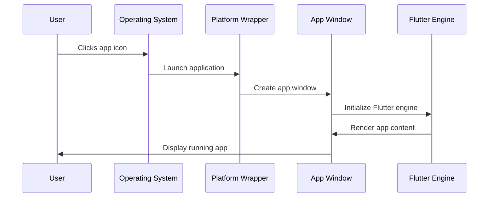
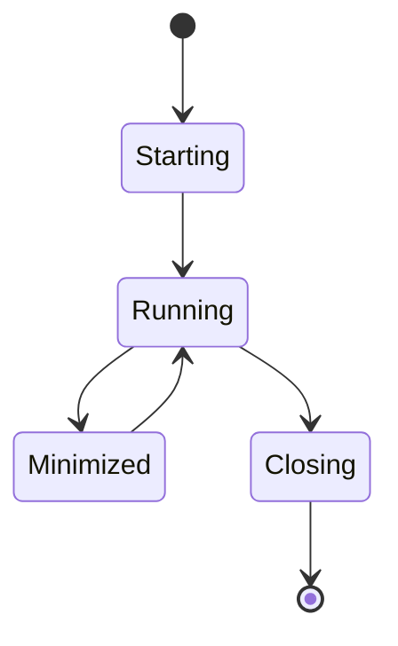

# Chapter 3: Platform Application Wrapper

Now that we've learned about the [Plugin Registration System](02_plugin_registration_system_.md) and how your Flutter app connects to device features, let's explore how your app actually gets started and managed by each operating system.

## The Problem: Getting Your App to Start Properly

Imagine you've built an amazing Public Safety App with beautiful interfaces and great functionality. But there's a fundamental challenge: how does your Flutter code actually become a "real" application that users can launch from their desktop or phone?

It's like having a brilliant script for a play, but you need a theater, stage, curtains, and lighting system before anyone can actually watch the performance. Your Flutter code is the script, but each operating system needs its own "theater" to host and run your app.

**The Platform Application Wrapper** solves this problem. Think of it as the "launch pad" for your Flutter app on each operating system. Just like how you need different installers for Mac vs Windows software, Flutter needs platform-specific wrappers to start up properly and integrate with the host operating system's expectations.

## What Is a Platform Application Wrapper?

A Platform Application Wrapper is like a universal adapter that:

1. **Speaks the platform's language** - Each OS expects apps to start up in a specific way
2. **Creates a window** - Provides a space where your Flutter app can draw its interface
3. **Handles system events** - Manages what happens when users minimize, resize, or close your app
4. **Manages the app lifecycle** - Controls startup, running, and shutdown phases

Let's break this down with a simple analogy: imagine your Flutter app is a talented musician, and each platform is a different venue (concert hall, outdoor stage, coffee shop). The Platform Application Wrapper is like the venue manager who:
- Sets up the right kind of stage
- Handles the sound system
- Manages the lighting
- Deals with the audience (operating system) expectations

## The Two Parts: Main Entry Point and Application Class

Every Platform Application Wrapper has two essential components:

### Part 1: The Main Entry Point

This is like the "power button" for your app. When a user clicks your app icon, this code runs first:

```cpp
// Linux main.cc
int main(int argc, char** argv) {
  g_autoptr(MyApplication) app = my_application_new();
  return g_application_run(G_APPLICATION(app), argc, argv);
}
```

This simple code does three things:
1. **Creates your application** - Sets up the basic app structure
2. **Starts the application** - Hands control to the platform's app management system
3. **Returns when done** - Cleans up when the app closes

### Part 2: The Application Manager

This is like the "stage manager" that handles all the ongoing operations:

```cpp
// From my_application.h
MyApplication* my_application_new();
```

The Application Manager is responsible for creating and managing the window where your Flutter app will appear.

## How Platform Wrappers Work: The Theater Analogy

Let's follow what happens when a user launches your Public Safety App:



Here's what each step means:

1. **User clicks**: The operating system recognizes the request to launch your app
2. **OS calls wrapper**: The platform wrapper's main function gets called
3. **Window creation**: The wrapper creates a window where your app can display
4. **Flutter startup**: The Flutter engine initializes inside that window
5. **App appears**: Your Flutter app's interface appears to the user

## Platform Differences: Different Theaters, Same Show

Each platform has its own way of managing applications, but the concept is the same:

### Linux Platform Wrapper

Linux uses GTK (a windowing toolkit) to create applications:

```cpp
// Creates a GTK-based application
g_autoptr(MyApplication) app = my_application_new();
```

This tells Linux: "Create a new application using the GTK framework, which knows how to create windows, handle mouse clicks, and integrate with the Linux desktop."

### Windows Platform Wrapper

Windows uses Win32 API and has a different structure:

```cpp
// From flutter_window.h
class FlutterWindow : public Win32Window {
  // Creates a new FlutterWindow hosting a Flutter view
  explicit FlutterWindow(const flutter::DartProject& project);
};
```

This tells Windows: "Create a new window that inherits all the standard Windows window behaviors (minimize, maximize, close buttons, etc.) and hosts a Flutter application inside it."

## Deep Dive: How the Wrapper Creates Your App Window

Let's explore what happens inside the Platform Application Wrapper when it sets up your app:

### Step 1: Platform Initialization

```cpp
// The wrapper starts by setting up platform-specific systems
MyApplication* my_application_new() {
  // Create application instance
  // Set up event handling
  // Prepare for window creation
}
```

This is like a theater manager checking that the sound system works, the lights are functioning, and the stage is ready.

### Step 2: Window Creation

```cpp
// Flutter needs a window to draw in
bool OnCreate() override {
  // Create the actual window
  // Set window properties (size, title, etc.)
  // Initialize Flutter engine within the window
}
```

This creates the actual "stage" where your Flutter app will perform. The window has standard platform features like a title bar, resize handles, and close button.

### Step 3: Flutter Engine Integration

```cpp
// Connect Flutter to the platform window
std::unique_ptr<flutter::FlutterViewController> flutter_controller_;
```

This creates the connection between your Flutter code and the platform window. It's like connecting the musician's instruments to the venue's sound system.

## Solving Our Use Case: Professional App Startup

Let's apply this to our Public Safety App. The Platform Application Wrapper ensures that:

### Professional Window Appearance

```cpp
// Windows example - setting window properties
SetWindowTitle("Public Safety Emergency App");
SetWindowIcon(LoadIcon("emergency_icon.ico"));
```

Your app appears with proper branding and behaves like other professional applications on the platform.

### Proper System Integration

The wrapper handles system expectations:
- **Window controls** work properly (minimize, maximize, close)
- **Taskbar integration** shows your app correctly
- **Alt+Tab switching** includes your app in the list
- **System events** are handled (like computer sleep/wake)

### Cross-Platform Consistency

While each platform wrapper is different, they all provide the same result: a properly integrated application that:
- Starts up reliably
- Behaves according to platform conventions
- Integrates with system features
- Shuts down cleanly

## The Application Lifecycle Management

The Platform Application Wrapper also manages your app's lifecycle:



### Lifecycle Events

```cpp
// The wrapper handles these key events:
bool OnCreate() {
  // App is starting up
  // Initialize Flutter engine
}

void OnDestroy() {
  // App is shutting down
  // Clean up resources
}
```

This ensures your app starts cleanly and shuts down properly, preventing crashes or resource leaks.

## Under the Hood: Message Handling

The Platform Application Wrapper also acts as a translator for system messages:

```cpp
LRESULT MessageHandler(HWND window, UINT message, 
                      WPARAM wparam, LPARAM lparam) {
  // Translate Windows messages to Flutter events
  // Handle window resize, mouse clicks, keyboard input
}
```

When a user clicks in your app window, the wrapper:
1. **Receives** the platform-specific click message
2. **Translates** it into Flutter-understandable coordinates
3. **Forwards** it to your Flutter app code
4. **Handles** the response appropriately

## What We've Learned

The Platform Application Wrapper is your Flutter app's "launch pad" and "stage manager." It:

- **Provides the entry point** that operating systems use to start your app
- **Creates and manages** the window where your Flutter app appears
- **Handles platform integration** so your app behaves like other native apps
- **Manages the lifecycle** from startup to shutdown
- **Translates system events** between the platform and Flutter

For our Public Safety App, this means users get a professional, reliable application that starts up properly, integrates well with their operating system, and behaves predictably - building the trust that's essential for emergency response software.

The Platform Application Wrapper, combined with [Platform Resource Management](01_platform_resource_management_.md) and the [Plugin Registration System](02_plugin_registration_system_.md), creates the complete foundation that allows your Flutter code to run as a fully-featured, professional application on any platform.

This completes our exploration of the core platform integration concepts that make Flutter apps work seamlessly across different operating systems!

