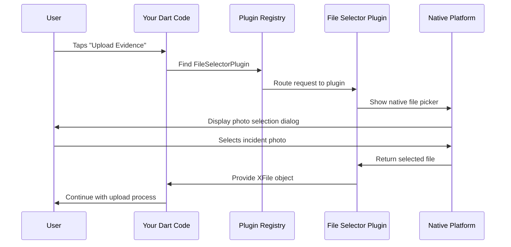

# Chapter 3: Plugin Registration System

Building on what we learned about [Platform-Specific Resource Management](02_platform_specific_resource_management_.md), we now understand how Flutter manages platform-specific visual elements and system integration. But there's another crucial piece of the puzzle: how does Flutter connect your Dart code to powerful native device features like file systems, web browsers, and hardware sensors? This chapter explores Flutter's Plugin Registration System.

## What Problem Does This Solve?

Imagine you're building our public safety app, and you need it to:

- Let emergency responders select and upload incident photos from their device
- Open emergency protocol websites in the device's web browser
- Access GPS coordinates for location reporting
- Save incident reports to the device's file system

Your Flutter code is written in Dart, but these features require talking to the device's native systems (iOS Swift/Objective-C, Android Java/Kotlin, Windows C++, Linux C). Without a plugin system, you'd need to write complex native code for each platform yourself!

**Our Use Case**: We want our emergency response app to have a "Upload Evidence" button that opens the device's file picker, lets responders select photos, and then opens an incident report website in the default browser. This should work seamlessly whether they're using an iPhone, Android tablet, or Windows laptop.

## The Universal Translator Analogy

Think of Flutter's plugin system like having a team of expert translators at an international emergency response conference:

- **Dart Translator**: Understands your Flutter app's requests ("I need to open a file picker")
- **iOS Translator**: Knows how to ask iOS to show its native photo picker
- **Android Translator**: Knows how to ask Android to show its file chooser
- **Windows Translator**: Knows how to ask Windows to open its file dialog

The plugin registration system is like the conference coordinator who makes sure each translator is ready and knows how to reach each other when translation is needed.

## Key Concepts Breakdown

### 1. What Are Plugins?

Plugins are pre-written pieces of code that bridge the gap between your Dart code and native platform features:

```dart
// Your simple Dart code
import 'package:file_selector/file_selector.dart';

final XFile? file = await openFile();
```

This single line of Dart code automatically:
- Shows iOS photo picker on iPhones
- Shows Android file chooser on Android devices  
- Shows Windows file dialog on Windows
- Shows Linux file manager on Linux

The plugin handles all the complex native code for you!

### 2. Plugin Registration (The Setup Process)

Before your app can use plugins, each platform needs to "register" them - essentially telling the platform "these translators are available":

```cpp
// Linux registration
void fl_register_plugins(FlPluginRegistry* registry) {
  file_selector_plugin_register_with_registrar(registrar);
  url_launcher_plugin_register_with_registrar(registrar);
}
```

This tells Linux: "The file selector and URL launcher plugins are ready to use."

### 3. Plugin Registry (The Phone Book)

The plugin registry is like a phone book that keeps track of which plugins are available and how to contact them:

```cpp
FlPluginRegistrar* registrar = 
    fl_plugin_registry_get_registrar_for_plugin(registry, "FileSelectorPlugin");
```

This is like looking up "FileSelectorPlugin" in the phone book to get its contact information.

### 4. Automatic Generation (The Magic)

The best part? You never write this registration code yourself! Flutter automatically generates these files based on the plugins you list in your `pubspec.yaml`:

```yaml
dependencies:
  file_selector: ^0.9.2
  url_launcher: ^6.1.7
```

Flutter sees this and automatically generates all the registration code for every platform.

## Solving Our Use Case

Let's build our evidence upload feature using the plugin system:

**Step 1: Add Plugins to Your Project**
```yaml
# pubspec.yaml
dependencies:
  flutter:
    sdk: flutter
  file_selector: ^0.9.2
  url_launcher: ^6.1.7
```

**Step 2: Write Simple Dart Code**
```dart
import 'package:file_selector/file_selector.dart';
import 'package:url_launcher/url_launcher.dart';

class EvidenceUploader extends StatelessWidget {
  Future<void> uploadEvidence() async {
    // Step 1: Let user select a photo
    final XFile? photo = await openFile(
      acceptedTypeGroups: [XTypeGroup(extensions: ['jpg', 'png'])]
    );
    
    if (photo != null) {
      // Step 2: Open incident report website
      await launchUrl(Uri.parse('https://emergency-reports.gov'));
    }
  }
}
```

**Step 3: Flutter Handles Everything Else**
Flutter automatically generates registration code for all platforms, so your simple Dart code works everywhere!

## What Happens Under the Hood

Here's the step-by-step process when an emergency responder taps "Upload Evidence":



Let's break this down:

1. **User Action**: Emergency responder taps the upload button
2. **Dart Request**: Your code calls `openFile()`
3. **Registry Lookup**: Plugin registry finds the FileSelectorPlugin
4. **Plugin Activation**: Registry routes the request to the plugin
5. **Native Call**: Plugin asks the OS to show file picker
6. **User Interaction**: Native file picker appears for photo selection
7. **File Selection**: User chooses an incident photo
8. **Return Path**: Selected file travels back through plugin to your Dart code

## Deep Dive: Platform Registration Files

Let's examine how each platform registers plugins:

### Linux Plugin Registration

```cpp
// generated_plugin_registrant.cc
void fl_register_plugins(FlPluginRegistry* registry) {
  // Register file selector plugin
  g_autoptr(FlPluginRegistrar) file_selector_registrar =
      fl_plugin_registry_get_registrar_for_plugin(registry, "FileSelectorPlugin");
  file_selector_plugin_register_with_registrar(file_selector_registrar);
  
  // Register URL launcher plugin  
  g_autoptr(FlPluginRegistrar) url_launcher_registrar =
      fl_plugin_registry_get_registrar_for_plugin(registry, "UrlLauncherPlugin");
  url_launcher_plugin_register_with_registrar(url_launcher_registrar);
}
```

This function does three important things:

1. **Gets a registrar**: Like getting a form to fill out for each plugin
2. **Registers the plugin**: Fills out the form with plugin details
3. **Repeats for each plugin**: Does this for every plugin your app uses

### Windows Plugin Registration

```cpp
// generated_plugin_registrant.h
void RegisterPlugins(flutter::PluginRegistry* registry);
```

Windows uses a similar approach but with C++ syntax that Windows understands. The header file declares that a `RegisterPlugins` function exists, and the implementation file contains the actual registration code.

### The Registration Process

Here's what happens during app startup:

**Step 1: App Initialization**
```cpp
// Linux main.cc calls this during startup
#include "flutter/generated_plugin_registrant.h"

fl_register_plugins(fl_engine_get_plugin_registry(engine));
```

**Step 2: Plugin Registry Creation**
```cpp
FlPluginRegistry* registry = fl_engine_get_plugin_registry(engine);
// Creates a new registry to track all plugins
```

**Step 3: Individual Plugin Setup**
```cpp
FlPluginRegistrar* registrar = 
    fl_plugin_registry_get_registrar_for_plugin(registry, "FileSelectorPlugin");
// Creates a registrar specifically for the file selector plugin
```

**Step 4: Plugin Activation**
```cpp
file_selector_plugin_register_with_registrar(registrar);
// Tells the plugin "you're now active and ready to handle requests"
```

## How Plugins Work in Practice

Let's trace through our evidence upload feature:

### File Selection Flow

**Your Dart Code:**
```dart
final XFile? photo = await openFile();
```

**Plugin Translation:**
- **Linux**: Calls GTK file chooser dialog
- **Windows**: Calls Windows File Explorer dialog  
- **iOS**: Calls UIDocumentPickerViewController
- **Android**: Calls Intent.ACTION_GET_CONTENT

**Return Value:**
All platforms return an `XFile` object that works the same way in your Dart code, regardless of which native dialog was actually shown.

### URL Launching Flow

**Your Dart Code:**
```dart
await launchUrl(Uri.parse('https://emergency-reports.gov'));
```

**Plugin Translation:**
- **Linux**: Calls `gtk_show_uri_on_window()`
- **Windows**: Calls `ShellExecute()`
- **iOS**: Calls `UIApplication.shared.open()`  
- **Android**: Calls `Intent.ACTION_VIEW`

**Result:**
The emergency reports website opens in each platform's default browser.

## Automatic Generation Magic

The most powerful aspect is that you never write registration code manually. Here's how Flutter creates it automatically:

**Step 1: Flutter Analyzes Dependencies**
```yaml
# Flutter reads your pubspec.yaml
dependencies:
  file_selector: ^0.9.2
  url_launcher: ^6.1.7
```

**Step 2: Flutter Generates Registration Code**
```cpp
// Flutter automatically writes this code for you:
void fl_register_plugins(FlPluginRegistry* registry) {
  file_selector_plugin_register_with_registrar(/*...*/);
  url_launcher_plugin_register_with_registrar(/*...*/);
}
```

**Step 3: Flutter Updates When You Add Plugins**
Add a new plugin to pubspec.yaml, run `flutter pub get`, and Flutter automatically updates all registration files!

## Integration with Previous Concepts

Remember how [Cross-Platform Flutter Application Structure](01_cross_platform_flutter_application_structure_.md) showed each platform has its own entry point? Those entry points call the plugin registration:

**Linux Integration:**
```cpp
// From the Linux entry point
int main(int argc, char** argv) {
  MyApplication* app = my_application_new();
  fl_register_plugins(/*...*/);  // Plugins register here
  return g_application_run(app, argc, argv);
}
```

**Resource Integration:**
The plugins also work with [Platform-Specific Resource Management](02_platform_specific_resource_management_.md). For example, the file selector plugin automatically uses:
- iOS-style file icons on iOS
- Material Design file icons on Android
- Windows Explorer icons on Windows
- GTK file manager icons on Linux

## Common Plugin Types for Public Safety Apps

Here are essential plugins for emergency response applications:

### File Management Plugins
```dart
import 'package:file_selector/file_selector.dart';
// Upload incident photos, documents, reports
```

### Communication Plugins
```dart
import 'package:url_launcher/url_launcher.dart';
// Open emergency websites, call emergency numbers
```

### Location Plugins
```dart
import 'package:geolocator/geolocator.dart';  
// Get GPS coordinates for incident reporting
```

### Camera Plugins
```dart
import 'package:camera/camera.dart';
// Capture real-time incident photos
```

Each of these plugins follows the same registration pattern - you add them to pubspec.yaml, and Flutter handles all the native platform integration automatically.

## Error Handling and Debugging

When plugins don't work correctly, the registration system provides helpful debugging:

```cpp
// If registration fails, you'll see specific error messages
g_autoptr(FlPluginRegistrar) registrar =
    fl_plugin_registry_get_registrar_for_plugin(registry, "MissingPlugin");
// Error: "Plugin 'MissingPlugin' not found in registry"
```

This makes it easy to identify which plugins aren't properly registered.

## Conclusion

You've learned how Flutter's Plugin Registration System acts as a universal translator that connects your simple Dart code to powerful native platform features. The key insight is that plugins handle all the complex native programming for you - you write straightforward Dart code, and Flutter automatically generates the registration code needed to make it work on every platform.

Your emergency response app can now:
- Open native file pickers for evidence upload
- Launch emergency websites in default browsers
- Access device GPS, cameras, and file systems
- Work identically across iOS, Android, Windows, and Linux

The plugin registration system seamlessly integrates with the [Cross-Platform Flutter Application Structure](01_cross_platform_flutter_application_structure_.md) we learned in Chapter 1 and the [Platform-Specific Resource Management](02_platform_specific_resource_management_.md) from Chapter 2 to create a complete, powerful development platform.

Remember: Flutter's plugin system means you can focus on building life-saving emergency response features while Flutter handles the complexity of connecting to each platform's native capabilities. You get the power of native apps with the simplicity of writing code once!

