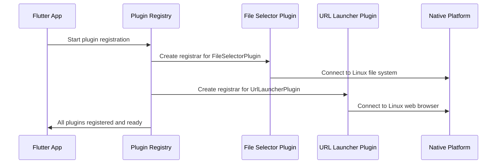

# Chapter 3: Plugin Registration System

In [Chapter 2: Cross-Platform Bridge Headers](02_cross_platform_bridge_headers_.md), we learned how Flutter communicates with native platform code through translation layers. But here's a new challenge: when your app starts up, how does it know which native features are available? How does Flutter discover that your Public Safety Application can access file selection, web browsing, or camera functionality?

This is where the **Plugin Registration System** comes to the rescue! Think of it as a smart phone book that automatically tells your app "Here are all the superpowers you have access to on this device."

## The Lost Contact Problem

Imagine you're an emergency responder using our Public Safety Application. You need to:
- **Select files** to attach incident reports 📁
- **Open web links** to access emergency databases 🌐
- **Access the camera** to document scenes 📷

Your phone has all these capabilities, but without a proper directory system, your Flutter app would be like someone with amnesia - it would forget which native features exist and how to reach them!

The Plugin Registration System solves this by creating an organized directory that says:
- "File selection? Call this number: FileSelectorPlugin"
- "Web browsing? Call this number: UrlLauncherPlugin"
- "Camera access? Call this number: CameraPlugin"

## What Is the Plugin Registration System?

The Plugin Registration System is like an **automatic phone book generator** that:
- **Discovers** all the plugins your app uses
- **Registers** them with unique identities
- **Connects** them to the right native code
- **Makes them available** when your Flutter code needs them

Let's look at how this works in practice. Here's the Linux version from our Public Safety Application:

```cpp
void fl_register_plugins(FlPluginRegistry* registry) {
  // Register file selector plugin
  g_autoptr(FlPluginRegistrar) file_selector_linux_registrar =
      fl_plugin_registry_get_registrar_for_plugin(registry, "FileSelectorPlugin");
  file_selector_plugin_register_with_registrar(file_selector_linux_registrar);
```

This code is saying: "Hey Linux, create a phone book entry for the File Selector plugin and connect it to the right native code."

## Key Components of Plugin Registration

### 1. The Registry Function

Every platform has a main registration function that acts like a directory builder:

**Linux Version:**
```cpp
void fl_register_plugins(FlPluginRegistry* registry) {
  // This function builds the plugin phone book for Linux
}
```

**Windows Version:**
```cpp
void RegisterPlugins(flutter::PluginRegistry* registry) {
  // This function builds the plugin phone book for Windows  
}
```

Think of this function as a librarian who organizes all the books (plugins) on the shelves (registry) so people can find them easily.

### 2. Individual Plugin Registration

Each plugin gets its own "phone book entry":

```cpp
g_autoptr(FlPluginRegistrar) file_selector_linux_registrar =
    fl_plugin_registry_get_registrar_for_plugin(registry, "FileSelectorPlugin");
file_selector_plugin_register_with_registrar(file_selector_linux_registrar);
```

This creates a unique identity card for the File Selector plugin. It's like adding a new contact to your phone with their name and number.

### 3. The Header File

The header file acts like the phone book's cover, telling everyone what's inside:

```cpp
#include <flutter_linux/flutter_linux.h>

// Registers Flutter plugins.
void fl_register_plugins(FlPluginRegistry* registry);
```

This declares: "We have a function that can register all plugins - call this function when you need the directory!"

## How Plugin Registration Solves Our File Selection Use Case

Let's walk through what happens when a user wants to attach a file to an incident report in our Public Safety Application:

**Step 1: App Startup - Building the Phone Book**
```cpp
void fl_register_plugins(FlPluginRegistry* registry) {
  g_autoptr(FlPluginRegistrar) file_selector_linux_registrar =
      fl_plugin_registry_get_registrar_for_plugin(registry, "FileSelectorPlugin");
```

During app startup, this code creates an entry in Flutter's plugin registry for file selection capabilities.

**Step 2: User Action - Flutter Code Needs File Selection**
```dart
// In your Flutter app
final file = await FilePicker.platform.pickFiles();
```

When the user taps "Attach File," your Flutter code asks for file selection functionality.

**Step 3: Registry Lookup - Finding the Right Plugin**

Flutter looks in its plugin phone book: "I need file selection... ah yes, FileSelectorPlugin is registered and ready!"

**Step 4: Native Code Execution**
```cpp
file_selector_plugin_register_with_registrar(file_selector_linux_registrar);
```

The registered plugin handles the actual native file selection dialog.

## Under the Hood: The Registration Process

Here's what happens when your app starts up and builds its plugin directory:


```mermaid
sequenceDiagram
    participant App as Flutter App
    participant Registry as Plugin Registry
    participant FilePlugin as File Selector Plugin
    participant URLPlugin as URL Launcher Plugin
    participant Native as Native Platform

    App->>Registry: Start plugin registration
    Registry->>FilePlugin: Create registrar for FileSelectorPlugin
    FilePlugin->>Native: Connect to Linux file system
    Registry->>URLPlugin: Create registrar for UrlLauncherPlugin  
    URLPlugin->>Native: Connect to Linux web browser
    Registry->>App: All plugins registered and ready
```

Let's examine each step:

### Step 1: Registration Function Called

When your app starts, the platform container calls the registration function:

```cpp
void fl_register_plugins(FlPluginRegistry* registry) {
```

This is like opening a new phone book and getting ready to add contacts.

### Step 2: Creating Plugin Registrars

For each plugin, a unique registrar is created:

```cpp
g_autoptr(FlPluginRegistrar) file_selector_linux_registrar =
    fl_plugin_registry_get_registrar_for_plugin(registry, "FileSelectorPlugin");
```

This creates a special "business card" for the file selector plugin with its name and contact information.

### Step 3: Connecting to Native Code

Each plugin registers its native implementation:

```cpp
file_selector_plugin_register_with_registrar(file_selector_linux_registrar);
```

This connects the plugin's Flutter interface to the actual Linux file selection code. It's like writing down the phone number on the business card.

### Step 4: Ready for Use

Once all plugins are registered, Flutter knows exactly which native features are available and how to access them.

## Platform-Specific Registration Differences

While the concept is the same across platforms, each operating system has its own registration style:

**Linux Style (GTK-based):**
```cpp
g_autoptr(FlPluginRegistrar) url_launcher_linux_registrar =
    fl_plugin_registry_get_registrar_for_plugin(registry, "UrlLauncherPlugin");
url_launcher_plugin_register_with_registrar(url_launcher_linux_registrar);
```

Linux uses GTK (a Linux windowing system) and has automatic memory management with `g_autoptr`.

**Windows Style (Win32-based):**
```cpp
void RegisterPlugins(flutter::PluginRegistry* registry) {
  // Windows plugins register differently but achieve the same result
}
```

Windows uses its own plugin registry system but follows the same pattern of creating entries for each plugin.

## The Magic of Generated Code

The beautiful thing about the Plugin Registration System is that it's **automatically generated**! Notice the comment at the top of the files:

```cpp
//
//  Generated file. Do not edit.
//
```

This means Flutter looks at your `pubspec.yaml` file and automatically creates the registration code for you:

```yaml
dependencies:
  file_picker: ^5.2.5
  url_launcher: ^6.1.9
```

When you add these plugins to your project, Flutter automatically generates the registration code. It's like having an assistant who automatically updates your phone book whenever you meet new people!

## How Multiple Plugins Work Together

Our Public Safety Application uses multiple plugins. Here's how they all get registered:

```cpp
void fl_register_plugins(FlPluginRegistry* registry) {
  // File selection for incident reports
  g_autoptr(FlPluginRegistrar) file_selector_registrar =
      fl_plugin_registry_get_registrar_for_plugin(registry, "FileSelectorPlugin");
  file_selector_plugin_register_with_registrar(file_selector_registrar);
  
  // Web browsing for emergency databases
  g_autoptr(FlPluginRegistrar) url_launcher_registrar =
      fl_plugin_registry_get_registrar_for_plugin(registry, "UrlLauncherPlugin");
  url_launcher_plugin_register_with_registrar(url_launcher_registrar);
}
```

Each plugin gets its own entry in the directory, so Flutter can find the right one for each task. It's like having separate contacts for your doctor, dentist, and emergency services - each serves a different purpose but they're all in the same phone book.

## Error Prevention and Safety

The registration system also prevents common problems:

- **No duplicate registrations**: Each plugin name can only be registered once
- **Clear naming**: Plugin names like "FileSelectorPlugin" are descriptive and unique  
- **Automatic cleanup**: The system handles memory management and cleanup automatically
- **Platform isolation**: Linux plugins don't interfere with Windows plugins

This is like having a smart phone book that prevents you from accidentally creating duplicate contacts or mixing up phone numbers.

## What We've Learned

In this chapter, we discovered that:

- Plugin Registration Systems are like automatic phone books that connect Flutter to native features
- Each platform has its own registration format, but they all serve the same purpose
- Registration happens automatically during app startup, before your Flutter code runs
- The system is generated automatically based on the plugins in your `pubspec.yaml`
- Multiple plugins can coexist peacefully, each with their own unique identity
- The architecture prevents common errors and handles platform differences transparently

The Plugin Registration System is the behind-the-scenes organizer that makes Flutter's plugin ecosystem work seamlessly. Without it, your app would be like a person with a phone full of contacts but no way to look up their numbers!

This completes our journey through the foundational concepts that make Flutter apps work across platforms. We've seen how [Platform Application Containers](01_platform_application_containers_.md) provide native shells, how [Cross-Platform Bridge Headers](02_cross_platform_bridge_headers_.md) enable communication between languages, and now how Plugin Registration Systems organize and connect all the pieces together.

These three concepts work together like a well-orchestrated team to make your Flutter apps feel native and powerful on every platform while keeping your development experience simple and consistent.

