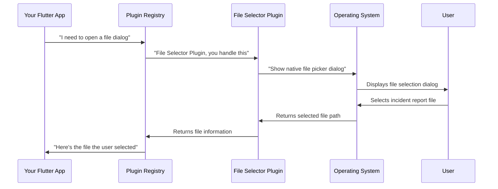

# Chapter 3: Plugin Registration System

Building on our understanding of [Platform-Specific Application Containers](02_platform_specific_application_containers_.md), we now need to explore how your Flutter app can actually use platform-specific features like opening files, launching web browsers, or accessing device cameras. This is where the Plugin Registration System comes into play.

## What Problem Does This Solve?

Imagine you're at a hotel in a foreign country. You want to book a spa appointment, order room service, and get directions to the airport. You don't speak the local language, but fortunately, there's a helpful receptionist who speaks your language AND knows exactly which hotel department can help you with each request.

The Plugin Registration System is like that multilingual hotel receptionist for your Flutter app. When your Flutter code says "I need to open a file" or "I want to launch a website," the registration system knows exactly which platform-specific service can handle that request and connects them automatically.

## The Real-World Use Case

Let's continue with our Public Safety Application. Your emergency responders need to:
- **Open incident reports** stored as PDF files on their devices
- **Launch web browsers** to access online mapping systems  
- **Access device cameras** to document crime scenes
- **Send emergency notifications** through the system

Your Flutter code should be able to say "open this file" without worrying about whether it's running on Linux, Windows, or iOS. The Plugin Registration System makes this possible by automatically connecting your requests to the right platform-specific implementation.

## Key Concepts Breakdown

### 1. The Plugin Concept
A plugin is like a specialized translator that knows how to do one specific task on each platform. For example:
- **file_selector plugin**: Knows how to open file dialogs on every platform
- **url_launcher plugin**: Knows how to open web browsers on every platform
- **camera plugin**: Knows how to access cameras on every platform

### 2. The Registration Process
Registration is like introducing these specialized translators to your app's receptionist (the registration system). Once introduced, the receptionist knows who to call for each type of request.

### 3. The Automatic Connection
When your Flutter code makes a request, the system automatically finds and uses the right plugin, just like how a hotel receptionist automatically connects you to the right department.

## How the Plugin Registration System Works

Let's trace what happens when an emergency responder clicks "Open Incident Report" in your app:


```mermaid
sequenceDiagram
    participant App as Your Flutter App
    participant Registry as Plugin Registry
    participant Plugin as File Selector Plugin
    participant OS as Operating System
    participant User

    App->>Registry: "I need to open a file dialog"
    Registry->>Plugin: "File Selector Plugin, you handle this"
    Plugin->>OS: "Show native file picker dialog"
    OS->>User: Displays file selection dialog
    User->>OS: Selects incident report file
    OS->>Plugin: Returns selected file path
    Plugin->>Registry: Returns file information
    Registry->>App: "Here's the file the user selected"
```

## The Registration Process: Step-by-Step

### Step 1: Plugin Declaration
When you add a plugin to your Flutter project, you declare it in your `pubspec.yaml`:

```yaml
dependencies:
  file_selector: ^0.9.2
  url_launcher: ^6.1.7
```

This is like telling the hotel "I might need spa and restaurant services during my stay."

### Step 2: Automatic Registration Generation
Flutter automatically generates registration code for each platform. Let's look at what gets created:

### Linux Registration
```cpp
#include <file_selector_linux/file_selector_plugin.h>
#include <url_launcher_linux/url_launcher_plugin.h>

void fl_register_plugins(FlPluginRegistry* registry) {
  // Register file selector for Linux
  g_autoptr(FlPluginRegistrar) file_registrar =
      fl_plugin_registry_get_registrar_for_plugin(registry, "FileSelectorPlugin");
  file_selector_plugin_register_with_registrar(file_registrar);
  
  // Register URL launcher for Linux  
  g_autoptr(FlPluginRegistrar) url_registrar =
      fl_plugin_registry_get_registrar_for_plugin(registry, "UrlLauncherPlugin");
  url_launcher_plugin_register_with_registrar(url_registrar);
}
```

This code is like introducing each specialized service to the hotel receptionist: "This is Maria, she handles file operations. This is Carlos, he handles web browser requests."

### Step 3: Registry Integration
The platform container calls this registration function during startup:

```cpp
// The hotel receptionist meets all the specialists
fl_register_plugins(fl_plugin_registry_get(messenger));
```

This single line introduces all available plugins to the registration system, so they're ready to help when needed.

## Using Registered Plugins: Practical Examples

Once plugins are registered, using them is incredibly simple:

### Opening a File Dialog
```dart
// Your simple Flutter code
final XFile? file = await openFile();
if (file != null) {
  print('User selected: ${file.name}');
}
```

Behind the scenes, this simple call triggers the entire registration system to find the right file selector plugin for the current platform and show the appropriate native file dialog.

### Launching a Website
```dart
// Launch emergency mapping system
final url = Uri.parse('https://emergency-maps.gov');
if (await canLaunchUrl(url)) {
  await launchUrl(url);
}
```

Again, your code stays simple, but the registration system handles finding the right URL launcher plugin and opening the default browser on whatever platform you're running.

## Under the Hood: How Registration Works

### Step 1: Startup Registration
When your app starts, each platform calls its registration function:

```cpp
// This happens automatically when app starts
fl_register_plugins(registry);  // Linux
RegisterPlugins(registry);      // Windows  
```

Think of this as the hotel manager introducing all department heads to the receptionist on the first day of work.

### Step 2: Plugin Storage
The registry creates a lookup table like this:

```
Plugin Registry Database:
├── "FileSelectorPlugin" → Linux file selector implementation
├── "UrlLauncherPlugin" → Linux URL launcher implementation  
└── "CameraPlugin" → Linux camera implementation
```

This is like the receptionist's contact book - they know exactly who handles what service.

### Step 3: Runtime Lookup
When your Flutter code makes a request:

1. **Request arrives**: "I need to open a file"
2. **Registry lookup**: Finds "FileSelectorPlugin" in the database
3. **Plugin execution**: Calls the Linux-specific file selector code
4. **Result return**: Native file dialog appears and returns user's selection

## Platform-Specific Implementations

The beauty of the registration system is that each platform can have completely different implementations, but your Flutter code stays the same:

### Linux File Selection
```cpp
// Linux uses GTK file dialogs
GtkWidget* dialog = gtk_file_chooser_dialog_new(
    "Select Incident Report",
    parent_window,
    GTK_FILE_CHOOSER_ACTION_OPEN,
    "_Cancel", GTK_RESPONSE_CANCEL,
    "_Open", GTK_RESPONSE_ACCEPT,
    NULL);
```

### Windows File Selection
```cpp
// Windows uses Win32 file dialogs  
OPENFILENAME ofn;
GetOpenFileName(&ofn);  // Shows Windows-style dialog
```

Your Flutter code just calls `openFile()`, and the registration system automatically uses the right implementation for each platform!

## Practical Example: Emergency Report Workflow

Let's see how the registration system helps with a complete emergency workflow:

```dart
class EmergencyReportHandler {
  Future<void> processIncident() async {
    // Step 1: Select incident photos
    final photos = await openFiles(acceptedTypeGroups: [
      XTypeGroup(label: 'images', extensions: ['jpg', 'png'])
    ]);
    
    // Step 2: Open department website for additional info
    await launchUrl(Uri.parse('https://department-database.gov'));
    
    // Step 3: Save report location
    final saveLocation = await getSavePath(suggestedName: 'incident-report.pdf');
  }
}
```

This single Flutter function works identically on Linux, Windows, and iOS because:
1. The registration system connects `openFiles()` to the right file selector
2. It connects `launchUrl()` to the right browser launcher
3. It connects `getSavePath()` to the right save dialog

Each platform shows its native dialogs and interfaces, but your code remains beautifully simple.

## Adding New Plugins

When you need new functionality, just add it to your `pubspec.yaml`:

```yaml
dependencies:
  camera: ^0.10.0  # For incident scene photos
  geolocator: ^9.0.0  # For location tracking
```

Then run:
```bash
flutter pub get
```

Flutter automatically regenerates the registration code to include these new plugins. It's like telling the hotel "I'd also like access to the fitness center and business center" - the receptionist automatically updates their contact list.

## Why This System Matters for Public Safety

The Plugin Registration System is crucial for emergency response applications because it provides:

1. **Seamless Integration**: Native file dialogs and browsers that users already know
2. **Reliable Performance**: Direct connection to platform-optimized implementations  
3. **Consistent Behavior**: Same Flutter code works identically across all platforms
4. **Easy Maintenance**: Add new capabilities without changing existing code

## Real-World Impact

Consider this emergency scenario: A police officer needs to quickly attach photos to an incident report. With proper plugin registration:
- **Linux**: Shows familiar GNOME/KDE file dialog
- **Windows**: Shows standard Windows Explorer dialog  
- **iOS**: Shows native iOS photo picker

The officer doesn't need to learn different interfaces - each platform provides its familiar, native experience while your Flutter code stays simple and maintainable.

## Troubleshooting Plugin Registration

If a plugin isn't working, the registration system provides helpful debugging:

```cpp
// Check if plugin was registered successfully
if (!fl_plugin_registry_get_registrar_for_plugin(registry, "FileSelectorPlugin")) {
  g_warning("File selector plugin not registered!");
}
```

This is like the receptionist checking their contact book and saying "Sorry, I don't have a contact for the spa" - it helps you identify missing registrations quickly.

## Conclusion

The Plugin Registration System is your app's multilingual receptionist, automatically connecting your Flutter code to the right platform-specific services. It handles all the complex work of finding, connecting, and translating between your simple Flutter requests and the sophisticated platform-specific implementations.

This system is what makes Flutter truly cross-platform - you write simple, readable code once, and the registration system ensures it works perfectly on every platform with native performance and familiar user interfaces.

The Plugin Registration System, combined with the [Platform-Specific Application Containers](02_platform_specific_application_containers_.md) we learned about earlier, forms the foundation that makes your single Flutter codebase feel completely native on Linux, Windows, iOS, and Android - giving your emergency responders the fast, reliable tools they need when every second counts.

