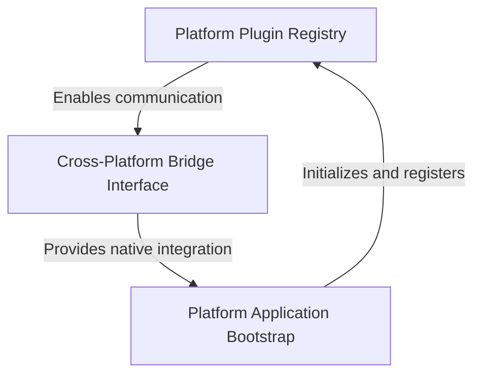

# Tutorial: Public_Safety_Application

The **Public Safety Application** is a *cross-platform Flutter mobile app* that can run on multiple operating systems including Linux, Windows, and iOS. 
The project uses **Flutter's native bridge system** to access platform-specific features like *file selection* and *URL launching*, 
while maintaining a consistent user experience across all supported platforms. Think of it as a single app that automatically 
adapts to work seamlessly whether you're using it on a phone, tablet, or desktop computer.

**Source Repository:** [https://github.com/pruthvirajt24/Public_Safety_Application](https://github.com/pruthvirajt24/Public_Safety_Application)

## Chapters

1. [Platform Application Bootstrap
](01_platform_application_bootstrap_.md)
2. [Platform Plugin Registry
](02_platform_plugin_registry_.md)
3. [Cross-Platform Bridge Interface
](03_cross_platform_bridge_interface_.md)
