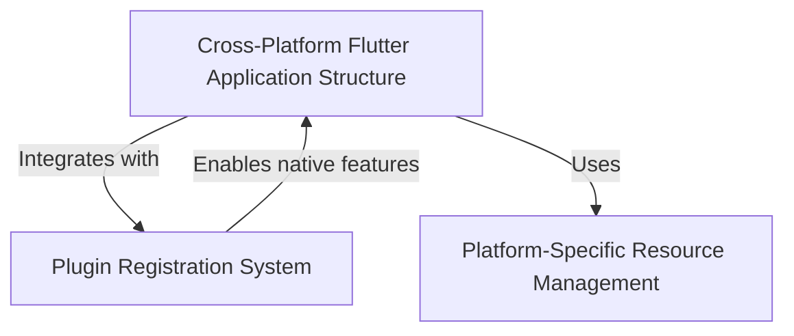

# Tutorial: Public_Safety_Application

This is a **Public Safety Application** built with *Flutter*, a cross-platform framework that allows 
developers to write code once and run it on multiple operating systems like iOS, Linux, and Windows. 
The app uses Flutter's **native integration system** to access platform-specific features like file 
selection and URL launching, while maintaining *consistent functionality* across all supported platforms. 
Each platform has its own customized resources and entry points to ensure the app feels native and 
integrates smoothly with the operating system's expectations.

**Source Repository:** [https://github.com/pruthvirajt24/Public_Safety_Application](https://github.com/pruthvirajt24/Public_Safety_Application)

## Chapters

1. [Cross-Platform Flutter Application Structure
](01_cross_platform_flutter_application_structure_.md)
2. [Platform-Specific Resource Management
](02_platform_specific_resource_management_.md)
3. [Plugin Registration System
](03_plugin_registration_system_.md)
