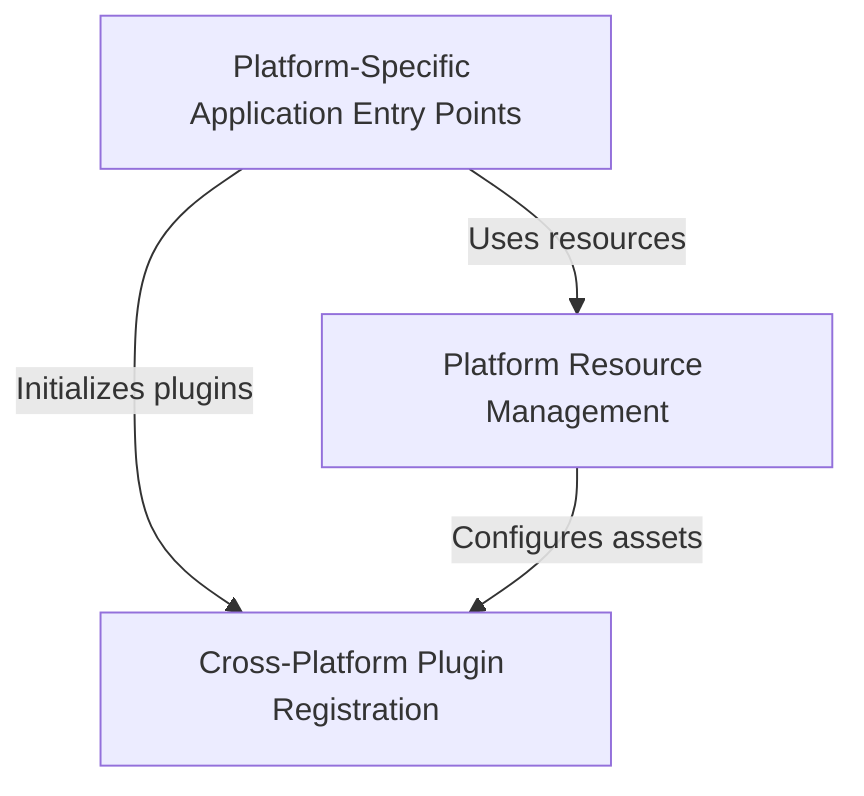

# Tutorial: Public_Safety_Application

This is a **Public Safety Application** built with *Flutter*, a cross-platform framework that allows 
the same app to run on multiple operating systems like *Windows*, *Linux*, and *iOS*. The project 
includes essential functionality for public safety work, such as **file selection** (for documents 
and reports) and **URL launching** (for accessing web resources). The codebase is organized to handle 
platform-specific requirements while maintaining a unified Flutter application core.

**Source Repository:** [https://github.com/pruthvirajt24/Public_Safety_Application](https://github.com/pruthvirajt24/Public_Safety_Application)

## Chapters

1. [Platform-Specific Application Entry Points
](01_platform_specific_application_entry_points_.md)
2. [Platform Resource Management
](02_platform_resource_management_.md)
3. [Cross-Platform Plugin Registration
](03_cross_platform_plugin_registration_.md)
