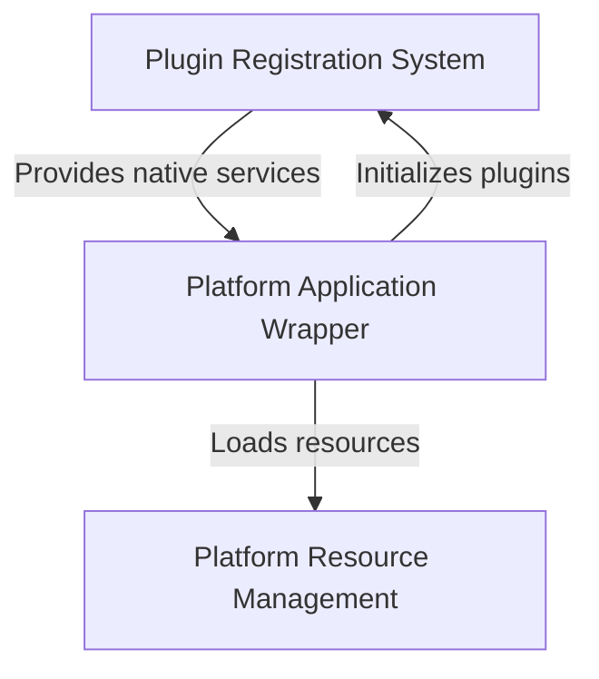

# Tutorial: Public_Safety_Application

This is a **Flutter-based Public Safety Application** that runs on multiple platforms including *Linux*, *Windows*, and *iOS*. 
The project creates a **cross-platform mobile/desktop app** for public safety purposes, handling platform-specific features like 
*file selection* and *URL launching*. Flutter allows developers to write the app once in Dart and deploy it across different 
operating systems, with each platform having its own **native wrapper** to integrate with the host OS.

**Source Repository:** [https://github.com/pruthvirajt24/Public_Safety_Application](https://github.com/pruthvirajt24/Public_Safety_Application)

```mermaid
flowchart TD
    A0["Plugin Registration System
"]
    A1["Platform Application Wrapper
"]
    A2["Platform Resource Management
"]
    A1 -- "Initializes plugins" --> A0
    A1 -- "Loads resources" --> A2
    A0 -- "Provides native services" --> A1
```

## Chapters

1. [Platform Resource Management
](01_platform_resource_management_.md)
2. [Plugin Registration System
](02_plugin_registration_system_.md)
3. [Platform Application Wrapper
](03_platform_application_wrapper_.md)
