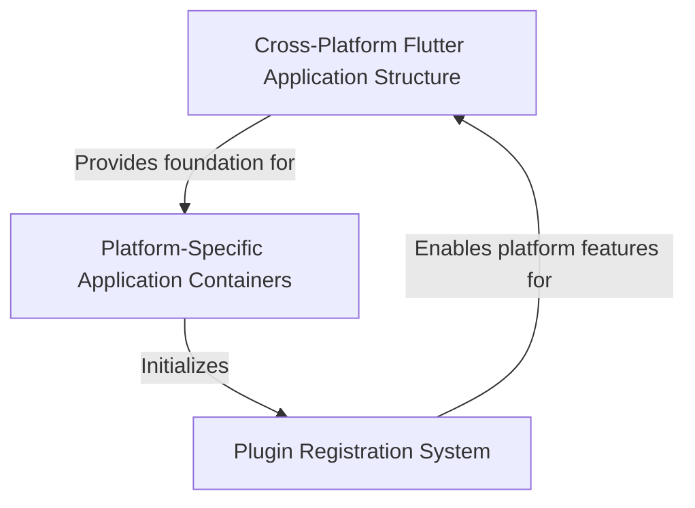

# Tutorial: Public_Safety_Application

This is a **Flutter mobile application** designed for *public safety* that can run on multiple platforms including **iOS, Linux, and Windows**. 
The app uses Flutter's *cross-platform framework* to provide a consistent user experience across different operating systems, 
while leveraging **native platform capabilities** like file selection and URL launching through specialized plugins.

**Source Repository:** [https://github.com/pruthvirajt24/Public_Safety_Application](https://github.com/pruthvirajt24/Public_Safety_Application)

```mermaid
flowchart TD
    A0["Cross-Platform Flutter Application Structure
"]
    A1["Plugin Registration System
"]
    A2["Platform-Specific Application Containers
"]
    A0 -- "Provides foundation for" --> A2
    A2 -- "Initializes" --> A1
    A1 -- "Enables platform features for" --> A0
```

## Chapters

1. [Cross-Platform Flutter Application Structure
](01_cross_platform_flutter_application_structure_.md)
2. [Platform-Specific Application Containers
](02_platform_specific_application_containers_.md)
3. [Plugin Registration System
](03_plugin_registration_system_.md)
