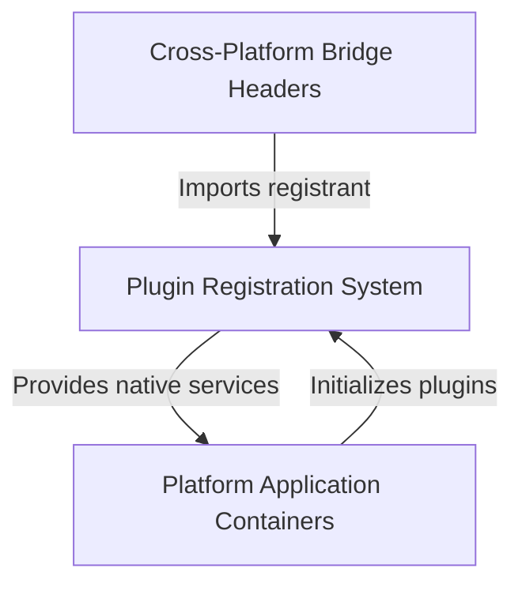

# Tutorial: Public_Safety_Application

This is a **Flutter mobile application** focused on *public safety* that runs across multiple platforms (iOS, Android, Linux, Windows). 
The app uses a **cross-platform architecture** where *Flutter's Dart code* handles the main application logic and UI, while **native platform code** provides the foundation and access to device-specific features like *file selection* and *web browsing*.
Think of it as a safety app that can work on any device while still accessing each platform's unique capabilities.

**Source Repository:** [https://github.com/pruthvirajt24/Public_Safety_Application](https://github.com/pruthvirajt24/Public_Safety_Application)

```mermaid
flowchart TD
    A0["Plugin Registration System
"]
    A1["Platform Application Containers
"]
    A2["Cross-Platform Bridge Headers
"]
    A1 -- "Initializes plugins" --> A0
    A2 -- "Imports registrant" --> A0
    A0 -- "Provides native services" --> A1
```

## Chapters

1. [Platform Application Containers
](01_platform_application_containers_.md)
2. [Cross-Platform Bridge Headers
](02_cross_platform_bridge_headers_.md)
3. [Plugin Registration System
](03_plugin_registration_system_.md)
